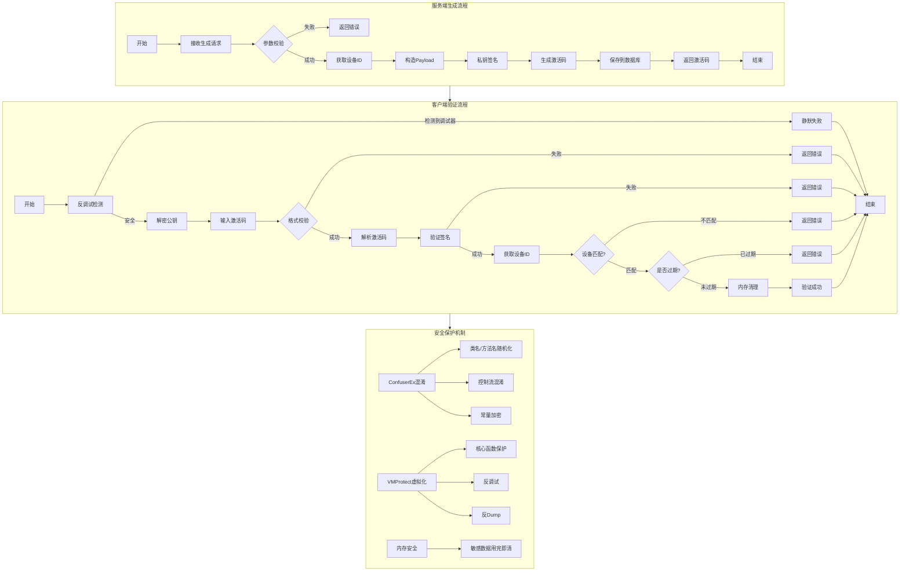
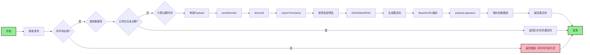
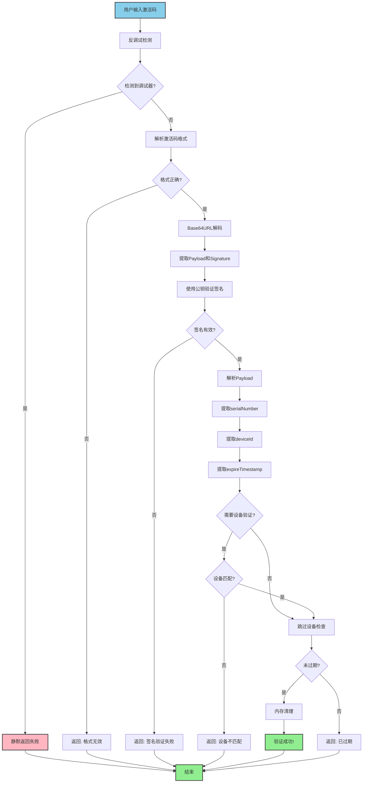
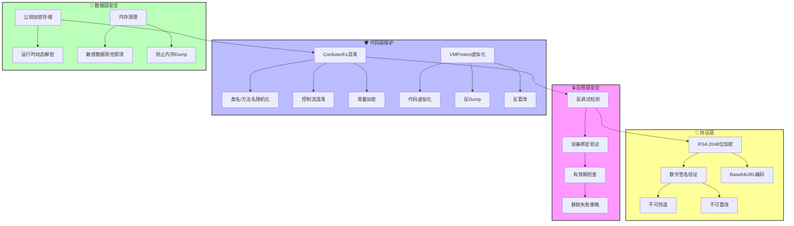
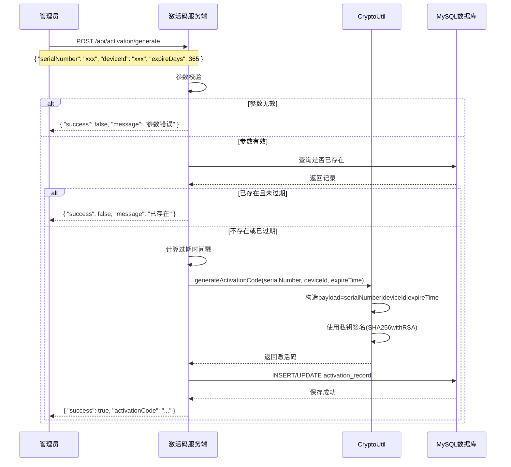
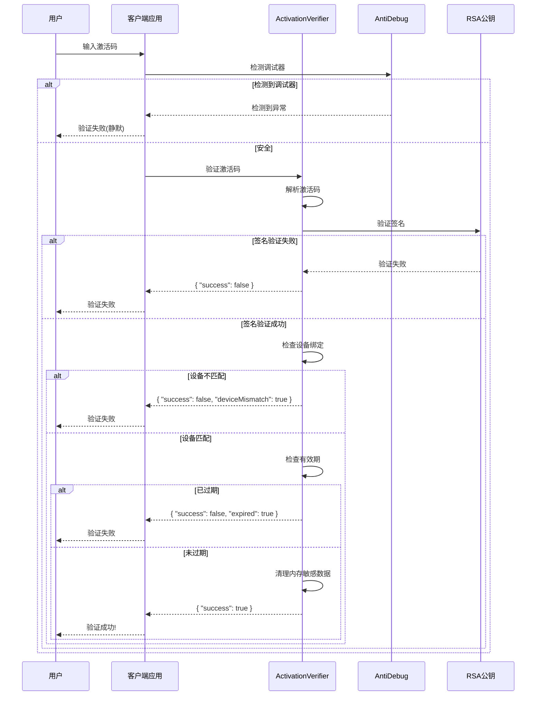
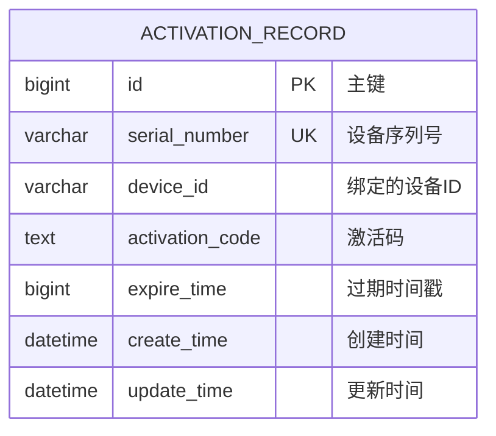

# 激活码管理系统 - 设计文档

## 1. 架构设计

### 1.1 系统架构图

```
┌─────────────────────────────────────────────────────────────────────┐
│                        客户端/前端（离线验证）                        │
└───────────────────────────┬─────────────────────────────────────────┘
                            │ HTTP/REST
                            ▼
┌─────────────────────────────────────────────────────────────────────┐
│                    Spring Boot Application                         │
│  ┌──────────────┐  ┌──────────────┐  ┌──────────────────────────┐ │
│  │Controller层  │  │ Service层    │  │  Configuration          │ │
│  │Activation    │→ │ Activation   │→ │  RsaKeyConfig           │ │
│  │Controller    │  │ Service      │  │  DataSourceConfig       │ │
│  └──────────────┘  └──────────────┘  └──────────────────────────┘ │
│        │                  │                                       │
│        │                  ▼                                       │
│        │         ┌──────────────┐                                  │
│        │         │ CryptoUtil   │ ← RSA密钥对（2048位）           │
│        │         │ (加密工具类) │                                  │
│        │         └──────────────┘                                  │
│        │                  │                                       │
│        │                  ▼                                       │
│        │         ┌──────────────┐                                  │
│        └────────→│ Mapper层     │→ MySQL数据库                     │
│                  │ Activation   │                                  │
│                  │ RecordMapper │                                  │
│                  └──────────────┘                                  │
└─────────────────────────────────────────────────────────────────────┘
                            │
                            ▼
┌─────────────────────────────────────────────────────────────────────┐
│                    MySQL Database                                  │
│              activation_record 表                                  │
└─────────────────────────────────────────────────────────────────────┘
```

### 1.2 客户端验证工具架构

```
┌─────────────────────────────────────────────────────────────────────┐
│                    客户端验证工具（离线）                             │
│  ┌─────────────────────────────────────────────────────────────┐  │
│  │  ActivationVerifier                                         │  │
│  │  ├── AntiDebug (反调试检测)                                  │  │
│  │  │   ├── IsBeingDebugged()                                  │  │
│  │  │   └── IsRunningInDebugger()                              │  │
│  │  ├── RSA验证                                                 │  │
│  │  │   ├── 公钥验证                                            │  │
│  │  │   └── 签名校验                                            │  │
│  │  ├── 设备绑定验证                                            │  │
│  │  │   └── DeviceId比对                                       │  │
│  │  ├── 有效期检查                                              │  │
│  │  │   └── 时间戳校验                                          │  │
│  │  └── 内存清理                                                │  │
│  │      └── Arrays.fill((byte)0)                               │  │
│  └─────────────────────────────────────────────────────────────┘  │
└─────────────────────────────────────────────────────────────────────┘
```

### 1.3 模块划分

| 模块 | 职责 | 状态 |
| :--- | :--- | :--- |
| controller | REST API控制层，处理HTTP请求 | 已实现 |
| service | 业务逻辑层，激活码生成与验证 | 已实现 |
| mapper | 数据访问层，基于MyBatis Plus | 已实现 |
| entity | 数据库实体模型 | 已实现 |
| dto | 数据传输对象（请求/响应） | 已实现 |
| util | 加密工具类（RSA签名） | 已实现 |
| config | 配置类（密钥加载、数据源） | 已实现 |
| verifier | 客户端离线验证工具 | 已实现 |
| anti-debug | 反调试检测模块 | 已实现 |

---

## 2. 核心流程图

### 2.1 完整流程图



### 2.2 服务端生成激活码流程图



### 2.3 客户端离线验证流程图



### 2.4 安全层级图



### 2.5 激活码生成流程（时序图）



### 2.6 客户端离线验证时序图



### 2.7 激活码结构图

```mermaid
graph LR
    A[激活码] --> B[Payload]
    A --> C[Signature]
    
    B --> D[serialNumber]
    B --> E[deviceId]
    B --> F[expireTimestamp]
    
    C --> G[私钥签名(SHA256withRSA)]
    
    style A fill:#f9f,stroke:#333,stroke-width:2px
    style B fill:#bbf,stroke:#333,stroke-width:2px
    style C fill:#bfb,stroke:#333,stroke-width:2px
```

---

## 3. 技术选型

### 3.1 技术栈

| 分类 | 技术 | 版本 | 说明 |
| :--- | :--- | :--- | :--- |
| 语言 | Java | 21 | LTS版本，性能稳定 |
| 框架 | Spring Boot | 3.4.5 | 社区成熟，生态完善 |
| ORM | MyBatis Plus | 3.5.6 | 简化数据库操作 |
| 数据库 | MySQL | 8.0+ | 开源稳定，性能优异 |
| 连接池 | HikariCP | 5.x | Spring Boot默认连接池 |
| 加密 | JCE | Java内置 | RSA非对称加密 |
| 客户端 | C# / Java | - | 跨平台离线验证 |

### 3.2 客户端技术

| 平台 | 语言 | 框架/库 |
| :--- | :--- | :--- |
| Windows | C# | .NET Framework/Core |
| 跨平台 | Java | 标准库 |

---

## 4. 目录结构

### 4.1 服务端结构

```
activation-code-server/
├── src/
│   └── main/
│       ├── java/
│       │   └── com/jones/activation/
│       │       ├── controller/
│       │       │   └── ActivationController.java
│       │       ├── service/
│       │       │   └── ActivationService.java
│       │       ├── mapper/
│       │       │   └── ActivationRecordMapper.java
│       │       ├── entity/
│       │       │   └── ActivationRecord.java
│       │       ├── dto/
│       │       │   ├── GenerateRequest.java
│       │       │   ├── GenerateResponse.java
│       │       │   ├── VerifyRequest.java
│       │       │   └── VerifyResponse.java
│       │       ├── util/
│       │       │   └── CryptoUtil.java
│       │       ├── config/
│       │       │   └── RsaKeyConfig.java
│       │       └── ActivationCodeServerApplication.java
│       └── resources/
│           ├── application.yml
│           ├── logback-spring.xml
│           └── schema.sql
├── rsa_keys/
│   ├── private_key.pem
│   └── public_key.pem
├── logs/
└── pom.xml
```

### 4.2 客户端验证工具结构

```
activation-code-verifier/
├── ActivationVerifier.java    # Java版验证工具
└── ActivationVerifier.cs      # C#版验证工具（含反调试）
```

---

## 5. 关键类设计

### 5.1 CryptoUtil (加密工具类)

**文件路径**: [CryptoUtil.java](file:///D:/huliang/java/ideaworkspace/jonesDevtools/active-manager/activation-code-server/src/main/java/com/jones/activation/util/CryptoUtil.java)

| 方法名 | 功能说明 | 参数 | 返回值 |
| :--- | :--- | :--- | :--- |
| generateKeyPair | 生成RSA密钥对 | keySize: int | KeyPair |
| parsePrivateKey | 解析PEM格式私钥 | privateKeyPem: String | PrivateKey |
| parsePublicKey | 解析PEM格式公钥 | publicKeyPem: String | PublicKey |
| generateActivationCode | 生成激活码 | serialNumber, deviceId, expireTimestamp | String |
| parseAndVerify | 解析并验证激活码 | activationCode, expectedDeviceId | ActivationCodeParseResult |

### 5.2 ActivationService (业务服务)

**文件路径**: [ActivationService.java](file:///D:/huliang/java/ideaworkspace/jonesDevtools/active-manager/activation-code-server/src/main/java/com/jones/activation/service/ActivationService.java)

| 方法名 | 功能说明 | 参数 | 返回值 |
| :--- | :--- | :--- | :--- |
| generateActivationCode | 生成激活码主逻辑 | GenerateRequest | GenerateResponse |
| verifyActivationCode | 验证激活码主逻辑 | VerifyRequest | VerifyResponse |

### 5.3 ActivationVerifier (客户端验证工具)

**文件路径**: [ActivationVerifier.cs](file:///D:/huliang/java/ideaworkspace/jonesDevtools/active-manager/activation-code-verifier/ActivationVerifier.cs)

| 方法名 | 功能说明 | 参数 | 返回值 |
| :--- | :--- | :--- | :--- |
| Verify | 验证激活码 | activationCode, expectedDeviceId | VerifyResult |
| - | - | - | - |
| AntiDebug.IsBeingDebugged | 反调试检测 | 无 | boolean |

### 5.4 实体类

**ActivationRecord** - [ActivationRecord.java](file:///D:/huliang/java/ideaworkspace/jonesDevtools/active-manager/activation-code-server/src/main/java/com/jones/activation/entity/ActivationRecord.java)

| 字段名 | 类型 | 说明 |
| :--- | :--- | :--- |
| id | Long | 主键ID |
| serialNumber | String | 设备序列号 |
| deviceId | String | 绑定的设备ID |
| activationCode | String | 激活码 |
| expireTime | Long | 过期时间戳(毫秒) |
| createTime | LocalDateTime | 创建时间 |
| updateTime | LocalDateTime | 更新时间 |

---

## 6. 数据库设计

### 6.1 数据库配置

| 配置项 | 值 | 说明 |
| :--- | :--- | :--- |
| 数据库类型 | MySQL | 关系型数据库 |
| 数据库名 | tools | 数据库名称 |
| 用户名 | tools | 数据库用户 |
| 密码 | toolsmarschat | 数据库密码 |
| 主机 | 192.168.31.182 | 数据库服务器地址 |
| 端口 | 3306 | MySQL默认端口 |
| 字符集 | utf8mb4 | 支持完整Unicode |

### 6.2 表结构

**表名**: `activation_record`

| 字段名 | 类型 | 约束 | 说明 |
| :--- | :--- | :--- | :--- |
| id | BIGINT | PRIMARY KEY, AUTO_INCREMENT | 主键ID |
| serial_number | VARCHAR(512) | NOT NULL, UNIQUE KEY | 设备序列号 |
| device_id | VARCHAR(128) | DEFAULT '' | 绑定的设备ID |
| activation_code | TEXT | NOT NULL | 激活码 |
| expire_time | BIGINT | NOT NULL | 过期时间戳(毫秒) |
| create_time | DATETIME | NOT NULL | 创建时间 |
| update_time | DATETIME | NOT NULL | 更新时间 |

### 6.3 ER图



---

## 7. 接口设计

### 7.1 生成激活码接口

| 属性 | 值 |
| :--- | :--- |
| URL | `POST /api/activation/generate` |
| 方法 | POST |
| 所属Controller | ActivationController |
| 功能描述 | 根据序列号和设备ID生成激活码 |

**请求体**:
```json
{
  "serialNumber": "设备序列号",
  "deviceId": "可选：设备ID",
  "expireDays": 365
}
```

**成功响应**:
```json
{
  "success": true,
  "message": "激活码生成成功",
  "activationCode": "payload.signature",
  "expireTime": 1735689600000,
  "serialNumber": "设备序列号",
  "deviceId": "设备ID"
}
```

### 7.2 验证激活码接口

| 属性 | 值 |
| :--- | :--- |
| URL | `POST /api/activation/verify` |
| 方法 | POST |
| 所属Controller | ActivationController |
| 功能描述 | 验证激活码有效性（支持设备绑定验证） |

**请求体**:
```json
{
  "activationCode": "payload.signature",
  "deviceId": "可选：当前设备ID"
}
```

**成功响应**:
```json
{
  "success": true,
  "message": "激活码验证成功",
  "serialNumber": "设备序列号",
  "deviceId": "设备ID",
  "expireTime": 1735689600000,
  "expired": false,
  "deviceMismatch": false
}
```

---

## 8. 安全性设计

### 8.1 加密机制

**激活码结构**:
```
激活码 = Base64URL(payload) + "." + Base64URL(signature)
payload = serialNumber + "|" + deviceId + "|" + expireTimestamp
signature = SHA256withRSA(payload, privateKey)
```

**加密流程**:
1. 构造payload: `序列号|设备ID|过期时间戳`
2. 使用私钥对payload进行SHA256withRSA签名
3. 将payload和signature分别进行Base64URL编码
4. 用"."连接两部分形成最终激活码

### 8.2 反调试检测（C#版本）

```csharp
public static bool IsBeingDebugged()
{
    if (Debugger.IsAttached) return true;
    
    bool isDebuggerPresent = false;
    CheckRemoteDebuggerPresent(Process.GetCurrentProcess().Handle, ref isDebuggerPresent);
    if (isDebuggerPresent) return true;

    uint start = GetTickCount();
    for (int i = 0; i < 100000000; i++) { }
    uint end = GetTickCount();
    
    if (end - start < 10) return true; // 执行太快，可能在调试

    return false;
}
```

### 8.3 内存清理

```java
finally {
    if (payloadBytes != null) {
        Arrays.fill(payloadBytes, (byte) 0);
    }
    if (signatureBytes != null) {
        Arrays.fill(signatureBytes, (byte) 0);
    }
}
```

### 8.4 安全特性汇总

| 特性 | 实现方式 | 说明 |
| :--- | :--- | :--- |
| 不可伪造 | RSA非对称加密 | 没有私钥无法生成有效激活码 |
| 不可篡改 | 数字签名 | 任何修改都会导致签名验证失败 |
| 设备绑定 | 激活码包含设备ID | 激活码只能在绑定设备上使用 |
| 反调试 | AntiDebug检测 | 检测到调试器时静默失败 |
| 内存安全 | 用完即清 | 敏感数据验证后立即清零 |
| 静默失败 | 统一错误信息 | 不暴露详细错误信息 |

---

## 9. 向后兼容性设计

### 9.1 旧格式兼容

激活码支持两种格式：
- **新格式**: `serialNumber|deviceId|expireTimestamp.signature`
- **旧格式**: `serialNumber|expireTimestamp.signature`

验证逻辑自动检测并兼容两种格式。

### 9.2 设备ID兼容

- 如果激活码中deviceId为空，验证时不进行设备匹配
- 如果请求中expectedDeviceId为空，验证时不进行设备匹配
- 只有两者都有值时才进行匹配

---

## 10. 部署与集成设计

### 10.1 环境要求

| 环境 | 要求 |
| :--- | :--- |
| JDK | 21+ |
| Maven | 3.8+ |
| MySQL | 8.0+ |
| .NET | 6.0+ (仅C#客户端) |

### 10.2 启动方式

**开发态运行**:
```bash
cd activation-code-server
mvn spring-boot:run
```

**打包构建**:
```bash
cd activation-code-server
mvn clean package
```

### 10.3 客户端集成

**Java版本**:
```java
String publicKeyPem = Files.readString(Paths.get("public_key.pem"));
ActivationVerifier verifier = new ActivationVerifier(publicKeyPem);
VerifyResult result = verifier.verify(activationCode, deviceId);
```

**C#版本**:
```csharp
string publicKeyPem = File.ReadAllText("public_key.pem");
ActivationVerifier verifier = new ActivationVerifier(publicKeyPem);
VerifyResult result = verifier.Verify(activationCode, deviceId);
```