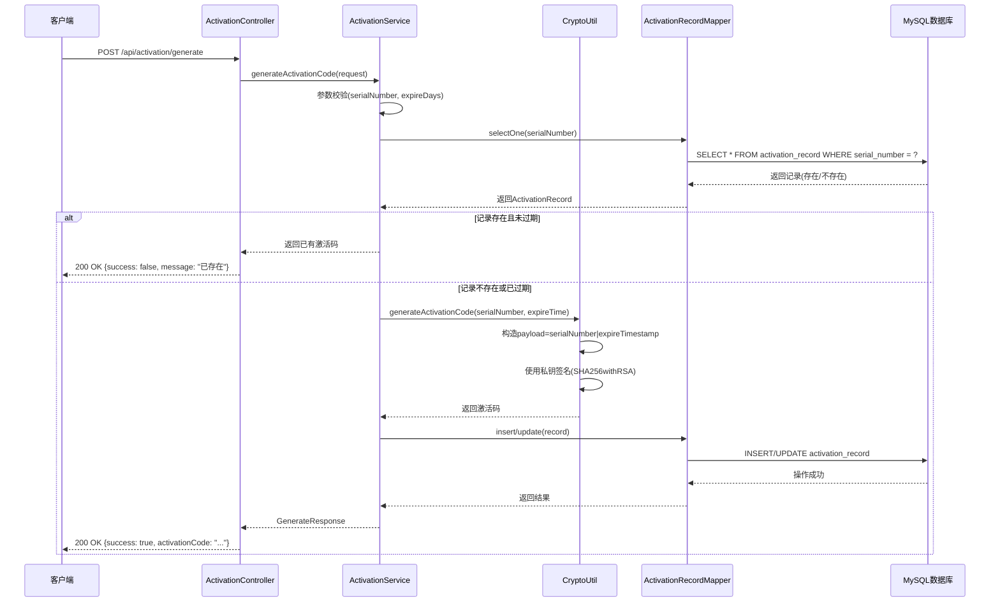
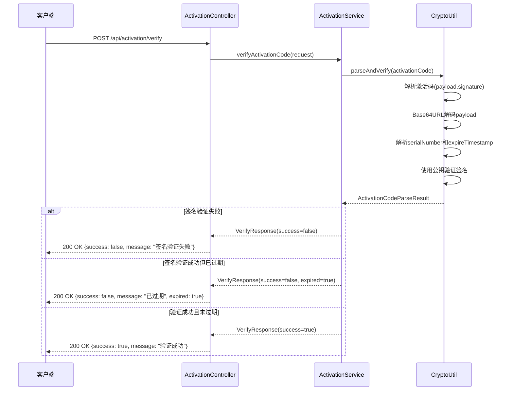
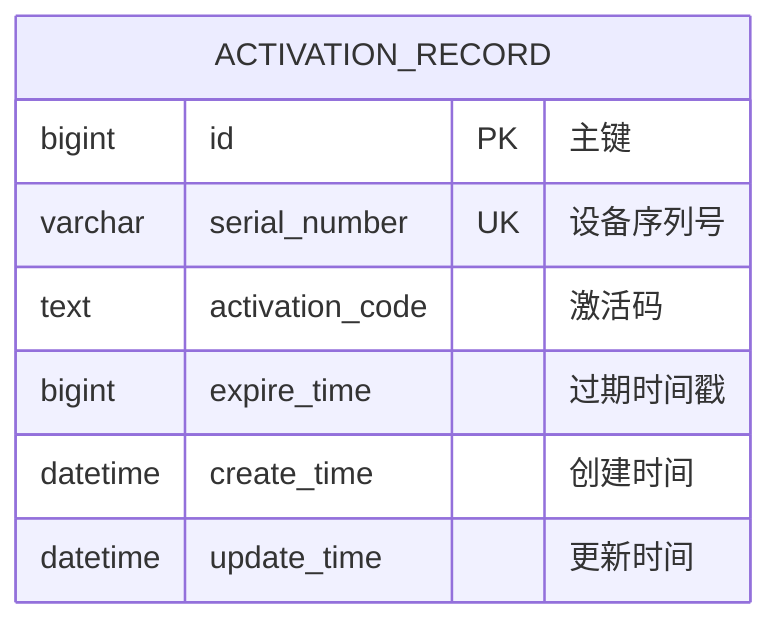

# 激活码管理系统 - 设计文档

## 1. 架构设计

### 1.1 系统架构图

```
┌─────────────────────────────────────────────────────────────────────┐
│                        客户端/前端                                  │
└───────────────────────────┬─────────────────────────────────────────┘
                            │ HTTP/REST
                            ▼
┌─────────────────────────────────────────────────────────────────────┐
│                    Spring Boot Application                         │
│  ┌──────────────┐  ┌──────────────┐  ┌──────────────────────────┐ │
│  │Controller层  │  │ Service层    │  │  Configuration          │ │
│  │Activation    │→ │ Activation   │→ │  RsaKeyConfig           │ │
│  │Controller    │  │ Service      │  │  DataSourceConfig       │ │
│  └──────────────┘  └──────────────┘  └──────────────────────────┘ │
│        │                  │                                       │
│        │                  ▼                                       │
│        │         ┌──────────────┐                                  │
│        │         │ CryptoUtil   │ ← RSA密钥对                      │
│        │         │ (加密工具类) │                                  │
│        │         └──────────────┘                                  │
│        │                  │                                       │
│        │                  ▼                                       │
│        │         ┌──────────────┐                                  │
│        └────────→│ Mapper层     │→ MySQL数据库                     │
│                  │ Activation   │                                  │
│                  │ RecordMapper │                                  │
│                  └──────────────┘                                  │
└─────────────────────────────────────────────────────────────────────┘
                            │
                            ▼
┌─────────────────────────────────────────────────────────────────────┐
│                    MySQL Database                                  │
│              activation_record 表                                  │
└─────────────────────────────────────────────────────────────────────┘
```

### 1.2 模块划分

| 模块 | 职责 | 状态 |
| :--- | :--- | :--- |
| controller | REST API控制层，处理HTTP请求 | 已实现 |
| service | 业务逻辑层，激活码生成与验证 | 已实现 |
| mapper | 数据访问层，基于MyBatis Plus | 已实现 |
| entity | 数据库实体模型 | 已实现 |
| dto | 数据传输对象（请求/响应） | 已实现 |
| util | 加密工具类（RSA签名） | 已实现 |
| config | 配置类（密钥加载、数据源） | 已实现 |

### 1.3 核心流程图

#### 1.3.1 激活码生成流程



#### 1.3.2 激活码验证流程



---

## 2. 技术选型

### 2.1 技术栈

| 分类 | 技术 | 版本 | 说明 |
| :--- | :--- | :--- | :--- |
| 语言 | Java | 21 | LTS版本，性能稳定 |
| 框架 | Spring Boot | 3.4.5 | 社区成熟，生态完善 |
| ORM | MyBatis Plus | 3.5.6 | 简化数据库操作 |
| 数据库 | MySQL | 8.0+ | 开源稳定，性能优异 |
| 连接池 | HikariCP | 5.x | Spring Boot默认连接池 |
| 加密 | JCE | Java内置 | RSA非对称加密 |

### 2.2 依赖说明

| 依赖 | GroupId | ArtifactId | 用途 |
| :--- | :--- | :--- | :--- |
| Spring Web | org.springframework.boot | spring-boot-starter-web | Web服务 |
| MyBatis Plus | com.baomidou | mybatis-plus-spring-boot3-starter | ORM框架 |
| MySQL驱动 | com.mysql | mysql-connector-j | 数据库驱动 |
| HikariCP | com.zaxxer | HikariCP | 数据库连接池 |

---

## 3. 目录结构

```
activation-code-server/
├── src/
│   └── main/
│       ├── java/
│       │   └── com/jones/activation/
│       │       ├── controller/          # REST API控制层
│       │       │   └── ActivationController.java
│       │       ├── service/             # 业务逻辑层
│       │       │   └── ActivationService.java
│       │       ├── mapper/              # 数据访问层
│       │       │   └── ActivationRecordMapper.java
│       │       ├── entity/              # 数据库实体
│       │       │   └── ActivationRecord.java
│       │       ├── dto/                 # 数据传输对象
│       │       │   ├── GenerateRequest.java
│       │       │   ├── GenerateResponse.java
│       │       │   ├── VerifyRequest.java
│       │       │   └── VerifyResponse.java
│       │       ├── util/                # 工具类
│       │       │   └── CryptoUtil.java
│       │       ├── config/              # 配置类
│       │       │   └── RsaKeyConfig.java
│       │       └── ActivationCodeServerApplication.java  # 启动类
│       └── resources/
│           ├── application.yml          # 应用配置
│           ├── logback-spring.xml       # 日志配置
│           ├── schema.sql               # 数据库初始化脚本
│           └── static/                  # 静态资源
├── rsa_keys/                            # RSA密钥目录
│   ├── private_key.pem
│   └── public_key.pem
├── logs/                                # 日志目录
│   └── activation-code-server.log
├── pom.xml                              # Maven配置
└── target/                              # 编译输出
```

---

## 4. 关键类设计

### 4.1 Controller层

**ActivationController** - [文件路径](file:///D:/huliang/java/ideaworkspace/jonesDevtools/active-manager/activation-code-server/src/main/java/com/jones/activation/controller/ActivationController.java)

| 方法名 | 功能说明 | 参数 | 返回值 |
| :--- | :--- | :--- | :--- |
| generate | 生成激活码 | GenerateRequest | GenerateResponse |
| verify | 验证激活码 | VerifyRequest | VerifyResponse |

### 4.2 Service层

**ActivationService** - [文件路径](file:///D:/huliang/java/ideaworkspace/jonesDevtools/active-manager/activation-code-server/src/main/java/com/jones/activation/service/ActivationService.java)

| 方法名 | 功能说明 | 参数 | 返回值 |
| :--- | :--- | :--- | :--- |
| generateActivationCode | 生成激活码主逻辑 | GenerateRequest | GenerateResponse |
| verifyActivationCode | 验证激活码主逻辑 | VerifyRequest | VerifyResponse |

### 4.3 工具类

**CryptoUtil** - [文件路径](file:///D:/huliang/java/ideaworkspace/jonesDevtools/active-manager/activation-code-server/src/main/java/com/jones/activation/util/CryptoUtil.java)

| 方法名 | 功能说明 | 参数 | 返回值 |
| :--- | :--- | :--- | :--- |
| generateKeyPair | 生成RSA密钥对 | keySize: int | KeyPair |
| parsePrivateKey | 解析PEM格式私钥 | privateKeyPem: String | PrivateKey |
| parsePublicKey | 解析PEM格式公钥 | publicKeyPem: String | PublicKey |
| generateActivationCode | 生成激活码 | serialNumber, expireTimestamp | String |
| parseAndVerify | 解析并验证激活码 | activationCode: String | ActivationCodeParseResult |

### 4.4 实体类

**ActivationRecord** - [文件路径](file:///D:/huliang/java/ideaworkspace/jonesDevtools/active-manager/activation-code-server/src/main/java/com/jones/activation/entity/ActivationRecord.java)

| 字段名 | 类型 | 说明 |
| :--- | :--- | :--- |
| id | Long | 主键ID |
| serialNumber | String | 设备序列号 |
| activationCode | String | 激活码 |
| expireTime | Long | 过期时间戳(毫秒) |
| createTime | LocalDateTime | 创建时间 |
| updateTime | LocalDateTime | 更新时间 |

### 4.5 DTO类

**GenerateRequest** - [文件路径](file:///D:/huliang/java/ideaworkspace/jonesDevtools/active-manager/activation-code-server/src/main/java/com/jones/activation/dto/GenerateRequest.java)

| 字段名 | 类型 | 说明 |
| :--- | :--- | :--- |
| serialNumber | String | 设备序列号（必填） |
| expireDays | Integer | 有效期天数（可选，默认365） |

**GenerateResponse**

| 字段名 | 类型 | 说明 |
| :--- | :--- | :--- |
| success | boolean | 是否成功 |
| message | String | 提示信息 |
| activationCode | String | 生成的激活码 |
| expireTime | Long | 过期时间戳 |
| serialNumber | String | 序列号 |

**VerifyRequest** - [文件路径](file:///D:/huliang/java/ideaworkspace/jonesDevtools/active-manager/activation-code-server/src/main/java/com/jones/activation/dto/VerifyRequest.java)

| 字段名 | 类型 | 说明 |
| :--- | :--- | :--- |
| activationCode | String | 激活码（必填） |

**VerifyResponse**

| 字段名 | 类型 | 说明 |
| :--- | :--- | :--- |
| success | boolean | 是否成功 |
| message | String | 提示信息 |
| serialNumber | String | 序列号 |
| expireTime | Long | 过期时间戳 |
| expired | boolean | 是否已过期 |

---

## 5. 数据库设计

### 5.1 数据库配置

| 配置项 | 值 | 说明 |
| :--- | :--- | :--- |
| 数据库类型 | MySQL | 关系型数据库 |
| 数据库名 | tools | 数据库名称 |
| 用户名 | tools | 数据库用户 |
| 密码 | toolsmarschat | 数据库密码 |
| 主机 | 192.168.31.182 | 数据库服务器地址 |
| 端口 | 3306 | MySQL默认端口 |
| 字符集 | utf8mb4 | 支持完整Unicode |

### 5.2 表结构

**表名**: `activation_record`

| 字段名 | 类型 | 约束 | 说明 |
| :--- | :--- | :--- | :--- |
| id | BIGINT | PRIMARY KEY, AUTO_INCREMENT | 主键ID |
| serial_number | VARCHAR(512) | NOT NULL, UNIQUE KEY | 设备序列号 |
| activation_code | TEXT | NOT NULL | 激活码 |
| expire_time | BIGINT | NOT NULL | 过期时间戳(毫秒) |
| create_time | DATETIME | NOT NULL, DEFAULT CURRENT_TIMESTAMP | 创建时间 |
| update_time | DATETIME | NOT NULL, DEFAULT CURRENT_TIMESTAMP ON UPDATE CURRENT_TIMESTAMP | 更新时间 |

**索引**:
- PRIMARY KEY: `id`
- UNIQUE KEY: `uk_serial_number` (serial_number)

### 5.3 ER图



---

## 6. 接口设计

### 6.1 生成激活码接口

| 属性 | 值 |
| :--- | :--- |
| URL | `POST /api/activation/generate` |
| 方法 | POST |
| 所属Controller | ActivationController |
| 功能描述 | 根据序列号生成激活码 |

**请求体**:
```json
{
  "serialNumber": "设备唯一序列号",
  "expireDays": 365
}
```

| 字段 | 类型 | 必填 | 说明 |
| :--- | :--- | :--- | :--- |
| serialNumber | String | 是 | 设备序列号 |
| expireDays | Integer | 否 | 有效期天数，默认365 |

**成功响应** (200 OK):
```json
{
  "success": true,
  "message": "激活码生成成功",
  "activationCode": "base64url_payload.base64url_signature",
  "expireTime": 1735689600000,
  "serialNumber": "设备序列号"
}
```

**失败响应** (200 OK):
```json
{
  "success": false,
  "message": "序列号不能为空",
  "activationCode": null,
  "expireTime": null,
  "serialNumber": null
}
```

### 6.2 验证激活码接口

| 属性 | 值 |
| :--- | :--- |
| URL | `POST /api/activation/verify` |
| 方法 | POST |
| 所属Controller | ActivationController |
| 功能描述 | 验证激活码有效性 |

**请求体**:
```json
{
  "activationCode": "base64url_payload.base64url_signature"
}
```

| 字段 | 类型 | 必填 | 说明 |
| :--- | :--- | :--- | :--- |
| activationCode | String | 是 | 激活码 |

**成功响应** (200 OK):
```json
{
  "success": true,
  "message": "激活码验证成功",
  "serialNumber": "设备序列号",
  "expireTime": 1735689600000,
  "expired": false
}
```

**失败响应** (200 OK):
```json
{
  "success": false,
  "message": "激活码签名验证失败",
  "serialNumber": null,
  "expireTime": null,
  "expired": false
}
```

---

## 7. 安全性设计

### 7.1 加密机制

**激活码结构**:
```
激活码 = Base64URL(payload) + "." + Base64URL(signature)
payload = serialNumber + "|" + expireTimestamp
signature = SHA256withRSA(payload, privateKey)
```

**加密流程**:
1. 构造payload: `序列号|过期时间戳`
2. 使用私钥对payload进行SHA256withRSA签名
3. 将payload和signature分别进行Base64URL编码
4. 用"."连接两部分形成最终激活码

**验证流程**:
1. 按"."分割激活码得到payload和signature
2. 对两部分分别进行Base64URL解码
3. 使用公钥验证signature是否正确
4. 解析payload获取序列号和过期时间戳
5. 检查过期时间是否有效

### 7.2 密钥管理

| 密钥类型 | 文件路径 | 用途 | 安全要求 |
| :--- | :--- | :--- | :--- |
| 私钥 | ./rsa_keys/private_key.pem | 生成激活码签名 | 严格保密，不对外暴露 |
| 公钥 | ./rsa_keys/public_key.pem | 验证激活码签名 | 可公开分发 |

**密钥生成**:
- 密钥长度: 2048位
- 算法: RSA
- 签名算法: SHA256withRSA

### 7.3 安全特性

| 特性 | 实现方式 | 说明 |
| :--- | :--- | :--- |
| 不可伪造 | RSA非对称加密 | 没有私钥无法生成有效激活码 |
| 不可篡改 | 数字签名 | 任何修改都会导致签名验证失败 |
| 防重放 | 有效期机制 | 激活码有过期时间限制 |
| 独立验证 | 验证工具仅用公钥 | 验证工具可安全分发，无法反向破解 |

---

## 8. 部署与集成设计

### 8.1 环境要求

| 环境 | 要求 |
| :--- | :--- |
| JDK | 21+ |
| Maven | 3.8+ |
| MySQL | 8.0+ |

### 8.2 配置说明

**application.yml** 关键配置:

```yaml
server:
  port: 8080

spring:
  datasource:
    url: jdbc:mysql://192.168.31.182:3306/tools?useUnicode=true&characterEncoding=utf-8&useSSL=false&serverTimezone=Asia/Shanghai&allowPublicKeyRetrieval=true
    username: tools
    password: toolsmarschat
    driver-class-name: com.mysql.cj.jdbc.Driver
    hikari:
      minimum-idle: 5
      maximum-pool-size: 20
      idle-timeout: 30000
      max-lifetime: 1800000
      connection-timeout: 30000

activation:
  rsa:
    private-key-path: ./rsa_keys/private_key.pem
    public-key-path: ./rsa_keys/public_key.pem
    key-size: 2048
```

### 8.3 启动方式

**开发态运行**:
```bash
cd activation-code-server
mvn spring-boot:run
```

**打包构建**:
```bash
cd activation-code-server
mvn clean package
```

**运行打包后的Jar**:
```bash
java -jar target/activation-code-server-1.0.0.jar
```

---

## 9. 监控与日志设计

### 9.1 日志配置

日志框架: Logback

**日志级别**:
- DEBUG: 详细调试信息
- INFO: 业务操作日志
- WARN: 警告信息
- ERROR: 错误信息

**日志文件**:
- 路径: `./logs/activation-code-server.log`
- 滚动策略: 按天滚动
- 保留天数: 30天

### 9.2 关键日志点

| 日志位置 | 日志内容 | 级别 |
| :--- | :--- | :--- |
| ActivationController | 收到生成/验证请求 | INFO |
| ActivationService | 参数校验失败 | WARN |
| ActivationService | 激活码已存在 | INFO |
| CryptoUtil | 生成/验证激活码 | INFO |
| CryptoUtil | 签名验证失败 | WARN |

### 9.3 指标监控

| 指标 | 说明 | 采集方式 |
| :--- | :--- | :--- |
| 请求总数 | 接口调用次数 | 日志统计 |
| 成功请求数 | 成功响应次数 | 日志统计 |
| 失败请求数 | 失败响应次数 | 日志统计 |
| 响应时间 | 请求处理耗时 | 日志统计 |
| 数据库连接数 | HikariCP连接池状态 | 日志统计 |