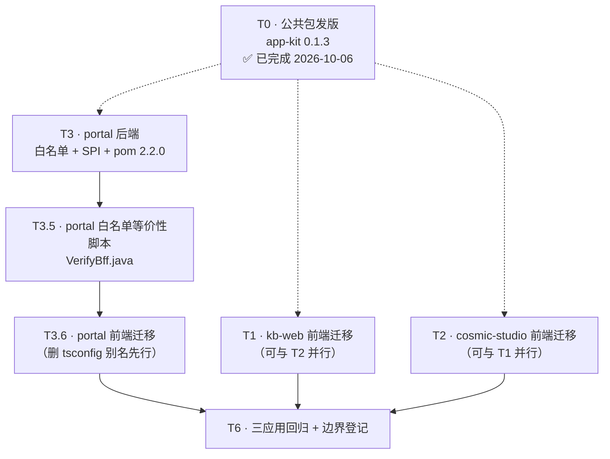

# Phase 13 · 剩余三应用（kb-web / portal / cosmic-studio）迁移增量设计

> **定位**：本文是 `PHASE13-CONFIG-DRIVEN-ONBOARDING.md` 与 kb-ops 迁移记录的**增量**部分，
> 只写「剩余 3 个应用」与已迁 3 个应用不同的地方，不重复已有内容。
> **日期**：2026-10-06 ｜ **状态**：设计完成，待工程师实施
> **证据标注约定**：🔵 = 我本机实测（有文件路径 + 行号）；🟡 = 推断，需工程师验证

---

## 0. 三个应用的形态差异总览（决定迁移方案分叉的根本原因）

| 维度 | kb-web | portal | cosmic-studio |
|---|---|---|---|
| 后端技术栈 | `mykng/kb-gateway` = **Spring Cloud Gateway（WebFlux）** 🔵 | `portal-server` = Servlet MVC + MyBatis-Plus，**无 Spring Security** 🔵 | **Python FastAPI** 🔵 |
| 后端能否用 auth-core BFF | ❌ **物理不可**（见 §1.3） | ✅ 可，但**必须自定义 SPI**（见 §3.3） | ❌ **物理不可**（JVM 库） |
| 浏览器持有的凭据 | auth-center 签发的 **OIDC access_token**（public client + PKCE）🔵 | **portal-server 自签 HS256** `portal_token` 🔵 | **Python 后端自签两段式** `localStorage.token` 🔵 |
| 令牌键 | `kb_access_token` / `kb_refresh_token` / `kb_token_kind` / `kb_id_token` 🔵 | **`portal_token`** / `portal_token_kind` 🔵 | **`token`** / `cosmic_token_kind` 🔵 |
| app-kit `deriveTokenKeys` 能否派生 | ✅ `tokenKeyPrefix: 'kb_'` 即可 🔵 | ❌ 派生必得 `portal_access_token` 🔵 | ❌ 派生必得 `cosmic_access_token` 🔵 |
| `sessionMode` | `oidc`（默认） | **`bff`** 🔵 | **`bff`** 🟡 |
| 权限查询走哪 | 直连 `issuer`（中心）🔵 | **自家 Python/门户 BFF 代理** 🔵 | **自家 Python BFF 代理** 🔵 |
| 菜单形态 | `createKbMenus(ctx)` **工厂函数**（93 行，依赖 store 闭包）🔵 | **无 menus.ts**，导航在 `MainLayout.vue` 内联 🔵 | 菜单由**后端** `GET /api/studio/menus` 动态下发 🔵 |
| 用户管理页路由 | `/users`（自己 `UsersView.vue`）🔵 | `/users`（app 作用域）+ `/admin`（**platform 作用域 4 页签**）🔵 | `/admin`（`Admin.vue` 内嵌面板 + LLM 配置）🔵 |
| `tsconfig` 有 `@marschat/*` 源码别名 | ❌ 无 ✅ | 🔵 **有 2 条**（T-LOW-18 风险） | 无（纯 JS，无 tsconfig） |

---

# 1. kb-web —— 纯前端迁移（后端免迁）

## 1.1 前端：`src/marschat.ts` 完整装配参数

```ts
// mykng/kb-web/src/marschat.ts
import { createMarschatApp } from '@marschat/app-kit'
import router from '@/router'
import { createKbMenus } from '@/menus'
import { APP_OPTIONS, RUNTIME, type MenuCtx } from '@/config'

export const marschat = createMarschatApp({
  ...APP_OPTIONS,
  router,
  menus: createKbMenus(buildMenuCtx()),   // ⚠️ 见 §1.2「菜单工厂的时序陷阱」
  runtime: RUNTIME,
  autoRoutes: false,                        // 路由沿用既有 router/index.ts（含 MainLayout 嵌套 + ?redirect=）
})

export const { config, sso, request, permissions } = marschat
```

```ts
// mykng/kb-web/src/config.ts
import type { AppOptionsInput } from '@marschat/app-kit'

// 🔴 `satisfies`（形态 2）而**非** `as const`：
//    🔵 我在 portal 真实环境注入 `tokenKeyz` 实测（--strict）——
//    `as const` 那行**完全静默**，只有 `satisfies` 报 TS2561「Did you mean to write 'tokenKeys'?」
//    ⇒ 这是**必需**（防 tokenKeys 拼错 → 权限不带 Bearer → 静默全放行），不是可选优化。
//    ✅ 三形态与 resolveAppConfig 形参均兼容（无 TS2345），形态 2 最简。
export const APP_OPTIONS = {
  appId: 'marschat-kbweb',       // 🔵 apps-registry.yml:39
  contextPath: '/kb',            // 🔵 apps-registry.yml:57 + kb-web/src/config.ts:29
  apiBase: '/kb/api',            // 🔵 apps-registry.yml:58 + config.ts:32
  authApiBase: '/kb/api/auth',   // 🔵 src/views/login/LoginView.vue:26（authApiBase: '/kb/api/auth'）
  tokenKeyPrefix: 'kb_',         // 🔴 必须显式传，见 §1.4
  // 🔴 必须显式传，见 §1.4.1「homePath 是家族约定不是平台默认」
  homePath: '/dashboard',
  // 🔴 `satisfies` 而非 `as const`：kb-ops / infra 现用 `as const`，它只锁字面量、
  //    **不施加结构约束** ⇒ 字段名拼错被静默接受。详见 §3.8.1 末段。
} satisfies AppOptionsInput
```

**逐字段取值理由**

| 字段 | 取值 | 理由（证据） |
|---|---|---|
| `appId` | `marschat-kbweb` | `apps-registry.yml:39`；kb-web `config.ts:40` 已硬编码同一值 |
| `contextPath` | `/kb` | `apps-registry.yml:57`；`config.ts:29` 默认值同 |
| `apiBase` | `/kb/api` | `apps-registry.yml:58`；`config.ts:32` 同。⚠️ **不能**写成 `/kb/kb/api`（坑 #1 家族） |
| `authApiBase` | `/kb/api/auth` | 🔵 `views/login/LoginView.vue:26` 明确 `authApiBase: '/kb/api/auth'`。app-kit 默认派生为 `${apiBase}/auth` = `/kb/api/auth`，**恰好一致**，但仍显式写（口径统一，避免 apps-registry 一改就漂） |
| `tokenKeyPrefix` | `'kb_'` | 🔵 `utils/token.ts:13-19` 四个键全为 `kb_*`；app-kit 派生默认是 `kbweb_*` → 不传则**全员登录态消失** |
| `autoRoutes` | `false` | kb-web 有自己的 `LoginView` / `SsoCallbackView` / `UsersView`（`router/index.ts:16/23/130`），且 `MainLayout` 嵌套子路由；开自动路由会**重复注册**同名路由 |
| `menus` | `createKbMenus(ctx)` | 见 §1.2 |
| `runtime` | `readRuntimeConfig('/')` | kb-web 现有 `config.ts:14-15` 用 `${import.meta.env.BASE_URL}app-config.json`；app-kit 的 `readRuntimeConfig` 剥 `//` 横幅（坑 #4），kb-web 现有代码**已手写了同样的剥注释逻辑**（`config.ts:21`） |
| `prefetchPermissions` | 默认 true | 现有 `main.ts:65` 有 `void permissions.ensure()`，语义一致 |
| `watchSession` | 默认 true | 🔴 **但见 §1.5 风险 R1**：kb-web `main.ts:59` 有一层 `isOidcToken(bootToken)` 分流，app-kit 的 `bootstrap()` **只判 `getToken()` 非空 + sessionMode**，`sessionMode` 默认 `'oidc'` → **账密/邮箱码会话也会启动监视器** → 复现 Phase 11「3 秒后被踢」事故 |
| `adminBypass` | 默认 true | 与现有 `permissions.ts` 无 `adminBypass` 字段（走 undefined）相比是**放宽**；🟡 需确认中心侧是否会对 kb-web 下发非 admin 用户的权限点集 |

### 1.4.1 🔴 `homePath` 是 **kb-ops 家族约定，不是平台默认** —— 三个应用都要显式传

🔴 **缺陷（2026-10-06 由 software-engineer-cosmic 在迁移自查中发现，已复核）**：
`resolveAppConfig` 不传 `homePath` 时回落内置默认 🔵 `config.ts:19` `DEFAULTS.homePath = '/dashboard'`。
而装配层的路由守卫拒绝分支是 🔵 `createMarschatApp.ts:151-155`：
```ts
onDeny: () => { void options.router.replace(config.homePath) }   // → replace('/dashboard')
```
⇒ **`/dashboard` 是 kb-ops / infra-monitor / kb-web 三家的首页约定**（🔵 三家
`router/index.ts` 均有 `path: 'dashboard'`，且 kb-ops `:27` / infra `:31` 还有 `redirect: '/dashboard'`），
**不是全平台默认**。

🔴 **kb-web 恰好有 `/dashboard`**（🔵 `kb-web/src/router/index.ts:44 path: 'dashboard'`）
⇒ 巧合不漏。但**另两个应用会中招**：

| 应用 | 迁移前 `onDeny` | 是否有 `/dashboard` | 不传 `homePath` 的后果 |
|---|---|---|---|
| kb-web | 🔵 `permissions.ts:89` `router.replace('/dashboard')` | ✅ **有**（`router/index.ts:44`） | 巧合不漏，但**仍应显式传**（依赖默认值 = 埋雷） |
| **portal** | 🔵 `permissions.ts:90` **`router.replace('/')`** | ❌ **没有**（`router/index.ts:26-36` 首页是 `path: '/'` + 子路由 `path: ''`） | 🔴 **权限点被收回 → 跳 `/dashboard` → vue-router 无此路由 → 空白页**（功能回退） |
| **cosmic** | 🔵 `permissions.js:77` **`router.replace('/')`** | ❌ **没有**（`router.js:16` 首页是 Layout 的空子路由 `''`） | 🔴 **同上**（engineer-cosmic 已实测确认并在其 `config.js` 修好） |

🔴 **为什么这条极难在常规回归里发现**：
只在「**权限点被收回**」这条低频路径上出现 —— 需要管理员先在中心把某个 menu 权限点摘掉，
普通回归跑 100 遍都不会碰到。**且症状是「空白页」而非报错**，排查时容易误判为「权限 bug」。

**处置**：
1. ✅ **kb-web**：`homePath: '/dashboard'`（显式，与现状逐字一致）
2. ✅ **portal**：`homePath: '/'`（🔵 对齐迁移前 `permissions.ts:90` 的真实行为）
3. ✅ **cosmic**：`homePath: '/'`（🔵 对齐迁移前 `permissions.js:77`；engineer-cosmic 已落地）
4. 🔴 **回归必加一条**：三个应用各跑一次「进门户/知识库 → 让管理员在中心摘掉一个 menu 权限点
   → 重新点该入口 → **必须落回工作台，不能是空白页**」
5. 🟡 **建议在 `docs/README.md` 坑表加一条编号坑**（当前最高编号 #39 ⇒ 建议 **#40**）：
   > **`homePath` 默认值 `/dashboard` 是 kb-ops 家族约定，不是平台默认** ——
   > 守卫 `onDeny` 跳不存在的路由 ⇒ 权限点被收回时白屏，且只在低频路径出现、常规回归测不出。
   > 接入方**必须显式传**本应用真实首页。

> 📌 **对已迁三应用的影响核查**（我已实测）：kb-ops（`router/index.ts:30` 有 `dashboard`）✅、
> infra-monitor（`:34` 有 `dashboard`）✅ —— **两者巧合不漏，无需改动**。
> activecode 前端未迁（UMD，`T-ENG-5`）不适用。**故这是「新增应用的坑」，不是「存量缺陷」**。

## 1.2 菜单：`createKbMenus` 工厂的时序陷阱（🔴 本迁移最易踩的坑）

kb-web 的 `menus.ts:27` 是**工厂函数**，签名 `createKbMenus(ctx: KbMenuCtx): MenuItemDef[]`，
`ctx` 是 9 个闭包（`hasCurrentSpace` / `kbKnowledgeAvailable` / `isAdmin` …），依赖 pinia store。

**问题**：`marschat.ts` 在模块求值期执行（被 `main.ts` import），此时 **pinia 尚未 `app.use()`**
（`main.ts:37` 才 `app.use(pinia)`）⇒ 若在 `marschat.ts` 顶层直接 `useSpaceStore()` 取值会抛
`getActivePinia() was called with no active Pinia`。

**两种解法，推荐 A**：

| 方案 | 做法 | 评价 |
|---|---|---|
| **A（推荐）** | `buildMenuCtx()` 返回**全部为箭头函数**的对象，箭头函数体**不在模块求值期执行**，只在 `useMenus()` 渲染菜单时调用 → 此时 pinia 已激活 | 零改动 `menus.ts`（93 行不动），与 kb-ops「未改动 menus.ts」的先例一致 |
| B | `app.use(pinia)` 提前到 `import './marschat'` 之前 | ❌ 反直觉，且 pinia 实例要跨模块共享，徒增复杂度 |

> 🟡 **需工程师验证**：`useMenus`（`auth-components/src/composables/useMenus.ts`）是否在
> `visibleMenus` 的**每次计算**时重新求值 `visibleFn`。若是 computed 缓存且菜单在
> `createMarschatApp` 时就被求值一次，方案 A 的闭包仍会拿到「未初始化」的值。
> **验证命令**：迁后打开 kb-web，切到另一个知识空间，确认侧边栏「当前空间」项**跟着变**。

## 1.3 后端：**免迁**（理由必须写进 STATUS.md）

🔵 **证据链**：
1. `mykng/kb-gateway/pom.xml:42` `spring-cloud-starter-gateway` + `:60` `spring-boot-starter-webflux`
   → 是 WebFlux 应用，**无 Servlet 容器**。
2. `auth-core` 的 `MarschatBffAutoConfig.java:28` 标注 `@ConditionalOnClass(name = "jakarta.servlet.http.HttpServletRequest")`
   → **类路径无 Servlet ⇒ BFF 不装配**。
3. `auth-core/pom.xml:63-68` `spring-boot-starter-web` 标 `<optional>true</optional>`
   → 不传递到 kb-gateway（`kb-gateway/pom.xml:26` 注释亦明写「不会把 servlet/tomcat 带入 WebFlux 网关」）。

**结论**：kb-web 后端**禁止**加 `bff-whitelist.yml` / `marschat.bff.enabled` ——
即使加了也**不生效**（假接入：文件存在但零规则被加载，比不加更危险，因为会误导后人以为已迁）。

🔵 kb-web 的 BFF 功能**已由网关路由实现**（`kb-gateway/src/main/resources/application.yml:112-136`）：
| 路由 id | 行号 | Path 谓词 | Method | 目标 |
|---|---|---|---|---|
| `kb-admin-proxy-read` | 115-122 | `/kb/api/admin/users,/kb/api/admin/users/*,/kb/api/admin/roles` | GET | `lb://auth-center` |
| `kb-admin-proxy-scoped` | 124-129 | `/kb/api/admin/users/*/client-roles,.../menu-overrides` | GET,PUT | `lb://auth-center` |
| `kb-admin-proxy-clients` | 131-136 | `/kb/api/admin/clients/marschat-kbweb/**` | 任意 | `lb://auth-center` |

🔵 三条都是 `StripPrefix=2`（剥掉 `/kb/api`）→ 中心收到 `/admin/...`。
**⚠️ 这三条路由的白名单宽度与 kb-ops 的 `bff-whitelist.yml`（9 条）不同**：
网关侧有 `/admin/users/*` 单段通配（可命中 `/admin/users/{id}`），而 kb-ops 白名单**刻意不放行**
`PUT /admin/users/{id}`（改身份）。**结论：网关侧比 kb-ops 宽** —— 见风险 R4。

## 1.4 令牌键：只需 `tokenKeyPrefix`（三应用中唯一无需改公共包的）

🔵 kb-web 键名（`utils/token.ts:13-19`）：`kb_access_token` / `kb_refresh_token` / `kb_token_kind` / `kb_id_token`
🔵 `deriveTokenKeys('marschat-kbweb', 'kb_')` 产出（`config.ts:131-141` 公式）：
`kb_access_token` / `kb_refresh_token` / `kb_token_kind` / `kb_id_token` → **四项全等**。

⇒ **kb-web 不需要给 app-kit 加任何能力**。

## 1.5 删/改文件清单与引用点重定向

**删除（3 个手写适配层，共 261 行）**

| 文件 | 行数 | 删除理由 |
|---|---|---|
| `src/utils/sso.ts` | 131 | 🔵 16 个导出全是 `bootstrapLoginPage` / `renewByReauthorize` 等**裸转发**，能力在 `auth-components` |
| `src/utils/permissions.ts` | 93 | 🔵 `permOptions` + `createAuthGuard` 由 app-kit ⑥ 接管 |
| `src/utils/token.ts` | 37 | 🔵 纯 `initTokenConfig` + 转发 |

**重写（2 个）**

| 文件 | 现状行数 | 目标 |
|---|---|---|
| `src/config.ts` | 42 | ~90 行：照抄 `kb-ops/kb-ops-web/src/config.ts` 形态，导出 `APP_OPTIONS` / `RUNTIME` / `APP_CONFIG` / `CONTEXT_PATH` / `API_BASE_URL` / `AUTH_BASE_URL` / `permCode()` / `currentSpaPath()` / `permOptions` + 令牌便捷出口 |
| `src/main.ts` | 66 | ~35 行：删 `startSessionWatcher` / `permissions.ensure` / `getToken` 引导，改为 `marschat.install(app)` + `marschat.bootstrap()` |

**引用点重定向清单（🔵 全部由 grep 实测得出，共 17 处）**

| 文件:行 | 现 import | 改成 | 备注 |
|---|---|---|---|
| `src/api/index.ts:3` | `@/utils/token` 的 6 个令牌函数 | `@/config` | |
| `src/api/index.ts:4` | `@/utils/sso` 的 `renewByReauthorize` | `@/config` 的 `sso.renew` | 🔴 见风险 R2：**这份 axios 是手写的，不在 app-kit 覆盖范围内** |
| `src/api/index.ts:7` | `@/config` 的 `CONTEXT_PATH` | 不变 | 但 `config.ts` 的实现换成 `APP_CONFIG.contextPath` |
| `src/layouts/MainLayout.vue:206` | `@/utils/token` `getToken` | `@/config` | |
| `src/layouts/MainLayout.vue:207` | `@/utils/sso` `decodeOidcClaims` | `@/config` | |
| `src/layouts/MainLayout.vue:208` | `@/utils/permissions` `permOptions` | `@/config` | |
| `src/router/index.ts:3` | `@/utils/token` `getToken` | `@/config` | |
| `src/router/index.ts:5` | `@/config` `CONTEXT_PATH as ctx` | 不变 | |
| `src/router/index.ts:6` | `@/utils/permissions` `permCode` + `setupAuthGuard` | `@/config` 的 `permCode`；**删 `setupAuthGuard(router)` 调用** | 🔴 app-kit ⑥ 已注册守卫，重复注册会**双重判定** |
| `src/stores/user.ts:6` | `@/utils/token` 5 个函数 | `@/config` | |
| `src/stores/user.ts:7` | `@/utils/sso` `ssoLogout` | `@/config` 的 `sso.logout` | |
| `src/utils/errorReporter.ts:2` | `./token` `getToken` | `@/config` | 🔵 靠 `replace_all` 一网打尽 |
| `src/views/login/LoginView.vue:7` | `@/utils/sso` 三个 | `@/config`（`sso` / `SSO_CONFIG`）+ **新增 `bootstrapLoginPage` 薄封装** | app-kit **不导出** `bootstrapLoginPage`，见 §1.6 |
| `src/views/settings/UsersView.vue:20` | `@/utils/token` `getToken` | `@/config` | |
| `src/views/settings/UsersView.vue:21` | `@/utils/sso` `decodeOidcClaims` + `renewByReauthorize` | `@/config` | |
| `src/views/settings/UsersView.vue:22` | `@/config` `OIDC_CLIENT_ID` + `API_BASE_URL` | `@/config` 的 `APP_CONFIG.clientId` / `APP_CONFIG.apiBase` | ⚠️ `OIDC_CLIENT_ID` 常量**不再导出**，改用 `APP_CONFIG.clientId` |
| `src/views/sso/SsoCallbackView.vue:24-25` | `@/utils/sso` + `@/utils/token` | `@/config` | 🔴 见风险 R3：**回调页不能删**，`autoRoutes:false` 下它仍是自己路由 |

**修改**：`package.json` 加 `"@marschat/app-kit": "^0.1.3"`（§4.1 需要 0.1.3）

**未改动**：`menus.ts`（93 行）、所有 `views/*` 业务页、`api/*`（除 import 路径）、路由结构、
`MainLayout.vue` 模板与样式、`UsersView.vue` 的面板配置。

## 1.6 app-kit 缺 `bootstrapLoginPage` 的补法

🔴 **实测缺口**：`createMarschatApp` 未暴露 `bootstrapLoginPage`（`createMarschatApp.ts` 无此导出），
而 kb-web `LoginView.vue:70` 与 portal/cosmic 的登录页都靠它做「进登录页先探 IdP 会话 → 免登」。

**方案（kb-web / portal / cosmic 三处一致）**：在各自的 `config.ts` 里加 **3 行薄封装**，
不改公共包：

```ts
export async function bootstrapLoginPage(redirect?: string): Promise<boolean> {
  const probe = await sso.probeSession()
  if (!probe.authenticated) return false
  sso.login(redirect)          // portal/cosmic 改为 window.location.href = bffAuthorizeUrl(...)
  return true
}
```

理由：这是「页面级 UX 编排」，不是「接入管道」；且 portal/cosmic 的跳转目标**根本不同**
（走自家 BFF 授权入口，见 §2.5 / §4.4），公共包无法统一。**明确不作为公共包缺口登记。**

## 1.7 kb-web 风险清单

| # | 风险 | 依据 | 处置 |
|---|---|---|---|
| **R1** | 🔴 **会话监视器误启动** → 账密/邮箱码会话「3 秒后被踢 `/login?slo=1`」 | kb-web `LoginView.vue:20-24` 三种登录齐备（`showMailLogin:true` + `onLogin`）；`main.ts:49-62` 有专门的 `isOidcToken` 分流注释；app-kit `createMarschatApp.ts:233-235` 只判 `sessionMode==='oidc' && getToken()` | 🔴 **必须传 `sessionMode` 语义修正**。但 `sessionMode: 'bff'` 会让 kb-web 的**真 OIDC 会话也失去监视**（装配层 `bootstrap()` 里 oidc 分支不执行）→ **正解：保留 `sessionMode:'oidc'`（默认），改传 `watchSession: false`，然后在 `main.ts` 里保留 kb-web 现有的 `if (isOidcToken(getToken())) startSessionWatcher()` 手工调用（从 `@/config` 取 `sso`）**。这样行为**逐字不变** |
| **R2** | 🔴 **`api/index.ts` 的手写 axios 不受 app-kit 覆盖** → 401 静默续期仍是死代码 | 🔵 `api/index.ts` 是 150+ 行手写 axios（`:28` `axios.create`），**不是** `createRequest`；app-kit 的 `request` 句柄（`createMarschatApp.ts:124`）虽然创建了但 kb-web 现有代码**从不 import 它**（kb-ops 也是这样：`kb-ops-web` 全仓只有 `main.ts` import `@/marschat`，`api/*` 仍走自己的 `utils/request.ts`） | **处置：本次不迁移 `api/index.ts` 的 axios 实现**，只重定向 import（它有 34 行精心写的业务信封判定 + traceId 透传 + 双分流续期，是**业务资产**不是胶水）。⚠️ 但需**明确记录**：`marschat.request` 句柄在 kb-web 是**未使用状态** —— 这是**有意的**（kb-ops 同款），不是漏迁 |
| **R3** | 🔴 **回调页/登录页仍要自己** | `autoRoutes:false` | 保留 `LoginView.vue` / `SsoCallbackView.vue`，仅改 import。🔴 **注意 `SsoCallbackView.vue` 里的 `router.replace` 目标**必须是**路由内路径**，否则 `/kb/kb/dashboard` 404（坑 #1） |
| **R4** | 🟠 **网关白名单比 kb-ops 宽**：`/kb/api/admin/users/*` 单段通配 + GET/Method 谓词 → `GET /kb/api/admin/users/{id}` 是放行的（若中心有该端点） | `application.yml:118-120` | 🟡 **工程师需核**：`GET /admin/users/{id}` 在中心是否存在。若存在且不应暴露 → 收窄网关路由谓词。**这属于网关配置审计，不在本次迁移范围内**，建议单独立项 |
| **R5** | 🟠 **类型错误存量** | `kb-web` 未做迁移前基线 | 🟡 先跑一次 `vue-tsc --noEmit` 记基线数字，迁移后对比**增量**（kb-ops 记录里 28→27 是这个用法） |
| **R6** | 🟡 `useMenus` 是否重新求值 `visibleFn` | 见 §1.2 | 浏览器实测 |
| **R7** | 🔴 **`homePath` 默认值 `/dashboard` 虽在 kb-web 存在，但依赖默认值=埋雷** | §1.4.1 | ✅ **显式传 `homePath: '/dashboard'`**。kb-web 是三家中唯一「巧合不漏」的 ⇒ 最容易漏掉显式声明，后人改路由时炸 |

---

# 2. portal —— 前后端全迁（风险最高，最后做）

## 2.1 前端：`src/marschat.ts` 完整装配参数

```ts
// portal/src/marschat.ts
import { createMarschatApp } from '@marschat/app-kit'
import router from '@/router'
import { APP_OPTIONS, RUNTIME } from '@/config/runtime'

export const marschat = createMarschatApp({
  ...APP_OPTIONS,
  router,
  menus: PORTAL_MENUS,        // 🟡 见 §2.2「portal 无 menus.ts」
  runtime: RUNTIME,
  autoRoutes: false,          // 🔵 router/index.ts:14 自有 /login，:21 自有 /auth/callback，:38/45/57 自有子路由
  // 🔴 BFF 会话：浏览器无 IdP 会话，会话监视必须关（否则账密会话 3 秒后被踢）
  sessionMode: 'bff',
  watchSession: false,
  usersPath: false,           // 🔵 portal 的用户管理是 /users + /admin 两个自定义页，且 /admin 是 platform 作用域
})

export const { config, sso, permissions } = marschat
// ⚠️ 刻意**不导出** request：portal 的三个 axios 实例（auth/portal/admin）各有独立 baseURL 与
//    401 语义，见 §2.6 风险 P2
```

```ts
// portal/src/config/runtime.ts（重写）
import type { AppOptionsInput } from '@marschat/app-kit'

export const APP_OPTIONS = {
  appId: 'marschat-portal',      // 🔵 apps-registry.yml:21
  contextPath: '/portal',        // 🔵 apps-registry.yml:36 + runtime.ts:28
  apiBase: '/portal/api',        // 🔵 apps-registry.yml:37
  authApiBase: '/portal/api',    // 🔵 runtime.ts:31（不是 ${apiBase}/auth！）
  homePath: '/',                // 🔴 必须显式传，见 §1.4.1：默认 `/dashboard` 在 portal 不存在 → 白屏
  tokenKeys: {                   // 🔴 §2.4：必须显式传 tokenKeys，deriveTokenKeys 派生不出
    accessTokenKey: 'portal_token',
    tokenKindKey: 'portal_token_kind',
    refreshTokenKey: 'portal_token',   // 🟡 见下方说明
    idTokenKey: 'portal_id_token',
  },
  // 🔴 `satisfies` 而非 `as const`：🔵 已在 portal 真实环境实测 —— `as const` 对字段名拼错
  //    **完全静默**（同文件 `satisfies` 那行报 TS2561），本文件有 `tokenKeys`/`permissionsIssuer`
  //    两个 0.1.3 新字段 + `authApiBase`/`homePath` 两个易错键 ⇒ 四个键全靠这层保护。
  //    ✅ 已实测三形态与 `resolveAppConfig` 形参均兼容（无 TS2345），不需要退化为 `as const satisfies`。
} satisfies AppOptionsInput
```

**逐字段理由**

| 字段 | 取值 | 理由 |
|---|---|---|
| `sessionMode: 'bff'` | 必传 | 🔵 `stores/user.ts:66` 账密走 BFF 换票、`:74` SSO 才标 `'oidc'`；app-kit `createMarschatApp.ts:233` 已是「仅 oidc 启监视」，传 `'bff'` 即自动不启 —— **与 portal 现状（`main.ts:58` `if (isOidcToken())`）语义一致** |
| `watchSession: false` | 必传 | 🔴 **portal 必须保留自己的会话监视**！它的 SSO 会话（`token_kind='oidc'`）**确实有 IdP 会话可监视**（`main.ts:59-68` 传了 `getLocalIdentity: () => userStore.authUid`）。若只靠 `sessionMode:'bff'`，**portal 的跨应用单点登出联动能力直接消失**（T-LOW 无编号，但属功能回退） |
| `authApiBase` | `/portal/api` | 🔵 `runtime.ts:31` 的 `API_BASE_URL` 就是它；app-kit 默认派生 `${apiBase}/auth` = `/portal/api/auth` —— 但 portal 的认证端点是 `/portal/api/auth/{login,sso/exchange,mail-login}`（`request.ts:8`），**前缀是 `/portal/api` 而非 `/portal/api/auth`** ⇒ 必须显式。🔴 **但绝不可填 `/portal/auth-api`** —— 那是指向 auth-center 的 nginx 路由，语义完全不同，见 §2.1.1 |
| **`homePath`** | **`'/'`** | 🔴 **必须显式**。app-kit 默认 `DEFAULTS.homePath='/dashboard'`（`config.ts:19`），而 portal **无 `/dashboard` 路由**（`router/index.ts:26-36` 首页是 `path: '/'`）⇒ 守卫 `onDeny`（`createMarschatApp.ts:154`）会跳到不存在的路由 ⇒ **白屏**。迁移前 `utils/permissions.ts:90` 是 `router.replace('/')` ⇒ **`'/'` 才是 portal 的真实首页**。详见 §1.4.1 |
| `autoRoutes: false` | 必传 | 🔵 `router/index.ts` 已有 `/login`(:14)、`/auth/callback`(:21)、`/users`(:45)、`/admin`(:57)。⚠️ portal 的回调路径是 `/auth/callback`（不是默认 `/sso-callback`）—— 即便开自动路由也要改 `callbackPath`，**不如保持 false** |
| `usersPath: false` | 必传 | app-kit 的 `buildUsersRoute`（`createMarschatApp.ts:354`）硬编码 `scope: { mode:'app', clientId }`，**无法表达 portal 的 platform 作用域 4 页签** ⇒ `/users` 页必须由 portal 自己的 `UsersView.vue` 承担（它已经是了） |
| `menus` | 见 §2.2 | |

🔴 **`watchSession:false` 的正确组合**（写给工程师，勿简化）：
```
sessionMode: 'bff'      // 让装配层不启监视（避免账密会话 3 秒被踢）
watchSession: false     // 双重保险，防 sessionMode 被误改
+ main.ts 保留原有 if (isOidcToken()) startSessionWatcher({...}) 逻辑，从 @/config 取 sso
```
这与 kb-web 的 R1 处置**同构**：装配层负责「不该启的别启」，应用层保留「该启的照启」。

> ✅ **0.1.4 已发布（2026-10-06 11:55Z+8），本节处置可简化为一行** ——
> 🔵 主理人权威核实 `npm view`：versions 含 `0.1.4`、`latest: 0.1.4`、`modified 03:55Z`。
> 0.1.4 新增 `watchSession?: boolean \| (() => boolean)`（🔵 `createMarschatApp.ts:270-272`
> `typeof === 'function'` → 取其返回值；否则 `(?? true) && sessionMode==='oidc'`，**与 0.1.3 完全兼容**）。
> ⇒ **推荐写法**：`watchSession: () => isOidcToken()` —— **删掉 `main.ts` 的手工分流**。
> 📌 **判据是「是否纯 oidc」，不是「是否用 BFF」**（🔵 `types.ts:177` 原文警告「反向坑」：
> 纯 BFF 单模应用传 `false` 会平白丢掉 SLO 联动）。
> 🟡 **但 kb-web / portal 的 `getLocalIdentity` 仍需应用侧注入**（portal 要传 `() => userStore.authUid`），
> 该部分**不随 0.1.4 免除**。
> ⚠️ **两阶段不可混**：若已按 0.1.3 写（`watchSession:false`），升级 0.1.4 后**不必立刻改** ——
> 布尔路径在 0.1.4 仍是合法分支。建议**迁移轮次先按 0.1.3 口径跑通提测，0.1.4 优化作后续独立小改**，
> 避免「portal 用的哪个版本」再次变复杂（本轮已因 0.1.3→0.1.4 反复过一次）。

## 2.1.1 🔴🔴 `authApiBase`「同名不同义」—— 三重语义冲突（本轮主理人裁决保留 `/portal/auth-api` 不动）

🔴 **这是本轮最容易误改的一处**。`authApiBase` 这个名字下有**三种不同语义**：

| # | 语义 | 实例 | 目标 | 谁在用 |
|---|---|---|---|---|
| ① | **app-kit 装配参数**：本应用 BFF 的认证基址 | 🔵 `config.ts:223` 默认 `${apiBase}/auth`；🔵 `createMarschatApp.ts:366` 拼 `${authApiBase}/login` | **portal-server**（`:8087`） | 装配层 `createRequest` + 账密登录 |
| ② | **`LoginPage` 组件配置**：auth-center 业务 API（忘记密码/重置密码） | 🔵 `views/LoginView.vue:37` `authApiBase: '/portal/auth-api'` | **kb-gateway → auth-center**（`:8090/kb/api/auth/`） | 登录页「忘记密码」按钮 |
| ③ | **`apps-registry.yml` 登记字段**：运行时配置产物 | 🔵 `apps-registry.yml:78` kb-ops `auth-api-base: /ops/auth-api` · `:104` infra `auth-api-base: /infra/api` | 随应用而异 | `gen-from-registry.py` → `app-config.json` |

🔵 **② 的真实路由证据**（我已查到定义处，不只是「可能是 nginx」）：
```
config-as-code/hosts/mykng/nginx/conf.d/locations/portal.conf:6
    location /portal/auth-api/ {
        proxy_pass http://127.0.0.1:8090/kb/api/auth/;    ← 经 kb-gateway 转发到 auth-center
    }
```
⇒ 🔴 **`/portal/auth-api` 在 portal-server 完全无路由**
（`grep -rn "auth-api" portal-server/src/main/java/` = **0 命中**，
portal-server 只有 `@RequestMapping("/api/auth")`）。

### ⚠️ 为什么「统一」这两个值会造成故障

若把 `APP_OPTIONS.authApiBase` 改成 `/portal/auth-api`（以求「与 LoginView 一致」）：
- 🔴 装配层会 POST `/portal/auth-api/login` ⇒ 打到 **auth-center**（不是 portal-server）
- 🔴 portal 是 **OIDC 机密客户端**，账密换票**必须**经 portal-server（它要带 `client_secret` + 做 `sys_user`/`auth_uid` 账号映射）
- ⇒ 账密登录**要么 404 要么绕过账号映射** ⇒ **登录态与 `sys_user` 视图分裂**

📌 **正确口径**：
- `APP_OPTIONS.authApiBase` = **①** = `/portal/api`（本应用 BFF）
- `LoginPage` 的 `authApiBase` = **②** = `/portal/auth-api`（auth-center 直达，**保持不动**）
- 🔵 **两者同名、不同义、不同目标、不同调用方 —— 不要「统一」**。主理人已裁决保持现状。

🟡 **顺手发现的登记缺口（建议登记，不阻塞迁移）**：
`apps-registry.yml` 的 `marschat-portal`（`:34-37`）与 `cosmic-studio`（`:154-157`）
**都没有 `auth-api-base` 字段**，而 kb-ops（`:78`）与 infra（`:104`）都有。
⇒ 若将来 `gen-from-registry.py` 要统一产出该字段，**这两家需先补登记**，否则会出现「有的应用有、有的没有」的不一致。

## 2.2 portal 的 `menus`：无 menus.ts，需新建

🔴 **实测**：portal **没有** `menus.ts`，导航结构内联在 `src/layouts/MainLayout.vue` 的模板里
（`:5-21` `el-menu` + `:100-110` 门户分类侧边栏），且分类定义在 `src/config/systems.ts`
（`categoryLabels` / `categoryIcons`）。portal 的「菜单」语义与 kb-web/infra 的**完全不同**：
它是「系统卡片目录 + 收藏 + 分类筛选」，不是树形导航。

**处置（推荐 A）**：

| 方案 | 做法 | 理由 |
|---|---|---|
| **A（推荐）** | `menus` 传 `[]`，`autoRoutes:false`，**不启用 `createShell()`**；`MainLayout.vue` 一行不改 | portal 的 MainLayout 是**门户特有 UI**（系统卡片 / 收藏 / 分类 / 全宽页切换），`createMarschatShell` 的侧边栏+顶栏结构**无法表达**。硬套会砸掉 T-LOW-11 里「三套外壳」的**其中一套的全部功能** ⇒ 得不偿失。⚠️ 代价：portal **不参与** T-LOW-14（`SidebarMenu` 复活）的收敛，需在 STATUS 登记 |
| B | 把门户分类伪造成 `menus` 树 | ❌ `menus` 的语义是「侧边栏树」，门户是「卡片网格」，映射出来是**假数据** |

> `menus: []` 的唯一影响：`createMarschatApp` 把 `menus` 传给 `createShell`（`createMarschatApp.ts:258`），
> 而 portal 不调 `createShell` ⇒ **零运行时影响**。

## 2.3 删/改文件清单与引用点重定向

**删除（2 个手写适配层，共 213 行）**

| 文件 | 行数 | 理由 |
|---|---|---|
| `src/utils/permissions.ts` | 94 | 🔵 能力在 app-kit ⑥（`createAuthGuard` + `permissions`） |
| 🔵 **`src/utils/sso.ts` 部分删除** | 169 | 🔵 **不能整体删**，见下 |

🔴 **`src/utils/sso.ts` 只能部分删** —— 它有 **app-kit 不提供**的能力：

| 导出 | app-kit 有吗 | 处置 |
|---|---|---|
| `SSO_CONFIG` / `sso` | ✅ `marschat.sso` | 改引用 |
| `probeIdpSession` / `buildSloUrl` / `clearLocalAuth` / `ssoLogout` | ✅ `marschat.sso.*` | 改引用 |
| `PORTAL_AUTHORIZE_PATH` / **`bffAuthorizeUrl(redirect)`** | ❌ **没有** | 🔴 **保留**（portal 机密客户端，授权入口是自家服务端 `/portal/api/auth/sso/authorize`，见 `SsoController.java:39-43`） |
| **`bootstrapLoginPage(redirect)`** | ❌ 没有 | 🔴 **保留**（§1.6 口径），但内部 `sso` 改从 `@/config` 取 |
| **`renewOidcSession(redirect)` + `isReauthInFlight()`** | ❌ 没有 | 🔴 **保留**。🔵 这是 portal 独有的 D-1 修复（`sso.ts:132-168`）：续期单飞标志防「身份守卫」与「401 续期」叠加跳转。**它是本仓真实缺陷的修复产物，删掉=回退已修缺陷** |
| `startSessionWatcher` / `stopSessionWatcher` / `logout` | ✅ `marschat.sso.*` | 改引用（但 `startSessionWatcher` 的**调用点保留在 main.ts**，见 §2.1） |

⇒ **`src/utils/sso.ts` 从 169 行瘦身到约 45 行**（保留 `bffAuthorizeUrl` / `bootstrapLoginPage` /
`renewOidcSession` / `isReauthInFlight` / `reauthInFlight`）。

**重写（3 个）**：`src/config/runtime.ts`（44→~110 行）、`src/main.ts`（73→~50 行）、
`src/api/request.ts`（123 行，**只改 import，业务三实例与 401 语义全留**）

**引用点重定向（🔵 grep 实测 21 处中的 17 处与 kb-web 同构，重点是这 5 处独特项）**

| 文件:行 | 现 import | 改成 |
|---|---|---|
| `src/utils/sso.ts:23` | `@/config/runtime` 的 5 个常量 | 保留文件，但常量来源改 `@/config`（新 `APP_CONFIG`） |
| `src/utils/permissions.ts:34,36` | `@/stores/user` + `@/config/runtime` | 🔴 **特殊**：`permOptions.issuer` 是 `BFF_API_BASE`（开发态 `/api`，生产 `/portal/api`）—— **不是 `APP_CONFIG.issuer`**（那是中心域名）。见 §2.5 风险 P4 |
| `src/api/request.ts:5,6` | `@/config/runtime` + `@/utils/sso` | `@/config`（新）+ `@/utils/sso`（保留的 4 个函数） |
| `src/views/AdminConsoleView.vue:86,88` | `@/utils/sso` `bffAuthorizeUrl` + `@/config/runtime` `BFF_API_BASE` | 前者保留；后者改 `@/config` |
| `src/views/UsersView.vue:31,33` | 同上 | 同上 |
| `src/layouts/MainLayout.vue:144` | `@/config/runtime` `OIDC_ISSUER` | `@/config` 的 `APP_CONFIG.issuer` |

**修改**：`package.json` 加 `@marschat/app-kit`；`tsconfig.json` **删 2 条源码别名**（T-LOW-18）
**未改动**：`MainLayout.vue` 模板/样式、`stores/user.ts`（见 §2.5 P5）、所有 `views/*` 业务页、
`api/auth.ts`、`config/systems.ts`。

## 2.4 令牌键：`portal_token` 派生不出来 —— ✅ **app-kit 0.1.3 已发布，直接按正式路径写**

> ✅ **状态更正（2026-10-06，主理人实测 + 我独立复核）**：
> `@marschat/app-kit@0.1.3` **已发布到 Nexus 并设为 latest**（我复核 `npm view ... dist-tags` ⇒ `{ latest: '0.1.3' }`，
> versions = `0.1.0 / 0.1.1 / 0.1.2 / 0.1.3`）。
> ⇒ **`tokenKeys` 已是正式能力，不是待发版的假设**；portal 迁移**直接传参即可**，
> **不需要**「先发版、再删降级兜底」的前置条件。

🔴 **原问题（仍然成立，只是解法已落地）**：`deriveTokenKeys`（`config.ts:131-141`）只能按 `<prefix><suffix>` 拼，
`portal_token` **不是** `portal_access_token` ⇒ 任何 prefix 都派生不出。

**已发布实现（0.1.3）**
- `AppOptionsInput.tokenKeys?: Partial<TokenKeys>`，内部导出 `mergeTokenKeys`
- 🔵 **用 `??` 而非 `||` 实现「逐字段覆盖 + `undefined` 不覆盖」** —— 这是关键细节：
  `||` 会让**空字符串**误回落到派生值，`??` 不会。portal 的键名均非空串，但这个实现选择让
  「显式传空串」也能如实生效，语义更正确
- 🔵 **主理人已独立复核**：kb-ops 实配与 `deriveTokenKeys` **逐字段全等**（`true`）；
  portal 部分覆盖精确生效（`portal_token` + 其余三键走派生）
- 单测：配置派生 **65 通过 / 0 失败**（基线 51 ⇒ 新增 14 项）

> 📌 **本节保留三个候选方案的记录**，理由是「为什么最终选 A」是这条设计的关键决策依据，
> 后人若想改回 B/C 需知道代价。**实施时只需执行 A。**

**三个候选方案**

| 方案 | 做法 | 优点 | 缺点 | 评价 |
|---|---|---|---|---|
| **A（✅ 已落地）** | app-kit 加 `AppOptionsInput.tokenKeys?: Partial<TokenKeys>`，优先级 `tokenKeys > tokenKeyPrefix > 派生` | ① 语义诚实（承认「键名可以是任意历史形状」）；② kb-web/infra 的 prefix 写法**完全不受影响**（向后兼容，`tokenKeys` 缺省即旧行为）；③ 单测好补 | — | ✅ **已发布 0.1.3，采用此方案** |
| B | portal 保留 `stores/user.ts` 的 pinia ref **不接 app-kit 的令牌层**，只迁「守卫 + 权限 + 路由」 | 零公共包改动 | 🔴 app-kit `createMarschatApp.ts:110` 无条件 `initTokenConfig(config.tokenKeys)` + `:127` `createTokenStoreAdapter()` + `:141` `getToken()` —— **守卫与权限预取的 token 全走 app-kit 的键**。若 portal 不用 `portal_token`，则守卫不带 Bearer → `/auth/permissions` 401 → `configured=false` **静默全放行** | ❌ 会重新制造 kb-web/infra 踩过的那个坑（`kb-ops-web/src/config.ts:107-110` 注释原话） |
| C | 在 `deriveTokenKeys` 里加「历史特例表」（`if (appId==='marschat-portal') return {accessTokenKey:'portal_token',...}`） | 零 API 改动 | 🔴 **公共库里写应用特例** = 把配置化接入退回硬编码，违背 Phase 13 立论 | ❌ 否决 |

**方案 A 的最终实现（0.1.3 已发布，供口径对齐）**

```ts
// app-kit/src/config.ts —— 0.1.3 已发布
export interface AppOptionsInput {
  appId: string
  // ...
  tokenKeyPrefix?: string
  /** 存量应用的历史键名可能不是 `<prefix>access_token`（如 portal 的 `portal_token`）。
   *  显式指定时**逐字段覆盖** tokenKeyPrefix 的派生结果；未列出的字段仍按前缀派生。 */
  tokenKeys?: Partial<TokenKeys>
}

// resolveAppConfig 内 —— 🔵 用 `??` 不是 `||`（空字符串不该误回落）
const tokenKeys = mergeTokenKeys(deriveTokenKeys(options.appId, options.tokenKeyPrefix), options.tokenKeys)
```

**向后兼容性（0.1.3 已验证）**
1. `tokenKeys` **可选**，缺省时行为与 0.1.2 逐字节相同；
2. `deriveTokenKeys` 签名与行为**完全不动**；
3. 🔵 **主理人已实测**：kb-ops 实配逐字段全等（`true`）、portal 部分覆盖精确生效 ⇒ 两个已迁应用**零回归**；
4. 🔵 配置派生单测 **65 通过 / 0 失败**（基线 51 ⇒ +14 项）。

## 2.4.1 🔴 portal 专属前置检查：pnpm 版本与「发布满 24h」供应链守卫

> ⚠️ **主理人指出的一条会打到流水线 install 阶段的实测风险，我独立核查后确认成立，
> 但结论与他的初步判断不同 —— 见下方「事实更正」。**

🔵 **机制**：pnpm 10+ 引入供应链守卫「发布满 24h 才允许安装」（`minimumReleaseAge`），
防止刚发布的恶意版本被立即装入。`0.1.3` 是今天刚发布 ⇒ **pnpm ≥10 会被挡**。

🔵 **已有豁免机制**：三家的 `pnpm-workspace.yaml` 都配了 `minimumReleaseAgeExclude`，
🔵 **但都只列了两个包，缺 `@marschat/app-kit`**：
```yaml
minimumReleaseAgeExclude:
  - '@marschat/auth-components'
  - '@marschat/frontend-components'   # ← 实际是 frontend-common
  # ⚠️ 缺 '@marschat/app-kit' ← 0.1.3 会被挡
```

### 🔵 事实更正：portal **不受影响**（主理人判断为「可能被挡」，实测不成立）

主理人担心「portal 无 `packageManager` 声明 ⇒ 版本靠猜」。我沿 CI 链路查证，**portal 有明确声明**：

| 环节 | 证据 | 结论 |
|---|---|---|
| ① 声明 | 🔵 `portal/package.json:4` `"packageManager": "pnpm@8.15.9"` | ✅ **有声明**（不是「无声明」） |
| ② 流水线 | 🔵 `.woodpecker.yml:234-243` `portal-web-build` → `image: node:20-slim` → `bash woodScript/ci/build-portal-web.sh` | — |
| ③ 构建脚本 | 🔵 `build-portal-web.sh:11` `setup_pnpm portal` → `:18` `pnpm install --frozen-lockfile` | — |
| ④ **版本决策** | 🔵 `woodScript/lib-build.sh:52-77` `setup_pnpm()`：🔴 **优先读 `package.json` 的 `packageManager` 并锁定安装**；仅当**无声明**才回落 `PNPM_DEFAULT_VERSION:-9.15.9` | ✅ **锁 8.15.9** |
| ⑤ 守卫适用性 | `minimumReleaseAge` 是 **pnpm 10+** 特性 | ✅ **pnpm 8 不触发守卫** |

⇒ ✅ **portal 用 pnpm 8.15.9 < 10 ⇒ 不受守卫影响，0.1.3 可直接安装。**
（旁证：本机 pnpm 已是 **11.6.0**，若不锁版本直接 `npm i -g pnpm@latest` 反而**会**被守卫挡住 ——
`lib-build.sh:66-70` 的注释正是为此写的，锁版本是既定设计。）

### 三家影响面（实测汇总，与主理人评估一致）

| 应用 | `packageManager` | 实际 pnpm | ≥10？ | 守卫影响 |
|---|---|---|---|---|
| **kb-web** | 🔵 `pnpm@9.15.9` | 9.15.9 | ❌ | ✅ **不受影响** |
| **portal** | 🔵 `pnpm@8.15.9` | 8.15.9 | ❌ | ✅ **不受影响**（主理人原判「需确认」，已查实） |
| **cosmic-studio** | 🔵 无声明，但用 **npm**（`package-lock.json`） | npm | — | ✅ **不受影响**（npm 无此守卫） |

### 🟡 但仍建议补一处防御（成本极低，防未来踩坑）

🔴 **风险窗口**：若日后有人「顺手升级 pnpm」（或 CI 镜像换 node 版本导致 corepack 行为变化），
三家会**同时**被守卫挡住，且**报错信息晦涩**（`No matching version found ... published 1 hour ago`），
排查成本高。

**处置（建议，非阻塞）**：三家 `pnpm-workspace.yaml` 的 `minimumReleaseAgeExclude`
**各补一行** `- '@marschat/app-kit'`，与现有两个 `@marschat/*` 条目并列。
🔵 kb-web 已有该文件的先例格式可照抄。**这与 kb-ops / infra-monitor 的做法一致**
（它们已迁但同样在等后续版本时会遇到）。

> 📌 **给工程师的一句话**：**这条不阻塞 portal 迁移**（pnpm 8.15.9 实测安全），
> 但 `pnpm install --frozen-lockfile` 🔴 **还有第二个含义**：会**拒绝修改 `lockfile`**。
> 而新增 `@marschat/app-kit@^0.1.3` 依赖**必然要改 lockfile** ⇒
> **首次必须先在本地跑一次不带 `--frozen-lockfile` 的 `pnpm install` 更新 lockfile 并提交**，
> 否则流水线 install 阶段直接失败。这与守卫无关，是 `--frozen-lockfile` 本身的语义 —— 🟡 需工程师确认。

## 2.5 portal 前端风险清单

| # | 风险 | 依据 | 处置 |
|---|---|---|---|
| **P1** | 🔴 **单点登出联动能力回退** | 见 §2.1 `watchSession` | 保留 `main.ts` 的 `startSessionWatcher` 调用（`sso` 改从 `@/config` 取） |
| **P2** | 🔴 **`api/request.ts` 的三个 axios 不受 app-kit 覆盖** | 🔵 `request.ts:12-25` 三实例（`authRequest`/`adminRequest`/`portalRequest`），baseURL 各不相同（开发态走 vite 代理）；`:68-107` 是精心写的 D-1 分流续期 | **不迁实现，只改 import**。⚠️ 记录：`marschat.request` 在 portal 是未使用句柄（**有意**，kb-ops 同款） |
| **P3** | 🔴 **`tsconfig` 源码别名（T-LOW-18）** | 🔵 `portal/tsconfig.json` 有 `"@marschat/auth-components": ["../../marschat-components/packages/auth-components/src"]` 与 frontend-common 同款 | 🔴 **迁移前先删这 2 条**。STATUS `T-LOW-18` 已实测：infra-monitor 因别名导致 `vue-tsc` 内部崩溃（`Debug Failure. No error for last overload signature`），二分确认触发源在 auth-components 源码。⚠️ portal 目前「有同样别名却不崩」，但这是**运气不是保证** |
| **P4** | 🔴 **权限 issuer 不是 `APP_CONFIG.issuer`** | 🔵 `utils/permissions.ts:57` `issuer: BFF_API_BASE`（自家代理）；且 `runtime.ts:43` 开发态是 `/api`、生产是 `/portal/api` | 🔴 app-kit `createMarschatApp.ts:139` 硬编码 `issuer: config.issuer`（= 中心域名）⇒ **权限查询会直连中心 → 必然 401 → `configured=false` 静默全放行**。**处置见 §2.6** |
| **P5** | 🔴 **`stores/user.ts` 的 pinia ref 与 app-kit 的 localStorage 双真源** | 🔵 `stores/user.ts:27` `ref(localStorage.getItem('portal_token'))`；app-kit `initTokenConfig` 让 `getToken()` 直读 localStorage | 🟡 两者**同源**（都读 `portal_token`），但 `clearSession()` 清 localStorage 后 ref 不会自动更新。**处置**：`stores/user.ts` 改用 app-kit 的 `getToken()/removeToken()`（从 `@/config` 导入），删掉手写 localStorage 读写。⚠️ **注意保留 `setSession()` 的 `authUid` / `role` / `username` 三个自有键**（app-kit 不管这些） |
| **P6** | 🔴 **`authApiBase` 派生错误** | 见 §2.1 | 显式传 `/portal/api` |
| **P7** | 🟠 **回调路径 `/auth/callback` 与 app-kit 默认 `/sso-callback` 不同** | 🔵 `router/index.ts:21` + `apps-registry.yml:28` | `autoRoutes:false` 已规避。若将来要开自动路由，须传 `callbackPath:'/auth/callback'` + `loginPath:'/login'` |
| **P8** | 🟠 **前端 401 拦截器的 3 条语义不能丢** | 🔵 `api/request.ts:69-72` 注释：`clearSession()` 会 remove `portal_token_kind`，**读晚了 OIDC 分支退化成硬跳登录页** | 迁移 `stores/user.ts` 时（§2.5 P5）⚠️ **不要改 `request.ts:68-107` 的判定顺序** |
| **P11** | 🔴 **`homePath` 默认值 `/dashboard` 在 portal 不存在 → 权限被收回时白屏** | §1.4.1；🔵 `config.ts:19` vs `router/index.ts:26-36` | ✅ **必须显式传 `homePath: '/'`**（对齐迁移前 `permissions.ts:90` 的真实行为）。**回归必测**：摘掉一个 menu 权限点 → 点该入口 → 落回工作台 |
| **P9** | 🟠 **T-OBS-3 身份守卫链路未验证** | 🔵 STATUS §1.5 `T-OBS-3`：现象为停在 `/portal/auth/callback?code=…`、`POST /sso/exchange` 未发出、全程 0 个 401 | 🟡 迁移**不修**此缺陷（不在范围），但**回归时不要把它误判成迁移引入的新问题** |
| **P10** | 🟠 **T-LOW-12 refresh 单槽无锁** | 🔵 STATUS §1.4：已判定为硬踢症状的**红鲱鱼** | 不修；迁移后若 401 归因异常，先排除此因素 |

## 2.6 ✅ P4 的处置：`permissionsIssuer` —— **0.1.3 已发布，按正式路径写**

🔴 **问题**：`createMarschatApp.ts:138-143`（0.1.2）的 `permissions` 对象是
```ts
const permissions = { issuer: config.issuer, clientId: config.clientId,
                      getToken: () => getToken(), adminBypass: ... }
```
`issuer` 写死为中心域名，**无参数可覆盖**。而 portal 与 cosmic 的浏览器令牌**中心不认**。

✅ **已落地（0.1.3）**：`MarschatAppOptions.permissionsIssuer?: string`
（🔵 实现位置 `createMarschatApp.ts:144`，**只在权限选项消费**）。

🔴 **主理人已逐行 grep 确认零污染**：`ssoConfig.issuer` 的 **3 处消费点
（`createMarschatApp.ts:114 / 305 / 378`）全部未被触碰** ⇒ 静默免登与 SLO 不受影响。

**portal 传法**：`permissionsIssuer: BFF_API_BASE`
（🔵 **开发态 `/api`，生产态 `/portal/api`** —— `runtime.ts:43` 有这个 DEV 分叉，必须在 `APP_OPTIONS` 里一并表达）

> **为什么不用「把 BFF_API_BASE 塞进 `issuer`」**：语义会污染 `APP_CONFIG.issuer`，
> 而它同时被 `ssoConfig.issuer` 用（`createMarschatApp.ts:115`）—— 改了就**连带把 SSO 客户端
> 的 issuer 指到自家代理**，静默免登与 SLO 全废。这是「一处配置错、连带两处功能坏」的典型。

## 2.7 portal 后端：白名单 + 自定义 SPI

### 2.7.1 🔴 必须先解决的前置阻塞：`pathPrefix` 与 context-path 的关系

🔵 portal-server `application.yml:4` `server.servlet.context-path: /portal`。
`MarschatBffAdminProxyController.java:71` 的映射是
`@RequestMapping("${marschat.bff.path-prefix:/api/admin}/**")` —— 这是 **context-path 之内**的路径。
浏览器请求 `/portal/api/admin/users` ⇒ Servlet 容器剥掉 `/portal` 后 controller 看到 `/api/admin/users` ✅ 匹配。

`centerPathOnly()`（`:120-133`）用 `uri.indexOf(prefix)` 从 `request.getRequestURI()` 裁剪。
🔴 **`getRequestURI()` 含 context-path**（= `/portal/api/admin/users`），
但 `indexOf("/api/admin")` 仍能命中（`:8` 处）⇒ 裁出 `/users` ⇒ 中心路径 `/admin/users` ✅ **正确**。

⇒ **无需改代码**，`path-prefix` 保持默认 `/api/admin` 即可。🟡 工程师需实测一条
`GET /portal/api/admin/users?client=marschat-portal` 确认响应体的 `traceId` 与中心一致（证明转发路径正确）。

### 2.7.2 白名单：从「全路径通配」收敛为显式清单（坑 #30 的正反面）

🔴 **现状**：`SsoController.java:234` `@RequestMapping("/admin/**")` = **全路径通配**，
class 级 `@RequestMapping("/api")`（`:29`）⇒ 实际暴露 `/portal/api/admin/**` **任意端点任意方法**。

**收敛前必须盘点真实调用面**（坑 #30：漏登记一条 = 制造「点了就报错」的坏功能）。
🔵 我已从 auth-components 源码逐个 client 反推出**确切端点清单**：

| # | 中心端点 | 方法 | 前端调用点（文件:行） | 面板 |
|---|---|---|---|---|
| 1 | `/admin/users` | GET | `userAdmin.ts:243`（带 `client`/`keyword`/`page`/`size`） | UserManagementPanel |
| 2 | `/admin/users` | POST | `userAdmin.ts:261` | 同上（**新增身份**） |
| 3 | `/admin/users/{id}` | PUT | `userAdmin.ts:265` | 同上（**编辑身份**） |
| 4 | `/admin/users/{id}` | DELETE | `userAdmin.ts:269` | 同上（**软删除**） |
| 5 | `/admin/users/{id}/password` | PUT | `userAdmin.ts:273` | 同上（**重置口令**） |
| 6 | `/admin/users/{id}/client-roles` | GET | `authorizationMatrix.ts:249` · `userMenuOverride.ts:235` · `UserManagementPanel.vue:509,705,808,833` | 授权矩阵 / 菜单减法 / 应用角色 |
| 7 | `/admin/users/{id}/client-roles` | PUT | `authorizationMatrix.ts:260` · `UserManagementPanel.vue:528` | 同上 |
| 8 | `/admin/users/{id}/menu-overrides` | GET | `userMenuOverride.ts:210` | UserMenuOverridePanel |
| 9 | `/admin/users/{id}/menu-overrides` | PUT | `userMenuOverride.ts:218` | 同上 |
| 10 | `/admin/roles` | GET | `authorizationMatrix.ts:245` · `UserManagementPanel.vue:508,743` | 授权矩阵 / 应用角色 |
| 11 | `/admin/permissions` | GET | `userMenuOverride.ts` · `MenuPermissionPanel.vue:113` | 菜单授权 |
| 12 | `/admin/roles/{id}/permission-codes` | GET | `userMenuOverride.ts:242` · `MenuPermissionPanel.vue:210` | 同上 |
| 13 | `/admin/roles/{id}/permission-codes` | PUT | `MenuPermissionPanel.vue:228` | 同上 |
| 14 | `/admin/authorization-matrix` | GET | `authorizationMatrix.ts:228` | CrossAppAuthPanel |
| 15 | `/admin/mappings` | GET | `accountMapping.ts:254` | AccountMappingPanel |
| 16 | `/admin/mappings/summary` | GET | `accountMapping.ts:272` | 同上 |
| 17 | `/admin/mappings/{id}/bind` | POST | `accountMapping.ts:284` | 同上 |
| 18 | `/admin/mappings/{id}/unbind` | POST | `accountMapping.ts:291` | 同上 |
| 19 | `/admin/users/{userId}/mappings` | GET | `accountMapping.ts:278` | 同上 |
| 20 | `/admin/clients/marschat-portal/**` | 任意 | path 化端点 | （T-ENG-1 未来切换） |

🔴 **portal 与 kb-ops 的根本差异**：kb-ops 白名单**永不放行** `POST /admin/users` /
`PUT|DELETE /admin/users/{id}` / `PUT /admin/users/{id}/password`（见 `bff-whitelist.yml:12-13`）；
**portal 必须放行** —— 因为 portal 的 `/admin` 页是**平台管理台**，其职责就是全平台身份 CRUD
（🔵 `AdminConsoleView.vue:131` roles 含 `superadmin`、`:129` subtitle 明写「新增 / 编辑 / 停用 / 重置密码」）。
**这不是「白名单放开了」，而是「portal 的角色本来就更大」**。中心侧 `@PreAuthorize("hasRole('ADMIN')")`
（🔵 `auth-center/.../AdminUserController.java:22`）仍是最终闸门。

⚠️ **安全边界不降级的关键**：portal 现有代码有**两道**本地闸门
（🔵 `SsoController.java:233` `@RequirePermission("api:admin")` + `:268-273` `requireAdmin()` 角色校验）。
迁到 auth-core 后，**这两道都不在了**：
- `MarschatBffAdminProxyController` **没有** `@RequirePermission`（🔵 通读 `createMarschatApp` 对应 Java 类全文确认）
- 也没有角色校验

⇒ 🟡 **必须在迁移设计中显式补回**，三选一（**推荐 ①**）：

| 方案 | 做法 | 评价 |
|---|---|---|
| **①（推荐）** | **保留 `SsoController.proxyAdminCenter` 不删**，只把它**降级为 404 兜底**（方法体改成 `return 404`），并把 `@RequirePermission("api:admin")` 挪到一个新增的 `@RestController @RequestMapping("/api/admin")` 空壳类上 | 🟡 有点 hack。**更干净**：删掉 `proxyAdminCenter`，在 `WebMvcConfig` 里给 `/api/admin/**` 加一个 `HandlerInterceptor` 复用 `PortalPermissionChecker` |
| ② | 依赖中心侧 `@PreAuthorize("hasRole('ADMIN')` | ❌ **降级**：中心只认「中心角色」，portal 的 `requireAdmin` 还额外认 `superadmin`（🔵 `SsoController.java:270` 注释：只比 `admin` 会把超管挡住，2026-09-13 实测事故）。丢掉这层 ⇒ **超管可能进不了** |
| ③ | 在 `bff-whitelist.yml` 里写 `methods` 收紧 | ❌ 白名单是**路径/方法**闸门，**管不了角色**。角色必须在应用侧 |

**`bff-whitelist.yml` 内容草案**（20 条端点 → 收敛为 10 条规则，⚠️ **草案，需与前端逐条对账**）

```yaml
# portal-server/src/main/resources/bff-whitelist.yml
# ⚠️ 本文件把 SsoController.proxyAdminCenter 的「/admin/** 全通配」收敛为显式清单。
#    盘点依据：auth-components 0.8.8 源码逐 client 端点反推（清单见设计文档 §2.7.2 表）。
#    铁律：新增中心管理端点 → 必须在此显式登记，否则 404（有意的摩擦）。
client-id: marschat-portal

rules:
  # ① path 化端点（T-ENG-1 切换后的目标形态）
  - path: /admin/clients/{clientId}/**
    client-in-path: true

  # ② 成员列表 + 候选池 + 「添加已有用户」搜索
  #    带 ?client= 时必须等于本应用；**缺省不传视为放行**（全平台池检索需要）
  - path: /admin/users
    methods: [GET]
    require-client-scope: true

  # ③ 平台作用域身份 CRUD —— portal 的职责（AuthController 之外的用户管理面）
  #    ⚠️ 与 kb-ops/infra/activecode 白名单**刻意不同**：它们永不放行这四条；
  #       portal 的 /admin 是**平台管理台**，不做则功能不可达。
  #    最终闸门在中心侧 @PreAuthorize("hasRole('ADMIN')")。
  - path: /admin/users
    methods: [POST]
  - path: /admin/users/{id}
    methods: [PUT, DELETE]
  - path: /admin/users/{id}/password
    methods: [PUT]

  # ④ 本应用角色绑定（授权矩阵 + 应用角色面板共用）
  - path: /admin/users/{id}/client-roles
    methods: [GET, PUT]
    require-client-scope: true

  # ⑤ 用户级菜单减法（只能减不能加）
  - path: /admin/users/{id}/menu-overrides
    methods: [GET, PUT]
    require-client-scope: true

  # ⑥ 角色定义只读
  - path: /admin/roles
    methods: [GET]

  # ⑦ 权限点树 + 角色→权限点绑定（角色与菜单授权面板）
  - path: /admin/permissions
    methods: [GET]
    require-client-scope: true
  - path: /admin/roles/{id}/permission-codes
    methods: [GET, PUT]

  # ⑧ 跨应用授权矩阵
  - path: /admin/authorization-matrix
    methods: [GET]

  # ⑨ 账号映射（全局总览；绑定/解绑是受控写）
  - path: /admin/mappings
    methods: [GET]
  - path: /admin/mappings/summary
    methods: [GET]
  - path: /admin/mappings/{id}/bind
    methods: [POST]
  - path: /admin/mappings/{id}/unbind
    methods: [POST]
  - path: /admin/users/{id}/mappings
    methods: [GET]

# 永不在此登记（放行等于把平台运维通道暴露给门户管理员）：
#   /admin/authz/**     授权策略运维（Bearer 超管专属）
#   /internal/**         上报内网通道（带 X-Client-Secret）
```

🔴 **白名单收敛的三个已知风险（必须逐条实测）**

| 风险 | 说明 |
|---|---|
| **W1** | 🔴 **`require-client-scope` 语义反转**。kb-ops 的 `/admin/users` GET 配了 `require-client-scope: true`，而 portal 的**候选池搜索**（`UserManagementPanel.vue:763` `appRolesApi('/users?keyword=...')`）**不带 `client`** ⇒ 🔵 `BffWhitelistRule` 的注释明写「**缺省未传视为放行**」⇒ 放行 ✅。但 🟡 需实测确认（`clientScopeOk` 的实现分支我未逐行读完，只读到方法签名） |
| **W2** | 🔴 **授权矩阵读别的 client 的角色**：`CrossAppAuthPanel` 的 `clientLabels` 含 6 个应用（🔵 `AdminConsoleView.vue:101-108`），`userClientRoles(row.userId, clientId)` 会用**其他应用**的 clientId 调 `GET /admin/users/{id}/client-roles?client=<别的应用>`。而规则 ④ 有 `require-client-scope: true` ⇒ **越界被拒** ⇒ 「跨应用授权」页**打不开**！🔴 **这是本白名单最大的功能回归风险**。<br>🟡 **处置待定**：(a) 规则 ④ 去掉 `require-client-scope`（**安全降级**，但中心侧 `@PreAuthorize` 仍在，且 portal 本就有意做跨应用授权）；(b) 加第二条不带 scope 的规则专供矩阵页。**倾向 (a)** —— portal 的角色就是跨应用授权平台admin。但**必须工程师与安全口径确认后再落** |
| **W3** | 🔴 **坑 #31：不能用「无凭据 401 vs 404」判断白名单是否放行**。安全过滤器在 controller **之前**返回 401/403 ⇒ 白名单根本没执行到。⇒ **必须带真实管理员会话测** |

### 2.7.3 自定义 `BffCredentialResolver`（照 activecode 先例，但数据源不同）

🔴 **为什么必须自定义**：🔵 `DefaultBffCredentialResolver.fromSessionStore`（`:73-82`）依赖
`request.getUserPrincipal()` —— 那是 **Spring Security 语义**。portal **无 Spring Security**
（🔵 `portal-server/pom.xml` 无 `spring-boot-starter-security`，只有 web/validation/actuator/mybatis/mysql/hutool/lombok）。
用户名在 🔵 `JwtInterceptor.java:60-62` 的 **`request.setAttribute("username"/"userId"/"role")`**，
且 **`JwtInterceptor` 不设 `SecurityContextHolder`**（全文无该调用）⇒ `getUserPrincipal()` 恒为 `null`。
⇒ 内置三种模式**全部失效**（`passthrough` 会把 portal 自签 HS256 透传给中心 → 中心 401）。

🔴 **但 portal 不能照抄 activecode（用 `CenterSessionStore`）** ——
🔵 portal 的中心令牌存在 `AuthCenterService.refreshTokens`（`:66` `Map<Long,String>`，**键是 portal userId**），
**不是** auth-core 的 `CenterSessionStore`（按 username 键）。若强行用 `CenterSessionStore`，
要么改 `AuthCenterService` 存储结构（**大改，风险高**），要么在登录时**双写**（`CenterSessionStore.put(username, token)`）。

**推荐设计：SPI 直接调 `AuthCenterService`（零侵入，不动既有存储）**

```java
// portal-server/src/main/java/com/kb/portal/config/MarschatBffConfig.java（新增，约 60 行）
package com.kb.portal.config;

@Configuration
public class MarschatBffConfig {

    /**
     * 中心凭据解析 —— portal 必须自定义的三个理由（不可用 credential-mode）：
     * ① portal 无 Spring Security ⇒ getUserPrincipal() 恒 null，内置三模式全失效；
     * ② portal 的中心令牌存在 AuthCenterService.refreshTokens（键 = portal userId），
     *    不是 auth-core 的 CenterSessionStore（键 = username）—— 复用需改既有存储结构；
     * ③ portal 的 refreshAccessToken 已内含「refresh 失效即清陈旧值 + 重试」的逻辑，
     *    复用它等于把 portal 已有的会话自愈能力一并保留。
     *
     * 🔴 安全不变式：解析不到 → 返回 null → 上层 401 fail-closed。
     *    绝不回退服务账号（🔴 AuthCenterService.callAdmin 有服务身份兜底，
     *    历史提权事故即源于此；BffCredentialResolver 契约明写「调用方据此 fail-closed」）。
     *    ⇒ 这意味着 portal 的**账密登录管理员将失去用户管理页**（无 SSO 会话 ⇒ 无 refresh_token
     *      ⇒ 取不到中心令牌 ⇒ 401）。见风险 P-bff-1。
     */
    @Bean
    public BffCredentialResolver bffCredentialResolver(AuthCenterService authCenterService) {
        return request -> {
            Object userIdAttr = request.getAttribute("userId");
            if (!(userIdAttr instanceof Long userId)) {
                return null;                       // 未登录 → fail-closed
            }
            if (!authCenterService.hasSsoSession(userId)) {
                return null;                       // 无 SSO 会话 → fail-closed
            }
            try {
                return authCenterService.refreshAccessToken(userId);
            } catch (Exception e) {
                // refresh 失效已在 AuthCenterService 内部清陈旧值；这里不重试、不兜底
                return null;
            }
        };
    }

    /**
     * 本地账号来源 —— 取代手写 LocalAccountReporter（111 行）。
     * 数据源 = portal 自有 sys_user 表（与旧 LocalAccountReporter:77-84 完全同源同语义）。
     */
    @Bean
    public BffAccountSource bffAccountSource(SysUserMapper sysUserMapper) {
        return () -> {
            List<SysUser> users = sysUserMapper.selectList(
                    new LambdaQueryWrapper<SysUser>().eq(SysUser::getStatus, 1));
            if (users == null || users.isEmpty()) return List.of();
            return users.stream()
                    .filter(u -> u != null && u.getUsername() != null && !u.getUsername().isBlank())
                    .map(u -> new BffAccountSource.BffLocalAccount(
                            u.getUsername(),
                            u.getNickname() != null ? u.getNickname() : u.getUsername()))
                    .toList();
        };
    }
}
```

**`application.yml` 新增段**
```yaml
marschat:
  bff:
    enabled: true
    client-id: marschat-portal
    auth-center-base: ${AUTH_CENTER_INTERNAL_BASE:http://auth-center:8085}  # 🔵 复用 internal-base，见下
    path-prefix: /api/admin        # 与旧 SsoController 的 /api + /admin/** 等价
    center-path-prefix: /admin
    credential-mode: passthrough   # 实际不生效（自定义 Bean 优先），写 passthrough 仅为可读性
    account-report-enabled: true
    report-secret: ${MARSCHAT_ACCOUNT_REPORT_SECRET:${MARSCHAT_MENU_REPORT_SECRET:}}
```

🔵 **`auth-center-base` 必须用内网地址**：🔵 `application.yml:45-50` 记录了一个 P0 实测缺陷 ——
`admin-api` 曾回落公网 issuer，而**公网未暴露 `/auth/login`** ⇒ 代理全量 502。
portal 现有 `internal-base` 已是 `http://auth-center:8085`（`:51`），**直接复用**。

### 2.7.4 portal 后端风险清单

| # | 风险 | 依据 | 处置 |
|---|---|---|---|
| **P-bff-1** | 🔴 **账密/邮箱码登录的管理员将失去用户管理页** | 🔴 `AuthController.login`（`:44-86`）**只调 `loginAsUser` 换用户自己的 token，不调 `storeRefreshToken`** ⇒ `refreshTokens` 里**没有**该用户的 refresh_token。而 `SsoController.exchange`（`:71`）与 `mailLogin` **有调**。⇒ 账密会话 `hasSsoSession=false` ⇒ 解析返回 null ⇒ **401** | 🔴 **这是本次迁移最大的行为变更，必须先决策**。三选一：<br>(a) **接受**（安全上是**收口**：账密管理员在门户点用户管理 → 401 → 前端 `onUnauthorized` 走 `bffAuthorizeUrl` 静默换票，用户无感）—— 🟡 **实测 portal 前端 `UsersView.vue:45-47` 的 `onUnauthorized` 正是 `bffAuthorizeUrl(origin + '/portal/users')`** ⇒ 体验上大概率无感，但**需真浏览器确认**。<br>(b) 在 `AuthController.login` 里补 `storeRefreshToken`（需 `loginAsUser` 的响应含 `refresh_token`，🟡 **未验证** `/auth/login` 是否签发 refresh_token）<br>(c) 在 resolver 里实现「无 SSO 会话则用 `loginAsUser` 现取」→ **等于服务身份兜底，提权，禁止**<br>⇒ **建议先按 (a) 实施 + 真浏览器验 (a) 的体验** |
| **P-bff-2** | 🔴 **`@RequirePermission("api:admin")` 与 `requireAdmin()` 双闸门丢失** | 见 §2.7.2 | 🔴 **必须补回**（推荐 §2.7.2 方案①的拦截器版）。⚠️ 漏做 ⇒ **portal 权限模型实质降级为「中心 ADMIN 即可」**，`api:admin` 权限点与本地 `superadmin` 兼容逻辑全失效 |
| **P-bff-3** | 🔴 **W2：授权矩阵页被 `require-client-scope` 挡住** | 见 §2.7.2 W2 | 迁移前定方案（倾向去掉规则④的 scope 校验） |
| **P-bff-4** | 🔴 **`SsoController.proxyAdminCenter` 与 auth-core 控制器路径冲突** | 🔵 旧方法映射 `/api/admin/**`（`:29` + `:234`），auth-core 也是 `/api/admin/**` ⇒ **同一路径两个 handler ⇒ Spring 启动期 `Ambiguous mapping` 崩溃** | 🔴 **必须先删 `proxyAdminCenter` + `extractAdminPath` + `requireAdmin` + `toResult`（若无人用）再开 `marschat.bff.enabled`**。⚠️ `toResult` 被 `permissions()`（`:200-203`）也用 ⇒ 只能删 `proxyAdminCenter`/`extractAdminPath`/`requireAdmin`，**`toResult` 保留** |
| **P-bff-5** | 🟠 **`JwtInterceptor` 与 BFF 控制器的拦截顺序** | 🔵 `WebMvcConfig.java:19` 已把 `/api/admin/**` 纳入 `jwtInterceptor` 路径 ⇒ BFF 控制器**仍受拦截器保护**（未登录 401 在 controller 之前）。但 `RequirePermissionInterceptor` 是 `order(0)`（auth-core `AuthzAutoConfig:50`），`jwtInterceptor` 是**默认 order（无序）** ⇒ 🟡 **需实测**：若 authz 拦截器先跑，`request.getAttribute("userId")` 尚未设置 ⇒ 鉴权失败 | 迁移后**必须实测**一条带真实会话的 `/portal/api/admin/users`（带 W3 警示） |
| **P-bff-6** | 🟠 **首次引入 BFF 自动装配不需要 exclude** | 🔵 portal **已经**引了 auth-core 2.1.6（`pom.xml:97-98`），且 `marschat.authz/menu/oidc` 都在用 ⇒ `MarschatBffAutoConfig` 是**新增**的自动装配，与既有 4 个 AutoConfig 无冲突（activecode 需要 4 条 exclude 是因为它**首次**引入） | 🟡 仍需 `mvn dependency:tree` 确认 `auth-core:2.2.0` 且启动日志无 `BeanDefinitionOverrideException` |
| **P-bff-7** | 🟠 **回滚耦合** | 🔵 前端迁完后用户管理不再有手写代理兜底 | 🔴 **前后端必须同版本回滚**（与 kb-ops/infra 同） |

---

# 3. cosmic-studio —— 纯前端迁移（后端免迁）

## 3.1 后端：**免迁**（物理不可用）

🔴 **证据**：`cosmic-studio/app/routers/auth.py` 是 **Python FastAPI**
（`:13` `from fastapi import APIRouter, Depends, HTTPException, Request`；
`:542` `admin_r = APIRouter(prefix="/api/admin")`；`:593-620` 4 个手写代理端点）。
`auth-core` 是 **JVM Maven 库**（`com.marschat:auth-core`）⇒ **Python 进程无法加载 JVM 类**。

⇒ **禁止**在 cosmic 加 `bff-whitelist.yml` / `marschat.bff.enabled`。同 kb-web，**加了是假接入**。

🔵 cosmic 现有 4 个代理端点（`auth.py:593/606/613/619`）：
`GET /api/admin/users` · `GET /api/admin/roles` · `GET|PUT /api/admin/users/{id}/client-roles`
⇒ 已是 kb-ops 白名单的最小子集（**无 POST/PUT/DELETE users，无 password，无 mappings/permissions**），
安全边界**不比已迁应用宽**。无需收敛。

## 3.2 前端：`src/marschat.js` 完整装配参数（🔵 JS 项目，非 TS）

🔴 **前置判断：JS 项目能用 app-kit 吗？** —— **能**。
🔵 `app-kit/package.json`：`"type": "module"`、`"main"/"module": "./dist/marschat-app-kit.es.js"`、
`"types": "./dist/index.d.ts"` ⇒ 产物是**纯 ESM**，`exports` 有 `import`/`require` 双入口。
vite 会正确解析。**唯一代价**：JS 项目拿不到类型提示（`jsconfig.json` 可缓解，但非必需）。
⚠️ **不可用**：`createMarschatApp` 内部 `h(LoginPage as never, ...)` 等 TS 语法只在**编译期**存在，
产物里是普通 JS ⇒ 运行无碍。

```js
// cosmic-studio/frontend/src/marschat.js
import { createMarschatApp } from '@marschat/app-kit'
import router from './router'
import { APP_OPTIONS, RUNTIME } from './config'

export const marschat = createMarschatApp({
  ...APP_OPTIONS,
  router,
  menus: [],          // 🔴 见 §3.3：cosmic 菜单由后端动态下发，无法前置为静态数组
  runtime: RUNTIME,
  autoRoutes: false,   // 🔵 router.js:10-11 自有 /login 与 /sso-callback；:13 自有 Layout 嵌套
  sessionMode: 'bff', // 🔴 见 §3.4
  watchSession: false, // 🔴 见 §3.4
  usersPath: false,    // 🔵 cosmic 的用户管理在 /admin（Admin.vue 内嵌面板），不是 /users
})

export const { config, sso, permissions } = marschat
```

```js
// cosmic-studio/frontend/src/config.js（新增）
import { readRuntimeConfig, resolveAppConfig } from '@marschat/app-kit'

/**
 * 🔴 `@type` 标注**必写** —— 它把对象字面量钉到 `AppOptionsInput`，
 *    字段名拼错（如 `tokenKeys` → `tokenKeyz`）才会被 tsc 抓到
 *    （`TS2561 ... Did you mean to write 'tokenKeys'?`）。
 * ⚠️ **但 `@type` 只在 `checkJs: true` 下生效**；`checkJs: false` 时它形同注释、完全不检查。
 *    完整 5 组对照实验与处置见 **§3.8.1**。
 *
 * @type {import('@marschat/app-kit').AppOptionsInput}
 */
export const APP_OPTIONS = {
  appId: 'cosmic-studio',       // 🔵 apps-registry.yml:129
  contextPath: '/',             // 🔵 apps-registry.yml:157（entry 根部署）
  apiBase: '/api',              // 🔵 api.js:3 baseURL: '/api'
  authApiBase: '/api',          // 🔵 app/routers/auth.py:197 prefix="/api/auth"
  homePath: '/',                // 🔴 必须显式传：默认 `/dashboard` 在 cosmic 不存在 → 白屏（§1.4.1）
  tokenKeys: {                  // 🔴 §3.5
    accessTokenKey: 'token',
    tokenKindKey: 'cosmic_token_kind',
    refreshTokenKey: 'cosmic_refresh_token',
    idTokenKey: 'cosmic_id_token',
  },
}
```

**逐字段理由**

| 字段 | 取值 | 理由 |
|---|---|---|
| `contextPath: '/'` | 根部署 | 🔵 `apps-registry.yml:157` 只有 `entry: https://cosmic.marschat.online/`；`vite.config.js` `base: '/'`。⇒ `normalizeContextPath` 返回 `'/'`，`baseFragment` 返回 `''` ⇒ **`toRouterPath` 是恒等函数**（坑 #1 天然免疫） |
| `apiBase: '/api'` | | 🔵 `api.js:3`。⚠️ cosmic 的 `/api` 是**自家 Python 后端**，不是中心 —— 正好与 `permissionsIssuer` 需求一致 |
| `authApiBase: '/api'` | | 🔵 `auth.py:197` `APIRouter(prefix="/api/auth")` ⇒ 基址是 `/api`（app-kit 默认派生 `${apiBase}/auth` = `/api/auth` 也对，但显式写更清晰） |
| `autoRoutes: false` | | 🔵 `router.js:10-11` 已有 `/login` + `/sso-callback`；`:13` Layout 嵌套 |
| `usersPath: false` | | 🔵 用户管理在 `/admin`（`router.js:25`），且 `Admin.vue:33` 的 `baseUrl: '/api/admin/users'` 指向自家 Python 代理。app-kit 的 `buildUsersRoute` 默认 `${contextPath}/api/admin/users` = `/api/admin/users` —— **恰好一致**，但 `scope` 硬编码 `{mode:'app'}` 无法关掉 `onUnauthorized` 的自定义（`Admin.vue:36` 是 `/login?reauth=1` 而非 SSO renew）⇒ 保持 false |
| `permissionsIssuer` | **`'/api'`**（🔴 §3.6） | 🔵 `utils/permissions.js:53` 现状就是 `issuer: ${window.location.origin}/api` |
| **`homePath`** | **`'/'`** | 🔴 **必须显式**。默认 `/dashboard`（`config.ts:19`）在 cosmic 不存在（`router.js:16` 首页是 Layout 的空子路由 `''`）⇒ 守卫 `onDeny` 白屏。迁移前 `utils/permissions.js:77` 是 `router.replace('/')` ⇒ `'/'` 才是真实首页。§1.4.1 |

## 3.3 菜单：cosmic 的菜单**不能**前置为静态数组

🔴 **实测**：cosmic **没有前端 menus.ts**，菜单由**后端动态下发**：
🔵 `Layout.vue:90-93` `api.get('/studio/menus')` → 🔵 `app/routers/studio.py:269` `def menus(...)`
做**三重过滤**：角色下限（`ROLE_RANK[min_role]`）+ 用户级 `menu_perms` 减法 + 中心 menu 权限点。

🔴 **含义**：菜单数据**依赖后端实时状态**（用户角色、中心权限点 TTL 60s），**无法在装配期静态化**。
若强行前置 ⇒ 菜单与后端过滤结果漂移，且**丢掉角色下限这道硬门槛**。

**处置**：`menus: []` + `autoRoutes: false` + **不启用 `createShell()`**，`Layout.vue` 一行不改。
⚠️ 与 portal 同款：cosmic **不参与 T-LOW-14**（`SidebarMenu` 复活）收敛，需在 STATUS 登记。
🔵 cosmic 的 `Layout.vue` 独有大量定制（移动端抽屉、页签 `useMenuState`、`navLog`、记忆快照），
`createMarschatShell` 无法表达 ⇒ 硬套等于砸功能。

## 3.4 `sessionMode` / `watchSession`：与 portal 同构但结论**不同**

🔵 cosmic `main.js:70-72` 有 `if (isOidcSession()) startSessionWatcher()` 的分流
（`utils/sso.js:52` `markOidcSession()` 由 SSO 换票打标）。

⇒ 与 portal 完全同构：**装配层用 `sessionMode:'bff'` + `watchSession:false` 关掉，
`main.js` 保留原有的 `isOidcSession()` 分流 + `startSessionWatcher()` 手工调用**（`sso` 改从 `@/config` 取）。

🔴 **但 cosmic 有一个 portal 没有的额外风险**：
🔵 `utils/sso.js:132-161` `buildWatcherOptions` 里的 `getLocalIdentity` 是**手写的 cosmic JWT 解码**
（注释原话：「不能用组件库 decodeClaims：cosmic token 是自定义两段式（body.hexsig），decodeClaims 取 split[1] 拿到的是 hex 签名 → 解析必败」）。
⇒ 🔴 **`watchSession:false` 之后这段代码仍留在 `utils/sso.js` 里，工程师极容易顺手删掉**
（因为「装配层已经接管了」）。⚠️ **必须显式在迁移清单里标注「保留」**。

## 3.5 令牌键：`localStorage.token` 派生不出来 → ✅ 走 0.1.3 的 `tokenKeys`

🔵 cosmic 键名（`utils/sso.js:21` `LOCAL_KEYS = ['token', 'user']`、`:30` `TOKEN_KIND_KEY = 'cosmic_token_kind'`）
🔴 `deriveTokenKeys('cosmic-studio', 'cosmic_')` → `cosmic_access_token` ≠ `token` ⇒ 必须显式 `tokenKeys`。

✅ **0.1.3 已发布**（我复核 `npm view` ⇒ `latest: 0.1.3`）⇒ **直接传参，无发版前置条件**。
实现细节（🔵 `??` 而非 `||`，空串不误回落）与向后兼容论证见 §2.4。

⚠️ **cosmic 独有的第二个键 `user`**（🔵 `api.js:63` `export const user = () => JSON.parse(localStorage.getItem('user'))`）
—— app-kit **完全不管** `user` 键（它只管 4 个令牌键）⇒ `tokenKeys` 里**无处安放**。
⇒ **处置**：保留 `utils/sso.js` 的 `LOCAL_KEYS = ['token','user']` 常量，
只把 `initTokenConfig` 的调用删掉（改由 app-kit 装配层做）。`user` 键的读写留在 `api.js` / `Login.vue`。

> 📌 **等 engineer-cosmic 的 0.1.3 收尾结论**（主理人已派单：核对 `tokenKeys` 实际生效 +
> 产物符号对照）—— 结论回来后本节补「实测结果」行。**结构与必传项已确定，不受结论影响。**

## 3.6 ✅ `permissionsIssuer` 在 cosmic 是**必需项**（0.1.3 已提供该能力）

🔴 `utils/permissions.js:53` `issuer: ${window.location.origin}/api`
—— 因为 cosmic 浏览器只有自家 Python 后端签发的两段式 token，**直连中心必然 401**
（注释原文：「直连 `https://auth.marschat.online/auth/permissions` 必然 401 → `configured` 永远 false」）。

若不加 `permissionsIssuer`（§2.6）⇒ app-kit `createMarschatApp.ts:139` 用中心域名
⇒ 权限体系**静默失效**（`configured=false` 全放行），且**不报错** —— 与 kb-web/infra 当年同一个坑。

⚠️ **开发态差异**：🔵 `vite.config.js` `server.proxy: { '/api': 'http://127.0.0.1:8311' }`
⇒ 开发态 `/api` 会被代理到 Python 后端，**恰好可用**。生产态 nginx（🔵 `frontend/nginx.conf`）
也把 `/api` 转到 Python 后端 ⇒ **两种环境都指向自家代理** ⇒ `permissionsIssuer: '/api'` 全环境正确 ✅

## 3.7 删/改文件清单与引用点重定向

**删除（1 个完整 + 1 个部分）**

| 文件 | 处置 | 理由 |
|---|---|---|
| `src/utils/permissions.js`（81 行） | **整体删** | 能力全在 app-kit ⑥ |
| `src/utils/sso.js`（213 行） | 🔴 **部分删，保留约 60 行** | 见下表 |

**`src/utils/sso.js` 保留清单**

| 导出 | 依据 | 处置 |
|---|---|---|
| `LOCAL_KEYS` | 🔵 `:21` 含 `user` 键，app-kit 不管 | **保留** |
| `TOKEN_KIND_KEY` | 🔵 `utils/sso.js:28` 注释称「组件库只导出了 `setTokenKind` / `isOidcToken`，**没有导出** `removeTokenKind`」——**该注释正确**（我 2026-10-06 复核，见下方「关于 removeTokenKind 的事实核查」） | **保留** |
| `markOidcSession` / `markLocalSession` / `isOidcSession` | 🔵 `:52/58/61`，供 `main.js` 分流 | **保留**（底层 `setTokenKind` 改走 app-kit 的 `initTokenConfig` 已绑定的键） |
| `LOGIN_URL` / `BFF_AUTHORIZE_PATH` / **`bffAuthorizeUrl`** | 🔵 `:64/67/82` | **保留**（Python 后端授权入口 `/api/auth/sso/authorize`，见 `auth.py:327`） |
| `clearLocalSession` | 🔵 `:87` 清 `token`+`user`+`token_kind` | **保留**（`user` 键 app-kit 不管） |
| **`bootstrapLoginPage`** | 🔵 `:108` | **保留**（§1.6 同款口径） |
| **`buildWatcherOptions` + `getLocalIdentity` 手写解码** | 🔵 `:132-161` | 🔴 **必须保留**（§3.4） |
| `startSessionWatcher` / `stopSessionWatcher` / `logout` | 底层 `sso` 换源 | 保留函数体，`sso` 改从 `@/config` 取 |
| `SSO_CONFIG` / `sso` / `createSsoClient` 调用 | app-kit 已建 | **删**（`sso` 从 `@/config` 取） |
| `probeIdpSession` / `buildSloUrl` / `clearLocalAuth` / `ssoLogout` | app-kit `sso.*` 有 | **删**，调用点改引用 |

#### 关于 `removeTokenKind` 的事实核查（2026-10-06，回应 engineer-cosmic 的第 2 点）

🟡 engineer-cosmic 反馈「`removeTokenKind` 实际已存在，`utils/sso.js:28` 的注释依据过时」——
**我复核后认为该反馈不成立**， cosmic 现有注释是**正确**的，特此记录以免后人重复走一遍：

| 事实 | 证据 |
|---|---|
| `removeTokenKind()` **函数体存在** | 🔵 `auth-components/src/utils/token.ts:287` `export function removeTokenKind()` |
| 🔴 **但它没有出现在包的公开 API 面上** | 🔵 `auth-components/src/index.ts:78-96` 的 re-export 列表里**没有** `removeTokenKind`（该列表含 `getTokenKind` / `setTokenKind` / `isOidcToken`，独缺 `removeTokenKind`） |
| 🔴 **已发布产物里也不存在** | 🔵 `dist/marschat-auth-components.es.js` 符号计数：`setTokenKind`=1 · `isOidcToken`=1 · `getTokenKind`=1 · **`removeTokenKind`=0** |

⇒ **应用侧 `import { removeTokenKind } from '@marschat/auth-components'` 会拿到 `undefined`**。
cosmic 保留本地 `TOKEN_KIND_KEY` 常量**是正确且必要**的（登出要清的键必须与装配层绑定的键**逐字一致**，
本地持有比依赖一个未导出的 API 更稳）。🟡 **可选后续**（**不在本次范围**）：
若认为该 API 应公开，走一次 auth-components 发版把它加进 `index.ts` 的 re-export 列表即可
（**纯追加、向后兼容**）；但 cosmic 侧**仍应保留本地常量**（避免为省一个常量去耦合一次发版）。

> 📌 **本条也修正了我原设计的表述**：我初稿写的是「🔵 `:30` 组件库**没导出** `removeTokenKind`（注释原话）」，
> 结论对但证据行号指错了（`:30` 是 `TOKEN_KIND_KEY` 定义行，注释在 `:26-28`），已一并更正。

**重写（2 个）**：`src/config.js`（**新增**，~40 行）、`src/main.js`（78→~55 行）

**引用点重定向**

| 文件 | 现 import | 改成 |
|---|---|---|
| `src/main.js:12` | `./utils/sso` 的 `startSessionWatcher` + `isOidcSession` | `./utils/sso`（**保留文件**）+ `./config` 的 `sso` |
| `src/main.js:13` | `./utils/permissions` 的 `permissions` | `./config` 的 `permissions`（由 marschat 导出） |
| `src/router.js:2` | `./utils/permissions` 的 `permCode` + `setupAuthGuard` | `./config` 的 `permCode`；**删 `setupAuthGuard(router)` 调用** |
| `src/views/Login.vue` | `./utils/sso` 若干 | `./config`（`sso`）+ 保留的 3 个函数 |
| `src/views/SsoCallback.vue` | `./utils/sso` 若干 | 同上 |
| `src/views/Admin.vue:6` | `../utils/sso` 的 `SSO_CONFIG` | `../config` 的 `config`（`config.clientId`） |
| 🔴 `src/utils/sso.js:13-18` | `createSsoClient` / `initTokenConfig` / `setTokenKind` / `isOidcToken` | 删 `createSsoClient`/`initTokenConfig`；保留 `setTokenKind`/`isOidcToken`（键已由 app-kit 绑定） |

**修改**：`package.json` 加 `"@marschat/app-kit": "^0.1.3"`
**未改动**：`Layout.vue`、`api.js`、所有 `views/*` 业务页、`composables/*`、`router.js` 的路由表与守卫逻辑

## 3.8 cosmic 风险清单

| # | 风险 | 依据 | 处置 |
|---|---|---|---|
| **C1** | 🔴 **`buildWatcherOptions` 被误删** | §3.4 | 迁移清单里显式标「保留」+ code review 专项检查 |
| **C2** | 🔴 **权限 issuer 未覆盖 ⇒ 权限静默全放行** | §3.6 | 🔴 **必须传 `permissionsIssuer: '/api'`** |
| **C3** | 🔴 **`permissions.js` 整体删除会带走 `permCode`** | 🔵 `router.js:17-25` 有 8 处 `permCode('menu', ...)` | `permCode` 迁到 `src/config.js` 重新导出 |
| **C4** | 🔴 **JS 项目无类型检查 ⇒ 拼写错误零反馈** | 🔵 cosmic `package.json` 的 `build` = `vite build`（**无 `vue-tsc`**，与 kb-web/portal 相同）；STATUS `T-LOW-18` 已指出「类型检查未接进 CI」 | ✅ **已彻底达成**（engineer-cosmic 2026-10-06 落地并验证）：`tsconfig.check.json`（`checkJs:true`）+ `npm run typecheck` EXIT=0；注入 `tokenKeyz`/`homePathh`/`…X` 均 EXIT=2 精准命中。🔴 但**实测发现 `include` 管不住依赖图**，见 §3.8.1 ③。TS 项目（portal/kb-web）另需 `satisfies AppOptionsInput`（✅ 已实测必需） |
| **C5** | 🔴 **`getLocalIdentity` 手写解码依赖「payload 是纯 ASCII」** | 🔵 `utils/sso.js:141-143` 注释：「payload 由 json.dumps ensure_ascii 生成，纯 ASCII，禁用 escape/decodeURIComponent —— 那是上次 URI malformed 的元凶」 | 🟡 本次不动。但 ⚠️ 若工程师「顺手优化」改成 `decodeURIComponent` ⇒ **回归 URI malformed**。code review 检查 |
| **C6** | 🟠 **`Layout.vue` 的菜单与 `menus: []` 的关系** | §3.3 | 🟡 验证：登录后侧边栏 8 项菜单**正常渲染**（来自 `/api/studio/menus`），不受装配层影响 |
| **C7** | 🟠 **e2e 脚本依赖登录态** | 🔵 `frontend/package.json` 有 `test:e2e: node e2e/smoke.mjs`；目录里有 9 张 `e2e_*.png` | 🟡 迁移后跑一次 `npm run test:e2e`；⚠️ 坑 #27：用持久 profile 会得到**假阳性**（应用本地残留 token 被守卫弹走而"免登成功"）⇒ **必须全新 profile + 显式清 localStorage** |
| **C8** | 🟠 **Python 后端 4 个代理端点未纳入统一白名单管理** | 🔵 §3.1 | 🔴 **登记为边界**（§5），建议 Phase 14 评估「Python BFF 的白名单配置化」等价物 |
| **C9** | 🔴 **`homePath` 默认值 `/dashboard` 在 cosmic 不存在 → 权限被收回时白屏** | §1.4.1；🔵 `config.ts:19` vs `router.js:16` | ✅ **必须显式传 `homePath: '/'`**。engineer-cosmic 已在其 `config.js` 落地并用真实产物实测「8 项配置派生等价性 FAIL 数 = 0」。**回归必测**：管理员在中心摘掉一个 menu 权限点 → 重新点该入口 → 必须落回工作台而非空白页 |

### 3.8.1 🔴 C4 的实测修正：`checkJs:false` 下 `@type` 标注**完全不生效**（engineer-cosmic 方案的一处致命缺口）

> **背景**：engineer-cosmic 反馈「加 `jsconfig.json` 只解决了一半，字段名拼错要靠 `@type` 才能抓」，
> 并建议设计文档补「`jsconfig` **且** `@type` 标注」两件套。
> 🔵 **我实测后确认其现象成立，但归因错了 —— 真正的开关不是 `@type`，是 `checkJs`。**

#### 我的对照实验（2026-10-06，cosmic 真实环境 + 真实依赖）

在 `cosmic-studio/frontend/src/` 下注入两个探针文件（**已清理，无残留**），
内容仅差 `@type` 一行，字段名均故意拼错为 `tokenKeyz`：

| 组 | 配置 | 注入的错 | 结果 |
|---|---|---|---|
| A | `checkJs:false` + **无** `@type` | `tokenKeyz` | 🔴 **静默**（0 错误） |
| B | `checkJs:false` + **有** `@type` | `tokenKeyz` | 🔴 **静默**（0 错误）← ⚠️ **推翻「加 @type 就能抓」** |
| C | `checkJs:false` + **有** `@type` | `appId: 12345`（类型错） | 🔴 **静默**（0 错误）← 证明 **`@type` 整体没生效** |
| D | **`checkJs:true`** + **无** `@type` | `tokenKeyz` | 🔴 **静默**（0 错误） |
| E | **`checkJs:true`** + **有** `@type` | `tokenKeyz` | ✅ **抓到**：`error TS2561: Object literal may only specify known properties, but 'tokenKeyz' does not exist in type 'AppOptionsInput'. Did you mean to write 'tokenKeys'?` |

#### 结论（与 engineer-cosmic 的差异）

🔴 **`checkJs: false` 时 `tsc` 根本不检查 JS 文件体，`@type` 标注形同注释 —— 三组全静默（A/B/C）**。
真正让字段名拼错能被抓到的**唯一开关是 `checkJs: true`（E 组），
`@type` 标注是**在 `checkJs:true` 前提下**才把对象字面量约束到 `AppOptionsInput`（D vs E 的差异）。

📌 **精确表述**（建议替换原 §3.8 C4 的处置）：
> **有效组合 = `checkJs: true` + `@type`/`satisfies` 标注，二者缺一不可**：
> - 只有 `checkJs:true` 无 `@type`（D 组）→ TS 仍推成宽松匿名类型 ⇒ **字段名拼错照样静默**；
> - 只有 `@type` 无 `checkJs`（B 组）→ **完全不检查** ⇒ 静默。
> **engineer-cosmic 当前的 `checkJs:false` 配置下，那两个 `@type` 标注目前不产生任何检查效果**
> （对 IDE 补全仍有效，但**抓不到拼写错误**）。

⚠️ **这意味着 cosmic 当前状态仍是「字段名拼错零防护」** —— 而这恰是 C4 要防的最危险一类
（`tokenKeys` 拼错 → 令牌键回落前缀派生 ⇒ 权限查询不带 Bearer ⇒ 401 ⇒ `configured=false` **静默全放行**）。

#### 给 cosmic 的处置建议（保留他已落地的部分，只补一项）

| 步骤 | 状态 |
|---|---|
| ① `jsconfig.json`（`allowJs:true` + `moduleResolution:bundler`） | ✅ **保留** —— 是三件套的地基，且提供 IDE 补全 |
| ② `src/vue-shim.d.ts` | ✅ **保留** —— 消 12 条 `TS2307` 噪声，用 `DefineComponent` 而非 `any` 是对的 |
| ③ 两个 `@type` 标注 | ✅ **保留**（D 组证明它是**必要但不充分**的一半） |
| ④ 🔴 **`checkJs: false` → `true`，或改用 `vue-tsc` 显式检查这两个文件** | 🔴 **待决**（见下） |

🟡 **④ 的两条路（2026-10-06 更新：engineer-cosmic 已选 A 并落地）**：
- **A（✅ 已落地）**：`checkJs: true` + **只检查 `config.js` / `marschat.js` 两个文件**
  （独立 `tsconfig.check.json` + `"include": ["src/config.js","src/marschat.js"]`）
  ⇒ 🔴 **绕开 9 条存量债**（`navLog.js` 5 / `usePaged.js` 2 / `main.js` 1 / `router.js` 1），收益最大、风险最低。
  🔵 **实测 `npm run typecheck` EXIT=0**；注入 `tokenKeys→tokenKeyz` / `homePath→homePathh` /
  `resolveAppConfig→…X` 均 EXIT=2 精准命中。
- **B**：全量开 + 先补 9 条 ⇒ **建议独立立项**。
- 🚫 保持 `checkJs:false` 且不做 ④ ⇒ C4 的原始目标**未达成**。

#### 🔴 ③ 补充条款（engineer-cosmic 实测踩到，我已独立复核成立）：**`include` 管不住依赖图**

⚠️ **我原方案写的「只查 N 个文件」是不准确的表述**。实测（cosmic 真实环境 `tsc --listFiles`）：

```
tsconfig.check.json 的 include 只写了 3 个：
    src/config.js  src/marschat.js  src/vue-shim.d.ts
实际被检查的 4 个：
    src/config.js  src/router.js  src/marschat.js  src/vue-shim.d.ts
             ▲ router.js 来自 marschat.js 的 `import router from './router'`
```

🔴 **根因**：`include` 只约束**入口文件**，`tsc` 仍会沿 **import 图**把被引用的 JS 文件一并拉进检查
（与 `isolatedModules` 无关，是 tsc 的固有行为）。

📌 **精确表述**（建议替代我原措辞）：
> **「只查 N 个文件」实际是「只查 N 个文件 + 它们的 JS 依赖图」。**
> ⇒ 落地时**必须** `tsc --listFiles` 复核真实范围，**不能只看 `include`**。
> 否则后来人照抄会以为「`include` 写了就一定只查这些」，然后被意外冒出的报错打到。

🟡 **cosmic 的实际代价很小**：`router.js` 恰好已在检查范围内，且报错根因很浅
（`routes` 数组是联合类型，TS 无法自行收窄成 `RouteRecordRaw[]`）
⇒ 补 `@type {import('vue-router').RouteRecordRaw[]}` 即消，**净效果仍是 9 → 0**。

#### 🔴 ④ 补充：`typescript` 必须显式进 devDependencies

我原方案没提这一条，会导致**假接线** —— cosmic 实测踩到：
`package.json` 原本**没有** typescript（纯 JS 项目），直接加 `typecheck` 脚本会跑不起来。
✅ 已补 `"typescript": "^5.4.2"` + `"typecheck": "tsc -p tsconfig.check.json"`。

#### 顺带修正：给 portal / kb-web 的同类建议（TS 项目）——✅ **已实测确认「必需，不是可选优化」**

它们是 `.ts` 项目 ⇒ 字段名**本应**受约束，但**只限于「有类型标注的变量」**。
若 `APP_OPTIONS` 写成 `export const APP_OPTIONS = {...} as const`（**无类型标注**），
TS 走「就地推断」⇒ **不会**报字段名错。

🔵 **我在 portal 真实环境实测（注入 `tokenKeyz`，`--strict`）**：
```
src/__sat_probe.ts(7,35): error TS2561: Object literal may only specify known properties,
  but 'tokenKeyz' does not exist in type 'AppOptionsInput'. Did you mean to write 'tokenKeys'?
```
🔴 **只报了 `satisfies` 那行；同一文件里的 `as const` 那行完全静默** ⇒ **我原 §3.8.1 的论断成立**。

✅ **`satisfies` 三形态与 `resolveAppConfig` 形参的兼容性 —— engineer-cosmic 实测无 `TS2345`**：
```
形态 1  as const                            → 通过 ✅
形态 2  satisfies AppOptionsInput            → 通过 ✅
形态 3  as const satisfies AppOptionsInput    → 通过 ✅
```
⇒ **不需要退化为形态 3**。已把文档 §1.1 / §2.1 的示例定为**形态 2（`satisfies`）**。

🚫 **但有一条边界（engineer-cosmic 未覆盖，我实测发现）**：
**`as const` / `satisfies` 是 TypeScript 语法糖，不能写在 `.js` 文件里** —— 实测报
`TS8016: Type assertion expressions can only be used in TypeScript files` /
`TS8037: Type satisfaction expressions can only be used in TypeScript files`。
⇒ **cosmic（`.js`）只能用 JSDoc `@type`，不能用 `satisfies`**。

🟡 **但「不能用」只限纯 `.js` 文件（主理人补充，我确认）** ——
**`.vue` 文件的 `<script setup lang="ts">` 里 `satisfies` 是可以的**（走 TS 解析）。
| 文件类型 | `satisfies` 可用？ |
|---|---|
| 纯 `.js`（cosmic 的 `config.js` / `marschat.js`） | ❌ 只能 JSDoc `@type` |
| `.ts`（portal / kb-web 的 `config.ts` / `runtime.ts`） | ✅ 可用 |
| `.vue` 的 `<script setup lang="ts">` | ✅ 可用 |
📌 **不要把这条读成「全平台不能用 `satisfies`」** —— 三个待迁应用里，portal 与 kb-web 都是 `.ts`，用 `satisfies` 无任何障碍。

---

# 4. 公共包改动汇总 —— ✅ **0.1.3 已发布（2026-10-06）**

> ✅ **状态**：0.1.3 **已发布并设为 latest**（🔵 我独立复核 `npm view ... dist-tags`）。
> 本节从「待办清单」改为「**已交付能力的口径记录**」—— 保留它是为了让工程师知道
> **两个新字段的准确语义**（尤其 `??` 与 `permissionsIssuer` 的隔离边界），避免误用。

## 4.1 两个新字段（0.1.3 已落地）

| # | 字段 | 语义 | 向后兼容 | 消费者 |
|---|---|---|---|---|
| **4.1** | `AppOptionsInput.tokenKeys?: Partial<TokenKeys>` | 显式指定令牌存储键，**逐字段覆盖** `tokenKeyPrefix` 的派生结果；未列出的字段仍走派生 | ✅ 可选字段，缺省行为与 0.1.2 逐字节相同；🔵 `deriveTokenKeys` 签名与行为**完全不动** | portal（`portal_token`）· cosmic（`token`） |
| **4.2** | `MarschatAppOptions.permissionsIssuer?: string` | 覆盖**权限查询**专用的 issuer（🔵 实现位置 `createMarschatApp.ts:144`，**只在权限选项消费**） | ✅ 缺省 = `config.issuer`（= 中心域名），即 0.1.2 行为 | portal（`BFF_API_BASE`）· cosmic（`/api`） |

🔴 **两个实现细节必须知道**：

1. **`tokenKeys` 用 `??` 而非 `||` 合并**（内部 `mergeTokenKeys`）
   ⇒ **空字符串不会被误回落到派生值**。这是刻意的：`||` 会让「显式传空串」被悄悄忽略，
   `??` 让它如实生效。
2. 🔴 **`permissionsIssuer` 与 `issuer` 是两条完全独立的通道**
   🔵 **主理人已逐行 grep 确认零污染**：`ssoConfig.issuer` 的 3 处消费点
   （`createMarschatApp.ts:114 / 305 / 378`）**全部未被触碰**
   ⇒ **静默免登与 SLO 不受影响**。
   🚫 **反面做法（务必避免）**：把 BFF 基址塞进 `issuer` 来「绕过」这个字段 ——
   `issuer` 同时被 `ssoConfig` 用，改了会把 SSO 客户端指向自家代理，
   **静默免登与 SLO 全废**（典型的「一处配置错、连带两处功能坏」）。

## 4.2 验证与体积（🔵 主理人实测口径）

| 项 | 结果 |
|---|---|
| 配置派生单测 | **65 通过 / 0 失败**（基线 51 ⇒ **新增 14 项**） |
| kb-ops 回归 | 实配与 `deriveTokenKeys` **逐字段全等**（`true`）⇒ 零影响 |
| portal 部分覆盖 | `portal_token` 精确生效，其余三键走派生 ⇒ 精确 |
| 产物体积 | `es.js` **13311 B（+346 B）** · `umd.cjs` **10297 B** |

### 🔵 体积口径更正（主理人要求改准，勿再写成「未超阈值」）

我原稿写「体积增量应 **< 0.3 kB**」作为**验证预期** —— 实际结果 **+346 B raw 超了该阈值**，
但 **gzip 仅 +74 B**。

**正确口径**（🔵 主理人已判「**接受**」）：
- **传输成本看 gzip**：+74 B 可忽略，这是真正影响用户的数字；
- **raw 体积因注释而偏大是合理代价** —— 那些注释正是
  「`permissionsIssuer` 为什么不能塞进 `issuer`」「`tokenKeys` 为什么用 `??`」的踩坑记录，
  **删注释压 raw 是负收益**（会重演「文档与实现脱节」，与 T-ENG-4「规范不进机械则失」同源）。
- 📌 **后续若再有人拿「raw 超 0.3 kB」当拒绝理由**，正确回应是：**阈值应按 gzip 校准**，
  raw 阈值需重设为 ~0.5 kB 或直接改用 gzip 口径。

## 4.3 复现验证命令

```bash
cd marschat-components/packages/app-kit
pnpm --filter @marschat/app-kit test        # EXIT=0（配置派生 65 项）
pnpm --filter @marschat/app-kit build       # vue-tsc + vite build + 声明文件
ls -la dist/marschat-app-kit.es.js         # 13311 B（0.1.2 基线 12965 B）
```
✅ **已执行**（主理人 2026-10-06 实测全过）。
🔵 **坑 #13 升级三对齐**亦已核：`npm view @marschat/app-kit dist-tags` ⇒ `{ latest: '0.1.3' }`。

---

# 5. 任务分解（有序、含依赖与验证命令）

## 5.1 依赖图



🔴 **T0 已完成**（0.1.3 已发布）⇒ 图中三条实线依赖**已解除**，T1 / T2 / T3 可立即并行开工。

🔴 **为什么 portal 必须拆成 T3/T3.5/T3.6 三步**（而不是 kb-ops 那样前后端一起）：
T3.5 的白名单等价性脚本**依赖 T3 的 `bff-whitelist.yml` 已定稿**，
而 T3.6 的前端迁移**依赖等价性通过**（否则前端先上、后端 404 = 制造坏功能，坑 #30 的反面）。

## 5.2 任务表

### T0 · 公共包发版 `@marschat/app-kit@0.1.3` —— ✅ **已完成（2026-10-06）**

| 项 | 内容 |
|---|---|
| **状态** | ✅ **已发布并设为 latest**。🔵 我独立复核：`npm view @marschat/app-kit dist-tags --registry https://nexus.marschat.online/repository/npm-public/` ⇒ `{ latest: '0.1.3' }`，versions = `0.1.0/0.1.1/0.1.2/0.1.3` |
| **改动文件（已落）** | `packages/app-kit/src/config.ts` · `src/createMarschatApp.ts` · `src/types.ts` · `test/run-tests.mjs` · `test/typecheck.ts` · `package.json` |
| **实现（🔵 主理人实测口径）** | ① `AppOptionsInput.tokenKeys?: Partial<TokenKeys>`，内部 `mergeTokenKeys`，🔴 **用 `??` 不用 `||`**（空串不误回落）；② `MarschatAppOptions.permissionsIssuer?: string`（🔵 `createMarschatApp.ts:144` 只在权限选项消费，`ssoConfig.issuer` 的 `114/305/378` 三处**零污染**，已 grep 逐行确认） |
| **验证（已过）** | 配置派生单测 **65 通过 / 0 失败**（基线 51 ⇒ **+14 项**）· kb-ops 实配逐字段全等（`true`）· portal 部分覆盖精确生效 |
| **体积（口径见 §4.1）** | `es.js` 13311 B（**+346 B**）· `umd.cjs` 10297 B · **gzip 仅 +74 B** |

⇒ **T1 / T2 / T3.6 的「依赖 T0」现已解除**，可立即开工。

### T1 · kb-web 前端迁移（P0）

| 项 | 内容 |
|---|---|
| **改动文件** | 删 `src/utils/{sso,permissions,token}.ts`（261 行）；新增 `src/marschat.ts`；重写 `src/config.ts`（42→~90）、`src/main.ts`（66→~35）；改 `src/api/index.ts` · `src/router/index.ts` · `src/stores/user.ts` · `src/layouts/MainLayout.vue` · `src/utils/errorReporter.ts` · `src/views/login/LoginView.vue` · `src/views/settings/UsersView.vue` · `src/views/sso/SsoCallbackView.vue` · `package.json` |
| **依赖** | ✅ **T0 已完成（0.1.3 已发布）⇒ 依赖解除** |
| **前置检查** | ① `grep -rn "hooks:" kb-web/src` → **0 命中**（T-LOW-16 已实测，本应用干净）；② `vue-tsc --noEmit` 记**基线错误数**；③ 🔴 **lockfile**：🔵 CI 走 `build-kb-web.sh:18` `pnpm install --frozen-lockfile` ⇒ **新增依赖必须先在本地跑一次不带该flag 的 `pnpm install` 更新并提交 lockfile**，否则流水线 install 阶段失败（🟡 见 §2.4.1 末段）；④ 🟡 `pnpm-workspace.yaml` 的 `minimumReleaseAgeExclude` 可补 `- '@marschat/app-kit'`（🔵 kb-web 声明 `pnpm@9.15.9` < 10，**当前不受守卫影响**，属防御性） |
| **关键动作** | ⚠️ `watchSession:false` + `sessionMode` 保持默认 + **`main.ts` 保留 `isOidcToken()` 分流**（§1.7 R1）；⚠️ `autoRoutes:false` + **删 `setupAuthGuard(router)`**（防双重守卫）；⚠️ `menus: createKbMenus(全箭头函数 ctx)`（§1.2）；⚠️ `api/index.ts` 的 axios **不动实现**，只改 import（§1.7 R2）；🔴 **`homePath: '/dashboard'` 显式传**（§1.4.1 R7） |
| **验证** | `vue-tsc --noEmit` **增量 = 0** · `vite build` EXIT=0 · `dist/` 产物 `grep -c "startSessionWatcher\|bootstrapLoginPage"` 应为 0（旧适配层符号归零，同 kb-ops 判据） |
| **回归（L4 真浏览器）** | ① SSO 免登（口令输入次数 == 1）② **账密登录 → 整页刷新 → 存活 > 10s**（R1 的直接验法）③ 401 静默续期 ④ `/users` 用户管理页有真实数据 ⑤ 切知识空间后侧边栏「当前空间」跟着变（§1.2）⑥ 🔴 **权限点被收回 → 落工作台而非白屏**（R7 / §1.4.1） |

### T2 · cosmic-studio 前端迁移（P0，JS 项目）

| 项 | 内容 |
|---|---|
| **改动文件** | 删 `src/utils/permissions.js`（81 行）；`src/utils/sso.js` 213→~60 行；新增 `src/config.js` + `src/marschat.js`；改 `src/main.js`（78→~55）· `src/router.js` · `src/views/Login.vue` · `src/views/SsoCallback.vue` · `src/views/Admin.vue` · `package.json` |
| **依赖** | ✅ **T0 已完成（0.1.3 已发布）⇒ 依赖解除**（**可与 T1 并行**） |
| **前置检查** | ① `npm run build` 记基线（**无类型检查**）；② 🔴 **code review 专项清单**：`buildWatcherOptions`（`sso.js:132-161`）保留 · `getLocalIdentity` 的 `atob` 解码**不得改成 `decodeURIComponent`**（§3.8 C5）· `user` 键读写点全部保留；③ 🔵 cosmic 用 **npm**（`package-lock.json`，无 `packageManager`）⇒ **不受 pnpm 守卫影响**，但 🔴 `npm ci` 同样需要 lockfile 与 `package.json` 一致 ⇒ 新增依赖后须提交更新后的 `package-lock.json` |
| **关键动作** | 🔴 `permissionsIssuer: '/api'`（C2，0.1.3+ 正式能力）· `menus: []`（§3.3）· `sessionMode:'bff'` + `watchSession:false` + **`main.js` 保留 `isOidcSession()` 分流**（C1）· `usersPath:false` · ✅ **`homePath: '/'` 已落地**（C9，engineer-cosmic 已修）· 🔴 `tokenKeys: { accessTokenKey: 'token', tokenKindKey: 'cosmic_token_kind', ... }`（§3.5，0.1.3+ 正式能力，**不再需要降级兜底**） |
| **验证** | `npm run build` EXIT=0 · 产物 `grep -c "createAuthGuard"` 归零 · `npm run test:e2e`（⚠️ **全新 profile + 显式清 localStorage**，坑 #27） |
| **回归（L4）** | ① SSO 免登 ② **账密登录 → F5 → 存活 > 10s** ③ 侧边栏 8 项菜单正常（来自 `/api/studio/menus`）④ `/admin` 用户管理面板有真实数据 ⑤ 切主题/页签正常 ⑥ ✅ **权限点被收回 → 落工作台而非白屏**（C9 已验） |

### T3 · portal 后端迁移（P0，**风险最高**）

| 项 | 内容 |
|---|---|
| **改动文件** | 删 `SsoController` 的 `proxyAdminCenter` + `extractAdminPath` + `requireAdmin`（**`toResult` 保留**，被 `permissions()` 用）；新增 `config/MarschatBffConfig.java`（~60 行）；新增 `resources/bff-whitelist.yml`（14 条规则）；改 `application.yml`（加 `marschat.bff.*`）· `pom.xml`（auth-core **2.1.6 → 2.2.0**）；**新增 §2.7.2 方案① 的权限拦截器**（P-bff-2） |
| **依赖** | T0（后端不依赖前端，但**上线必须同版本**） |
| **前置决策（阻塞，需主理人拍板）** | 🔴 **D1**：W2 授权矩阵的 `require-client-scope` 处置（倾向去掉规则④的 scope 校验）<br>🔴 **D2**：P-bff-1 账密管理员失去用户管理页的处置（倾向「接受 + 前端 `onUnauthorized` 静默换票」）<br>🔴 **D3**：P-bff-2 双闸门的补回方式（推荐拦截器版） |
| **顺序铁律** | 🔴 **必须先删 `proxyAdminCenter` 再开 `marschat.bff.enabled`** —— 否则 `/api/api/admin/**` 两 handler 冲突 ⇒ **启动期 `Ambiguous mapping` 崩溃**（P-bff-4） |
| **验证** | `mvn compile` EXIT=0 · `mvn dependency:tree` 含 `auth-core:jar:2.2.0` · `mvn package` EXIT=0 且 jar 内含 `bff-whitelist.yml` + `auth-core-2.2.0.jar` · 启动日志「已加载 **14** 条规则」· **无** `BeanDefinitionOverrideException` · **无** `Ambiguous mapping` |

### T3.5 · portal 白名单等价性脚本（P0，**上线卡口**）

| 项 | 内容 |
|---|---|
| **改动文件** | 新增 `portal/docs/verify/VerifyBff.java`（照抄 `kb-ops/docs/verify/VerifyBff.java` 与 `active-manager/activation-code-server/docs/verify/VerifyBff.java` 形态） |
| **依赖** | T3 |
| **验证** | `java -cp "target/classes;$(cat target/cp.txt)" docs/verify/VerifyBff.java` ⇒ **期望 ≥ 40 项全通过**：<br>· 允许面 20 项（§2.7.2 表 20 个端点逐条）<br>· 越界拒绝：`?client=其他应用` · HPP 重复 `client` 键 · 路径段越界 · `/admin/authz/**` · `/internal/**`<br>· 方法不匹配：`GET /admin/mappings/{id}/bind`（只放行 POST）· `DELETE /admin/roles/{id}`<br>🔴 **W3 警示**：脚本是**离线**的（直接调 `BffWhitelist.isAllowed`），**不受 401 拦截**影响 ⇒ 天然规避坑 #31 |
| **额外人工核对** | ⚠️ 脚本覆盖不到的：`@RequirePermission` + `requireAdmin` 双闸门（P-bff-2）是否真的生效 ⇒ **必须带真实管理员会话在浏览器验证一条 `/portal/api/admin/users`** |

### T3.6 · portal 前端迁移（P0，**必须在 T3.5 通过后**）

| 项 | 内容 |
|---|---|
| **改动文件** | 🔴 **第一步：删 `tsconfig.json` 2 条源码别名（T-LOW-18）**；删 `src/utils/permissions.ts`（94 行）；`src/utils/sso.ts` 169→~45 行；重写 `src/config/runtime.ts`（44→~110）· `src/main.ts`（73→~50）· `src/api/request.ts`（仅改 import）；改 `src/stores/user.ts` · `src/router/index.ts` · `src/layouts/MainLayout.vue` · `src/views/{LoginView,SsoCallbackView,AdminConsoleView,UsersView}.vue` · `package.json` |
| **依赖** | T3.5（白名单等价性通过）。✅ T0 已完成 |
| **前置检查** | ① `grep -rn "hooks:" portal/src` → **0 命中**（已实测）；② 删别名后先跑一次 `vue-tsc --noEmit` 记基线（**删别名本身可能暴露/消除一批错误**，需分清）；③ 🔴 **lockfile**：🔵 CI 走 `build-portal-web.sh:18` `pnpm install --frozen-lockfile` ⇒ **新增依赖必须先本地更新并提交 `pnpm-lock.yaml`**（🟡 见 §2.4.1 末段）；④ ✅ **pnpm 版本已查实 = 8.15.9 < 10 ⇒ 不受「发布满 24h」守卫影响**（🔵 链路证据见 §2.4.1，**无需等待、无需改 workspace 配置**） |
| **关键动作** | 🔴 `sessionMode:'bff'` + `watchSession:false` + **`main.ts` 保留 `isOidcToken()` 分流 + `startSessionWatcher`**（P1）· 🔴 `permissionsIssuer: BFF_API_BASE`（含 DEV 分叉，P4，**0.1.3+ 正式能力**）· 🔴 `authApiBase:'/portal/api'`（P6，🔴 **绝不可填 `/portal/auth-api`**，见 §2.1.1 三重语义冲突）· 🔴 **`homePath: '/'`**（P11 / §1.4.1）· 🔴 `tokenKeys`（§2.4，**0.1.3+ 正式能力，不再需要降级兜底**）· 🔴 `stores/user.ts` 改用 app-kit 令牌 API 但**保留 `authUid`/`role`/`username` 三键**（P5）· 🔴 `api/request.ts:68-107` 的 401 判定顺序**一字不动**（P8）· `usersPath:false` + `autoRoutes:false` + `menus:[]` |
| **验证** | `vue-tsc --noEmit` 增量 = 0 · `vite build` EXIT=0 · 产物旧适配层符号归零 |
| **回归（L4，**七条 · 含三条 portal 专属**）** | ① SSO 免登 ② **账密登录 → F5 → 存活 > 10s**（`watchSession` 的直接验法）③ **账密/邮箱码管理员点 `/users` → 能看到用户列表**（P-bff-1 / D2 的直接验法）④ `/admin` 四个页签全部有真实数据（统一用户 / 跨应用授权 / 账号映射 / 角色菜单授权）—— **W2 的直接验法：跨应用授权矩阵必须能打开** ⑤ 401 静默续期（OIDC 会话）无感 ⑥ **停 `MARSCHAT_BFF_ENABLED=false` 后 `/users` 会 404** —— 确认回滚闸门有效（同时确认前后端必须同版本回滚）⑦ 🔴 **权限点被收回 → 落工作台而非白屏**（P11 / §1.4.1） |

### T6 · 三应用回归 + 边界登记（P0）

| 项 | 内容 |
|---|---|
| **改动文件** | `marschat-components/docs/STATUS.md`（§1.2 加 T-ENG-3d/e/f + §1.4 登记 3 条边界）· `devtools/docs/PHASE13-剩余三应用迁移设计.md`（本文，补「实施后实测」段）· 各应用 `docs/PHASE13-*.md` |
| **依赖** | T1 · T2 · T3.6 |
| **内容** | ① 三应用五通道回归汇总表；② STATUS 边界登记（§6）；③ 坑 #30/31 的实测记录 |

---

# 6. 边界登记建议（写入 `marschat-components/docs/STATUS.md`）

## 6.1 免迁登记

| 应用 | 层 | 免迁理由 | 证据 | BFF 功能由谁承担 |
|---|---|---|---|---|
| **kb-web** | **后端** | 🔴 后端是 Spring Cloud Gateway（WebFlux），**无 Servlet 容器**；`MarschatBffAutoConfig` 有 `@ConditionalOnClass(jakarta.servlet.http.HttpServletRequest)` ⇒ **类路径不满足 ⇒ 不装配**。且 auth-core 的 `spring-boot-starter-web` 是 `optional` 不传递 | `kb-gateway/pom.xml:42,60` · `auth-core/src/.../MarschatBffAutoConfig.java:28` · `auth-core/pom.xml:63-68` | **网关路由**：`kb-gateway/application.yml:112-136` 三条 `kb-admin-proxy-*`（Path+Method+StripPrefix=2 → `lb://auth-center`） |
| **kb-web** | 前端 | ✅ 已迁（T1） | — | — |
| **cosmic-studio** | **后端** | 🔴 后端是 **Python FastAPI**，`auth-core` 是 **JVM Maven 库** ⇒ **物理不可加载** | `cosmic-studio/app/routers/auth.py:13,542,593-620` · `auth-core/pom.xml` (groupId `com.marschat`) | **自家 Python 代理**：`auth.py:593/606/613/619` 四端点（已是 kb-ops 白名单的最小子集，安全边界不宽于已迁应用） |
| **cosmic-studio** | 前端 | ✅ 已迁（T2） | — | — |
| **activecode** | 前端 | 🟠 已在 `T-ENG-5` 登记（无构建 UMD 应用，app-kit 不适用） | STATUS §1.2 T-ENG-5 | — |

🔴 **登记时必须写明的一句话**（防止后人误加）：
> **「免迁」≠「未接入」**。kb-web 与 cosmic-studio 的管理代理**仍在工作**，
> 只是由**网关路由**（kb-web）/ **Python 手写端点**（cosmic）承担，而非 auth-core 的
> `bff-whitelist.yml`。
> 🔴 **在 WebFlux / Python 项目里加 `bff-whitelist.yml` 或 `marschat.bff.enabled` 是无效的**
> （WebFlux 是不装配、Python 是类加载不到），**文件存在但零规则生效 ⇒ 比不加更危险**
> （会让后人误以为已完成配置化收敛）。**请在 STATUS 里显式写「禁止添加」**。

## 6.2 迁移过程中新增的技术债登记

| # | 事项 | 归属 | 说明 |
|---|---|---|---|
| **T-LOW-19**（建议新增） | 🟠 **kb-web 网关白名单比 kb-ops 宽**：`kb-admin-proxy-read` 的 Path 含 `/kb/api/admin/users/*` 单段通配 + `Method=GET` | `STATUS.md` §1.4 | 🟡 若中心存在 `GET /admin/users/{id}` 端点且不应暴露 → 需收窄。**属网关配置审计，建议单独立项**（不在 T-ENG-3 范围） |
| **T-LOW-20**（建议新增） | 🟠 **portal 与 cosmic 不参与 T-LOW-14（`SidebarMenu` 复活）收敛** | `STATUS.md` §1.4 | 两者 `menus: []` + 不启用 `createShell()`。原因：portal 是「系统卡片目录 + 收藏 + 分类」、cosmic 是「后端三重过滤动态菜单」，与 `menus` 树形语义不同构，硬套=砸功能。⇒ **收敛后仍是 4 套外壳**（kb-ops / infra / kb-web / activecode 迁完 + portal / cosmic 保留 = 实际 5 套），T-LOW-11 的 16 项视觉债**不会因本次迁移而清零** |
| **T-LOW-21**（建议新增） | 🟡 **app-kit 的 `menus` 只支持静态数组，无法表达后端动态下发** | `STATUS.md` §1.2 或 §1.4 | cosmic 的菜单来自 `GET /api/studio/menus`（角色下限 + 用户减法 + 中心权限点三重过滤）。若未来有更多应用是动态菜单，`menus` 的静态假设会成为路径缺失 |
| **T-LOW-22**（建议新增） | 🟡 **`marschat.request` 句柄在三应用中均未使用** | `STATUS.md` §1.4 | kb-web（手写 axios 含业务信封判定）、portal（3 个不同 baseURL 实例）、cosmic（`/api` 单实例 + blob 下载）。**这是有意的**（避免为迁移而重写业务请求层），但**「一行装配」的名声与实际覆盖面有差距**，README 应说明装配层**不接管业务请求实例** |
| **T-LOW-23**（建议新增） | 🔴 **`DEFAULTS.homePath='/dashboard'` 是 kb-ops 家族约定，被误当作平台默认** | `STATUS.md` §1.2 或 `docs/README.md` 坑表（建议编号 **#40**） | 🔵 `app-kit/src/config.ts:19` + `createMarschatApp.ts:154` 守卫 `onDeny` 跳 `config.homePath`。kb-ops/infra/kb-web 巧合有 `/dashboard` ⇒ 存量无碍；但**kb-web 之外的新应用（portal `/`、cosmic `/`）会白屏**。**建议两条**：① README 加编号坑（坑位文案见 §1.4.1 第 5 条）；② **长期看应把 `DEFAULTS.homePath` 改为 `'/'`**（更符合语义），但那会让 kb-ops/infra/kb-web 的「未显式传」路径行为变化 ⇒ 需与三应用同步显式化后再改，**建议 Phase 14 评估** |

## 6.3 T-LOW-15 / 16 / 17 / 18 的本轮处置

| # | kb-web | portal | cosmic-studio |
|---|---|---|---|
| **T-LOW-15**（`sso.ts` 兼容壳随迁移删除） | ✅ **全删**（131 行）。⚠️ 但 `bootstrapLoginPage` 需在 `config.ts` 重建薄封装（§1.6） | 🟡 **部分删** 169→45 行。**必须保留**：`bffAuthorizeUrl` · `renewOidcSession` + `isReauthInFlight`（D-1 单飞修复）· `bootstrapLoginPage` | 🟡 **部分删** 213→60 行。**必须保留**：`LOCAL_KEYS`(含 `user`) · `TOKEN_KIND_KEY` · `buildWatcherOptions` 的手写解码（§3.8 C1/C5） |
| **T-LOW-16**（`hooks` 静默失效自查） | ✅ **干净**：`grep -rn "hooks:" mykng/kb-web/src` = **0 命中**（已实测） | ✅ **干净**：`grep -rn "hooks:" portal/src` = **0 命中**（已实测） | ✅ **干净**（同一 grep 覆盖 `cosmic-studio/frontend/src`，0 命中） |
| **T-LOW-17**（显式 401 entry point） | 🟡 **不适用**（kb-web 无自有后端鉴权层，网关 `JwtAuthFilter` 自行处理）→ 🟡 **需工程师确认网关是否对「未带 token / 无效 token」返回同一个 401**（若 403 与 401 并存，前端 401 拦截器会假死，同 kb-ops 事故） | ✅ **天然满足**：`JwtInterceptor.java:140-144` `writeUnauthorized` **恒返 401**（无 Bearer / 验签失败 / 已过期三条路径全部汇到它）—— 与 kb-ops 的坑 #2 相反，portal **本来就对** | 🟡 **不适用**（Python 后端，`require_role` 装饰器）→ 🟡 需确认 `app/auth.py` 的 401 语义 |
| **T-LOW-18**（`@marschat/*` 源码别名致 `vue-tsc` 崩溃） | ✅ **无需处理**：`kb-web/tsconfig.json` 只有 `@/*` 一条别名，**无 `@marschat/*`** | 🔴 **必须删 2 条**：`portal/tsconfig.json` 有 `"@marschat/auth-components": [.../src]` 与 frontend-common 同款。STATUS 已实测 infra-monitor 因此崩溃 | 🟡 **无 tsconfig**（纯 JS），不适用 |

---

# 7. 需要主理人决策的阻塞项（汇总）

| # | 决策点 | 选项 | 我的建议 | 阻塞谁 |
|---|---|---|---|---|
| **D1** | portal 白名单 W2：`/admin/users/{id}/client-roles` 的 `require-client-scope` | (a) 去掉该规则的 scope 校验 · (b) 加一条无 scope 的规则专供矩阵页 | **(a)**：portal 本就是跨应用授权平台；中心侧 `@PreAuthorize` 仍在 | T3（白名单定稿） |
| **D2** | portal P-bff-1：账密管理员失去用户管理页 | (a) 接受（前端 `onUnauthorized` 静默换票）· (b) `AuthController.login` 补 `storeRefreshToken` · (c) 服务身份兜底 | **(a)**，**但必须真浏览器验证**（前端 `UsersView.vue:45-47` 的 `onUnauthorized` 正是 `bffAuthorizeUrl`，理论上无感）。**(c) 绝对禁止**（提权） | T3 · T3.6 回归 |
| **D3** | portal P-bff-2：`@RequirePermission("api:admin")` + `requireAdmin()` 双闸门补回方式 | (a) 新增 `/api/admin/**` 权限拦截器 · (b) 依赖中心 `@PreAuthorize` · (c) 靠白名单 methods 收紧 | **(a)**。(b) 会丢掉 `superadmin` 兼容（🔵 `SsoController.java:263-267` 记录了 2026-09-13 超管被挡的真实事故） | T3 |
| **D4** | 是否接受 `watchSession:false` + 应用层手工分流的双重写法 | (a) 接受（kb-web/portal/cosmic 三家一致）· (b) 改 app-kit 支持「按 token kind 分流启监视」 | **(a)**：装配层已用 `sessionMode` 表达了「不该启的别启」，应用层保留「该启的照启」，职责清晰。**(b) 需要发 0.2.0**（改行为语义） | T1 · T2 · T3.6 |
| **D5** | 三应用上线顺序 | (a) 逐个上 · (b) kb-web + cosmic 先上，portal 单独窗口 | **(b)**：portal 是唯一有后端变更的、唯一有 3 个开放决策的、且前后端强耦合 ⇒ 单独窗口 + 单独观察期 | 全局 |

---

# 8. 我实测的 vs 需工程师验证的

## 8.1 我本机实测（可复现的证据）

- kb-web 令牌键四项（`utils/token.ts:13-19`）· portal 令牌键（`stores/user.ts:7,23`）· cosmic 令牌键（`utils/sso.js:21,30`）
- kb-web/portal/cosmic 三家的 `@/utils/sso`、`@/utils/permissions`、`@/utils/token`、`@/config` 引用点全清单（grep 输出）
- kb-web 后端是 WebFlux（`kb-gateway/pom.xml:42,60`）+ auth-core 的 servlet `optional`（`auth-core/pom.xml:63-68`）+ `MarschatBffAutoConfig` 的 `@ConditionalOnClass`（`:28`）
- kb-web BFF 由网关三条路由实现（`application.yml:112-136`，含 StripPrefix=2）
- portal 无 Spring Security + 用户名在 request attribute（`pom.xml` 依赖清单 · `JwtInterceptor.java:60-62`）· `JwtInterceptor` 恒返 401（`:140-144`）
- portal 的 `/admin/**` 是**全通配**（`SsoController.java:29,234`）· 双闸门（`:233` + `:268-273`）· 服务身份兜底（`AuthCenterService.java:222-240`）· `callAsUser` 明确禁止兜底（`:245-249`）
- portal 账密登录**不**留存 refresh_token（`AuthController.java:44-86` 无 `storeRefreshToken`）· SSO/mailLogin 留存（`SsoController.java:71`）
- cosmic 后端 4 个手写代理端点（`app/routers/auth.py:593,606,613,619`）· 菜单三重过滤（`app/routers/studio.py:269-285`）
- cosmic 权限 issuer 指向自家代理（`utils/permissions.js:53`）· vite 代理 `/api`（`vite.config.js`）
- app-kit 的 7 个装配步骤与 4 处硬编码（`createMarschatApp.ts:106,110,121,124-135,139,146-156,233-247`）
- `deriveTokenKeys` 公式（`config.ts:131-141`）⇒ 派生不出 `portal_token` / `token`
- 三家**均无** `hooks:` 误用（T-LOW-16 全部干净）
- 🔵 **`DEFAULTS.homePath='/dashboard'` 对三家都不适用**（kb-web 巧合有；**portal 首页是 `/`**（`router/index.ts:26-36`）· **cosmic 首页是 Layout 空子路由**（`router.js:16`））⇒ 确认这是**跨应用通用缺陷**，不止 cosmic
- 🔵 **已迁三应用不受影响**：kb-ops（`router/index.ts:30` 有 `dashboard`）· infra-monitor（`:34` 有）⇒ 属「新增应用的坑」而非「存量缺陷」
- 🔵 **`removeTokenKind` 虽在 `utils/token.ts:287` 有函数体，但 `index.ts:78-96` 未 re-export、已发布产物中符号计数为 0** ⇒ 应用侧 import 不到（**驳回 engineer-cosmic 的第 2 点**，见 §3.7 事实核查）
- ✅ **`@marschat/app-kit@0.1.3` 已发布并设为 latest**（`npm view dist-tags` ⇒ `{ latest: '0.1.3' }`，versions 四档齐全）；单测 65 通过（+14）；`es.js` 13311 B（+346 B）/ gzip +74 B
- 🔵 **三家包管理器与 pnpm 守卫影响面（沿 CI 链路逐环查证）**：
  - kb-web 🔵 `pnpm@9.15.9`（`package.json`）· portal 🔵 `pnpm@8.15.9`（`package.json:4`）· cosmic 🔵 **npm**（`package-lock.json`，无 `packageManager`）
  - 🔵 **portal 有 `packageManager` 声明**（不是「无声明靠猜」）⇒ `woodScript/lib-build.sh:52-77` `setup_pnpm()` 会**锁定安装 8.15.9** ⇒ **< 10 不触发「发布满 24h」守卫** ⇒ ✅ 三家均不受影响
  - 🔵 CI 链路：`.woodpecker.yml:234-243` → `build-portal-web.sh:11` `setup_pnpm portal` → `:18` `pnpm install --frozen-lockfile`
  - 🔵 **新发现**：三家 `pnpm-workspace.yaml` 的 `minimumReleaseAgeExclude` **都只列了 auth-components / frontend-common，缺 `@marschat/app-kit`** ⇒ 当前无害（无一家用 pnpm ≥10），但 pnpm 升级后会成为埋雷
- 🔵 **CI 全部用 `--frozen-lockfile`** ⇒ 新增依赖**必须先本地更新并提交 lockfile**，否则 install 阶段直接失败（与 pnpm 守卫无关，是 `--frozen-lockfile` 自身语义）
- portal `tsconfig.json` 有 2 条 `@marschat/*` 源码别名（T-LOW-18 命中）· kb-web 没有
- auth-components 20 个 admin 端点的**精确调用点**（逐文件逐行）
- `BffWhitelistRule` 的 HPP 加固与「缺省未传视为放行」语义（`BffWhitelistRule.java` 类注释与 `matches`）
- `MarschatBffAdminProxyController` 的状态码/响应体透传与「角色判定不在此做」

## 8.2 需工程师验证（我未逐行读完或无法在本机确认）

| # | 待验证 | 方法 |
|---|---|---|
| V1 | `clientScopeOk` 在「不带 `client` 参数」时**确实放行**（我只读到方法签名，未读完实现分支） | 读 `BffWhitelistRule.clientScopeOk` 全文，或写单测 |
| V2 | `useMenus` 是否**每次计算**都重新求值 `visibleFn`（决定 §1.2 方案 A 是否成立） | 浏览器实测（切空间看菜单是否跟随） |
| V3 | portal 白名单规则 ④ 去掉 `require-client-scope` 后，中心侧是否还有第二道 client 边界 | 读 `AdminUserController` 的 `client-roles` 端点实现 + 真浏览器验跨应用授权矩阵 |
| V4 | `GET /portal/api/admin/users?client=marschat-portal` 的转发路径正确（`centerPathOnly` 在 context-path 下的裁剪） | 真浏览器带真实会话打一条，看响应 `traceId` |
| V5 | `RequirePermissionInterceptor`(`order(0)`) 与 `JwtInterceptor`（无 order）的执行顺序（P-bff-5） | 真浏览器带真实会话打 `/portal/api/admin/users` |
| V6 | `/auth/login` 响应是否含 `refresh_token`（决定 D2 的选项 (b) 可行性） | curl 打一次 `http://auth-center:8085/auth/login`（**内网地址**，用测试账号；⚠️ 坑 #36：探测**改密**类端点要先备回滚，本项是登录不写数据，安全） |
| V7 | kb-web 基线 `vue-tsc --noEmit` 错误数 / portal 删别名后的错误数 | 各跑一次记数 |
| V8 | cosmic `npm run test:e2e` 在迁移后是否仍全绿（**必须全新 profile**） | 跑一次（坑 #27） |
| V9 | kb-web 网关 `JwtAuthFilter` 对「未带 token」与「无效 token」是否**都返 401**（T-LOW-17 在网关侧的等价检查） | 无 token / 错 token 各打一次 `/kb/api/system/modules` |
| V10 | cosmic Python 后端 `require_role` 的 401 语义（是否与 403 并存） | 无 token 打一次 `/api/studio/menus` |
| **V11** | 🔴 **「权限点被收回 → 落工作台而非白屏」**（§1.4.1 新增回归通道，**三应用各一次**） | 管理员在中心摘掉某 menu 权限点 → 应用内点该入口 → 看是否落回工作台。⚠️ **这条测不出来的原因就是它难被发现**（低频 + 症状是白屏而非报错） |
| **V12** | 🟡 **portal `clearSession()` 三个调用点是否都清自管键** | 🔵 `stores/user.ts:84-95` 的 `clearSession()` 本身干净（清 `portal_user`/`portal_role`/`portal_auth_uid`）；待核三个调用点（`api/request.ts:88` · `:103` · `stores/user.ts:106`）是否都走到、且**无第四条登出分支漏清**。⇒ 决定 0.1.4 的 `clearExtraAuth` 对 portal 是「必须」还是「第二道保险」 |

---

# 9. 部署与回滚检查清单（主理人 2026-10-06 追加，只写文档不动代码）

## 9.1 灰度顺序与「同版本回滚」铁律

🔵 **顺序不可颠倒**：先发布 → 试点 → 铺开。三应用落地顺序：

| 批次 | 应用 | 前置 | 可并行 |
|---|---|---|---|
| **第 1 批** | kb-web · cosmic-studio | T0（0.1.3+）完成 | ✅ 可并行 |
| **第 2 批** | portal | **D1 拍板** + T3.5 白名单等价性 ≥40 项通过 | ❌ 单独窗口 |

🔴 **前后端必须同版本回滚**（🔵 三应用的 BFF 归属不同，回滚代价也不同）：

| 应用 | 前端迁了吗 | 后端迁了吗 | 回滚动作 |
|---|---|---|---|
| kb-web | ✅ | ❌（后端免迁，网关路由承担） | **仅前端回滚**；网关三条 `kb-admin-proxy-*` **不动** |
| cosmic | ✅ | ❌（后端免迁，Python 代理） | **仅前端回滚**；`app/routers/auth.py` **不动** |
| portal | ✅ | ✅ | 🔴 **必须同版本**；后端回滚 = `marschat.bff.enabled: false` |

🔴 **kb-web / cosmic 的「无后端回滚」是一道优势** —— 它们的前后端**无耦合**，
可独立灰度与回滚；**portal 是唯一有前后端强耦合的** ⇒ 也是唯一需要「同版本回滚」的 ⇒ **风险最高、故排最后**。

## 9.2 portal 逐项回滚检查（🔴 唯一有后端变更的）

| # | 检查项 | 判据 | 动作 |
|---|---|---|---|
| 1 | 🔴 **BFF 开关** | 设 `marschat.bff.enabled: false` 后，`GET /portal/api/admin/users` 应返 **404**（白名单不生效/控制器不装配） | 验证回滚闸门有效 |
| 2 | 🔴 **同版本铁律** | 只回后端不回前端 ⇒ 用户管理页**必 404**（前端已无手写代理兜底） | 验收时**显式验证这一点**，避免误判为「回滚失败」 |
| 3 | 🔵 **`path-prefix` 不变** | 🔵 保持 `/api/admin`（= 旧 `SsoController` 的 `/api` + `/admin/**`） | 改它会让所有 `/admin/**` 落 404 |
| 4 | 🔵 **context-path 关系** | 🔵 `server.servlet.context-path: /portal`；控制器 `@RequestMapping` 在 context **之内** ⇒ **无需改** | 🟡 实测一条 `GET /portal/api/admin/users?client=marschat-portal` 看 `traceId`（V4） |
| 5 | 🟡 **启动日志** | 应见「已加载 **14** 条规则」；🔴 **不得**有 `BeanDefinitionOverrideException` / `Ambiguous mapping` | 后端起不来 ⇒ 立即 `enabled: false` |
| 6 | 🟡 **中心可达** | 🔵 `auth-center-base` 用**内网** `http://auth-center:8085`（`:51` `internal-base`），**不可**用公网 issuer | 用公网 ⇒ 打 `/auth/login` 404 ⇒ 全量 502（`:45-50` 记录的 P0 实测缺陷） |

## 9.3 kb-web / cosmic 逐项回滚检查（前端独立）

| # | 应用 | 检查项 | 判据 |
|---|---|---|---|
| 1 | kb-web | 🔵 **网关三条路由不动** | `application.yml:112-136` `kb-admin-proxy-*` **不碰** ⇒ 用户管理页在回滚后仍可用 |
| 2 | kb-web | 前端版本戳 | 🔵 线上 entry 的 chunk hash 变化（坑 #24：流水线 SUCCESS ≠ 产物已更新） |
| 3 | cosmic | 🔵 **`app/routers/auth.py` 不动** | 4 个代理端点保留 ⇒ 回滚后 `/admin` 用户管理仍可用 |
| 4 | 两者 | **产物符号归零** | `dist/` 里旧适配层符号应 0 命中。⚠️ **cosmic 判据例外**：`bootstrapLoginPage` 命中 **1** 个 chunk 属正常（自研 `Login.vue`/`SsoCallback.vue` + `autoRoutes:false`），**不是**残留适配层 |

## 9.4 BFF 换票反查（portal 专用，最易出静默故障）

🔵 portal 是**唯一**走「服务端换票」的应用 ⇒ 换票链路出问题时**用户只看到「登录后什么都加载不出」**。

| # | 反查项 | 方法 | 失败症状 |
|---|---|---|---|
| 1 | 🔴 **换票是否发生** | 浏览器 Network 看 `POST /portal/api/auth/sso/exchange` 是否发出、状态码 | 无请求 ⇒ 🔵 `T-OBS-3` 已知缺陷（**不属本次迁移**，勿误判） |
| 2 | 🔴 **`client_secret` 是否带对** | 🔵 `SsoController.exchange:53` 走 `authCenterService.exchangeCode`（带 secret） | 401 ⇒ 检查 `AUTH_CENTER_CLIENT_SECRET` env |
| 3 | 🔴 **`redirect_uri` 逐字一致** | 🔵 `apps-registry.yml:26-29` 三条白名单；`SsoCallbackView` 固定 `router.replace('/')` | 不一致 ⇒ 中心拒绝 |
| 4 | 🟡 **`internal-base` 分离** | 🔵 `:42` `issuer`（浏览器可见，公网）vs `:51` `internal-base`（服务端互调，内网） | 混用 ⇒ `:45-50` 的 P0 缺陷复现 |
| 5 | 🟡 **`refresh_token` 是否留存** | 🔵 只有 `SsoController.exchange:71` 与 `mailLogin` 调 `storeRefreshToken`；🔴 **`AuthController.login`（账密）不调** | 账密会话无 refresh ⇒ P-bff-1 的 401（D2 的验法） |
| 6 | 🟡 **状态守恒** | 🔵 换票后 `localStorage.portal_token_kind` 应为 `'oidc'`（`stores/user.ts:74`） | 非 `oidc` ⇒ 会话监视器不启动 ⇒ **失去 SLO 联动**（不报错） |

## 9.5 三应用「端口实况」速查（迁移时确认反代链路未变）

🔵 **kb-web**（🔵 `kb-gateway/application.yml:112-136` + 静态路由 `kb-web-static`）
- `/kb/s/` → `http://kb-web:80`（静态）
- `/kb/api/admin/**` → `lb://auth-center`（StripPrefix=2）—— 端到端：`/kb/api/admin/users` ⇒ 中心 `/admin/users`
⇒ 3 层：浏览器 → nginx → kb-gateway（WebFlux 路由）→ auth-center

🔵 **portal**（🔵 `config-as-code/hosts/mykng/nginx/conf.d/locations/portal.conf`，**5 个 location 我逐条读了**）
| location | proxy_pass | 目标 |
|---|---|---|
| `/portal/auth-api/` | 🔵 `:8090/kb/api/auth/` | kb-gateway → auth-center（**忘记密码专用**） |
| `/portal/api/sys/` | 🔵 `:8087/portal/api/sys/` | portal-server |
| `/portal/system/` | 🔵 `:8087/portal/system/` | portal-server |
| `/portal/api/` | 🔵 `:8087/portal/api/` | portal-server（**BFF 代理走这条**） |
| `/portal/` | 🔵 `:8095` | 前端静态（**不是** 8087） |
⇒ 🔴 **注意**：`/portal/api/admin/**` 命中的是 `/portal/api/` 这条 ⇒ `proxy_pass` **带 `/portal/` 后缀**
⇒ 转给 portal-server 的路径是 `/portal/api/admin/...`，再由其 context-path `/portal` 剥掉 ⇒ 控制器看到 `/api/admin/...`
⇒ 🟡 **这就是 V4 必须实测的原因**（`centerPathOnly` 用 `indexOf` 裁剪，理论上对，但要看真实响应 `traceId`）

🔵 **cosmic**（🔵 `frontend/nginx.conf:40-42`）
- `/api/**` → FastAPI :8311（🔵 `vite.config.js` `server.proxy` 同）
- 🔴 `/auth-api/` **单独开前缀**（🔵 注释原文：「会被 nginx 更长的前缀匹配抢走」）
- 静态 context-path = `/`（🔵 `apps-registry.yml:157`）⇒ `baseFragment` 返回 `''` ⇒ `toRouterPath` 恒等（坑 #1 天然免疫）

---

*设计完毕。所有量化结论均来自 2026-10-06 本机实测，证据已标注文件路径 + 行号。*
*🔴 标记项为「不做就会出事」的强制动作；🟡 标记项为「需工程师验证后再定」的开放项。*