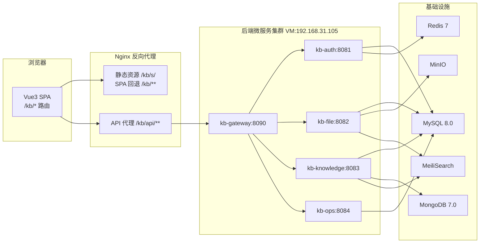

# mykng 知识库前端 - 技术架构文档

## 1. 架构设计



## 2. 技术描述

- **前端框架**：Vue 3.5 + TypeScript 5.6（Composition API + `<script setup>`）
- **构建工具**：Vite 6.0（开发热更新 + 生产构建）
- **UI 组件库**：Element Plus 2.9（企业级组件，中文友好）
- **路由**：Vue Router 4（history 模式，base=`/kb/`）
- **状态管理**：Pinia 2（轻量响应式 store）
- **HTTP 客户端**：Axios 1.7（拦截器 + JWT 自动刷新）
- **CSS 方案**：Tailwind CSS 3.4（原子化）+ SCSS（主题变量）
- **Markdown 编辑器**：md-editor-v3 4（带预览、工具栏、快捷键）
- **图标**：lucide-vue-next
- **图表**：ECharts 5（运维看板趋势图）
- **包管理**：pnpm（私有 registry: `https://nexus.marschat.online/repository/npm-public/`）
- **后端**：已部署，无需开发（微服务 API 已就绪）
- **初始化工具**：vite-init（vue-ts 模板）

## 3. 路由定义

| 路由路径 | 组件 | 说明 | 需登录 |
|----------|------|------|--------|
| `/kb/login` | Login.vue | 登录页 | 否 |
| `/kb/dashboard` | Dashboard.vue | 工作台统计 | 是 |
| `/kb/space` | SpaceList.vue | 知识空间列表 | 是 |
| `/kb/space/:id` | SpaceDetail.vue | 空间详情（目录树+文档） | 是 |
| `/kb/doc/:id` | DocEditor.vue | 文档编辑 | 是 |
| `/kb/search` | Search.vue | 全文搜索 | 是 |
| `/kb/tag` | TagManage.vue | 标签管理 | 是 |
| `/kb/share` | ShareList.vue | 分享中心 | 是 |
| `/kb/trash` | Trash.vue | 回收站 | 是 |
| `/kb/file` | FileManager.vue | 文件管理 | 是 |
| `/kb/ops/host` | OpsHost.vue | 运维-主机 | 是 |
| `/kb/ops/service` | OpsService.vue | 运维-服务 | 是 |
| `/kb/ops/dashboard` | OpsDashboard.vue | 运维-看板 | 是 |
| `/kb/ops/log` | OpsLog.vue | 运维-日志 | 是 |
| `/kb/settings` | Settings.vue | 设置 | 是 |

路由守卫：全局 beforeEach 检查 localStorage 中的 accessToken，无则跳转 `/kb/login`。

## 4. API 定义

### 4.1 统一响应格式

```typescript
interface Result<T = any> {
  code: number;      // 200=成功，其他=失败
  message: string;
  data: T;
  traceId?: string;
}
```

### 4.2 认证 API

| 接口 | 方法 | 路径 | 请求体 | 响应 |
|------|------|------|--------|------|
| 登录 | POST | /kb/api/auth/login | `{username, password}` | `{accessToken, refreshToken, expiresIn}` |
| 刷新 | POST | /kb/api/auth/refresh | `{refreshToken}` | `{accessToken, refreshToken, expiresIn}` |
| 登出 | POST | /kb/api/auth/logout | - | `null` |
| 用户信息 | GET | /kb/api/user/profile | - | `{id, username, nickname, avatar, email}` |

### 4.3 知识库 API（kb-knowledge）

| 接口 | 方法 | 路径 |
|------|------|------|
| 空间列表 | GET | /kb/api/space/list |
| 创建空间 | POST | /kb/api/space |
| 删除空间 | DELETE | /kb/api/space/{id} |
| 目录树 | GET | /kb/api/folder/tree/{spaceId} |
| 创建目录 | POST | /kb/api/folder |
| 删除目录 | DELETE | /kb/api/folder/{id} |
| 文档列表 | GET | /kb/api/doc/list?folderId=&page=&size= |
| 创建文档 | POST | /kb/api/doc |
| 文档详情 | GET | /kb/api/doc/{id} |
| 更新文档 | PUT | /kb/api/doc/{id} |
| 删除文档 | DELETE | /kb/api/doc/{id} |
| 收藏文档 | PUT | /kb/api/doc/{id}/star |
| 搜索 | GET | /kb/api/search?q=&page=&size= |
| 标签列表 | GET | /kb/api/tag/list |
| 创建标签 | POST | /kb/api/tag |
| 分享创建 | POST | /kb/api/share |
| 分享校验 | GET | /kb/api/share/verify/{code} |
| 版本列表 | GET | /kb/api/version/list/{type}/{id} |
| 回收站列表 | GET | /kb/api/trash/list |

### 4.4 文件 API（kb-file）

| 接口 | 方法 | 路径 |
|------|------|------|
| 桶列表 | GET | /kb/api/bucket/list |
| 文件列表 | GET | /kb/api/file/list?bucketId=&page=&size= |

### 4.5 运维 API（kb-ops）

| 接口 | 方法 | 路径 |
|------|------|------|
| 主机列表 | GET | /kb/api/ops/host/list?page=&size= |
| 服务列表 | GET | /kb/api/ops/service/list?page=&size= |
| 看板统计 | GET | /kb/api/ops/dashboard |
| 操作日志 | GET | /kb/api/log/list?page=&size= |

### 4.6 Axios 拦截器

```typescript
// 请求拦截器：自动注入 Authorization 头
request.interceptors.request.use(config => {
  const token = useAuthStore().accessToken
  if (token) config.headers.Authorization = `Bearer ${token}`
  return config
})

// 响应拦截器：401 自动刷新 Token，失败跳转登录
response.interceptors.response.use(
  res => res.data,  // 直接返回 Result<T>
  async error => {
    if (error.response?.status === 401) {
      const refreshed = await tryRefreshToken()
      if (refreshed) return retryOriginalRequest(error.config)
      redirectToLogin()
    }
    return Promise.reject(error)
  }
)
```

## 5. 项目结构

```
mykng/frontend/
├── index.html              # 入口 HTML（base=/kb/s/）
├── vite.config.ts          # Vite 配置（proxy + base）
├── .npmrc                  # pnpm 私有 registry
├── src/
│   ├── main.ts             # 应用入口
│   ├── App.vue             # 根组件
│   ├── router/
│   │   └── index.ts        # 路由定义 + 守卫
│   ├── stores/             # Pinia 状态
│   │   ├── auth.ts         # 认证状态（token/user）
│   │   └── app.ts          # 应用状态（侧栏折叠）
│   ├── api/                # API 请求层
│   │   ├── request.ts      # Axios 实例 + 拦截器
│   │   ├── auth.ts         # 认证 API
│   │   ├── space.ts        # 空间 API
│   │   ├── doc.ts          # 文档 API
│   │   ├── folder.ts       # 目录 API
│   │   ├── search.ts       # 搜索 API
│   │   ├── tag.ts          # 标签 API
│   │   ├── share.ts        # 分享 API
│   │   ├── trash.ts        # 回收站 API
│   │   ├── file.ts         # 文件 API
│   │   └── ops.ts          # 运维 API
│   ├── layouts/
│   │   └── MainLayout.vue  # 主布局（侧栏+顶栏+内容）
│   ├── views/              # 页面组件
│   │   ├── Login.vue
│   │   ├── Dashboard.vue
│   │   ├── SpaceList.vue
│   │   ├── SpaceDetail.vue
│   │   ├── DocEditor.vue
│   │   ├── Search.vue
│   │   ├── TagManage.vue
│   │   ├── ShareList.vue
│   │   ├── Trash.vue
│   │   ├── FileManager.vue
│   │   └── ops/
│   │       ├── Host.vue
│   │       ├── Service.vue
│   │       ├── Dashboard.vue
│   │       └── Log.vue
│   ├── components/         # 通用组件
│   │   ├── FolderTree.vue  # 目录树组件
│   │   ├── StatCard.vue    # 统计卡片
│   │   ├── EmptyState.vue  # 空状态
│   │   └── PageHeader.vue  # 页头
│   ├── composables/        # 组合式函数
│   │   ├── useAuth.ts      # 认证逻辑
│   │   └── usePagination.ts # 分页逻辑
│   ├── types/              # TypeScript 类型
│   │   └── api.ts          # API 类型定义
│   ├── utils/
│   │   ├── storage.ts      # localStorage 封装
│   │   └── format.ts       # 格式化工具
│   └── styles/
│       ├── variables.scss  # 主题变量
│       └── global.scss     # 全局样式
└── package.json
```

## 6. 开发环境配置

### 6.1 Vite Proxy

```typescript
// vite.config.ts
export default defineConfig({
  base: '/kb/s/',           // 静态资源基础路径
  plugins: [vue()],
  server: {
    proxy: {
      '/kb/api': {
        target: 'http://192.168.31.105:8090',
        changeOrigin: true
      }
    }
  }
})
```

### 6.2 路由 Base

```typescript
// router/index.ts
const router = createRouter({
  history: createWebHistory('/kb/'),
  routes: [...]
})
```

### 6.3 pnpm 配置

```ini
# .npmrc
registry=https://nexus.marschat.online/repository/npm-public/
```
