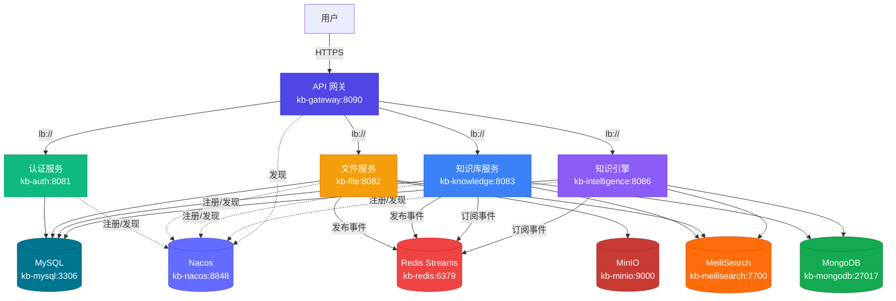

# mykng 模块契约文档

> 自动生成时间：2026-07-04 10:18:06
> 数据源：`module-registry.yml`
> 模块总数：5 个服务 + 6 个基础设施 + 1 个前端

---

## 目录

1. [基础设施清单](#1-基础设施清单)
2. [微服务模块契约](#2-微服务模块契约)
3. [前端模块](#3-前端模块)
4. [事件流全景图](#4-事件流全景图)
5. [Profile 环境预设](#5-profile-环境预设)
6. [可拔插规则](#6-可拔插规则)
7. [架构图](#7-架构图)

---

## 1. 基础设施清单

| ID | 名称 | 类型 | 端口 | 镜像 | 必选 | Profiles | 数据隔离 |
|----|------|------|------|------|------|----------|----------|
| `kb-mysql` | MySQL 数据库 | infrastructure | 3306 | `mysql:8.0` | ✅ | dev, test, prod | DB: kb_auth, kb_file, kb_knowledge, kb_intelligence |
| `kb-redis` | Redis 缓存 | infrastructure | 6379 | `redis:7.4` | ✅ | dev, test, prod | Streams: 3 条 |
| `kb-nacos` | Nacos 注册/配置中心 | infrastructure | 8848 | `nacos/nacos-server:v2.3.2` | ✅ | dev, test, prod | - |
| `kb-minio` | MinIO 对象存储 | infrastructure | 9000 | `minio/minio` | ➖ | dev, test, prod | Buckets: kb-files |
| `kb-meilisearch` | MeiliSearch 搜索引擎 | infrastructure | 7700 | `getmeili/meilisearch:v1.6` | ➖ | dev, test, prod | Indexes: kb_docs, kb_webpages, kb_files, kb_folders |
| `kb-mongodb` | MongoDB 文档库 | infrastructure | 27017 | `mongo:7.0` | ➖ | dev, test, prod | Collections: doc_content, web_content, file_content |

## 2. 微服务模块契约

每个模块的自描述契约：API、发布事件、订阅事件、降级策略、前端菜单。

### 2.1 API 网关 (`kb-gateway`)

- **技术栈**：Spring Cloud Gateway
- **端口**：8090
- **上下文路径**：`/kb`
- **必选**：✅ 是
- **Nacos 服务发现**：✅ 已启用
- **Profiles**：dev, test, prod
- **依赖基础设施**：`kb-nacos`

---

### 2.2 认证服务 (`kb-auth`)

- **技术栈**：Spring Boot 3.2 + JWT
- **端口**：8081
- **上下文路径**：`/kb/api/auth`
- **必选**：✅ 是
- **Nacos 服务发现**：✅ 已启用
- **Profiles**：dev, test, prod
- **依赖基础设施**：`kb-mysql`, `kb-redis`, `kb-nacos`

#### 暴露的 API

| 路径 | 方法 | 鉴权 |
|------|------|------|
| `/auth/login` | POST | 否 |
| `/auth/refresh` | POST | 否 |
| `/user/**` | ANY | 是 |
| `/token/**` | ANY | 是 |

---

### 2.3 文件服务 (`kb-file`)

- **技术栈**：Spring Boot 3.2 + MinIO
- **端口**：8082
- **上下文路径**：`/kb/api/file`
- **必选**：➖ 可选
- **Nacos 服务发现**：✅ 已启用
- **Profiles**：dev, test, prod
- **依赖基础设施**：`kb-mysql`, `kb-redis`, `kb-minio`, `kb-nacos`

#### 暴露的 API

| 路径 | 方法 | 鉴权 |
|------|------|------|
| `/file/upload` | POST | - |
| `/file/merge` | POST | - |
| `/file/list` | GET | - |
| `/file/{id}` | GET | - |
| `/file/{id}/download` | GET | - |
| `/file/{id}/content` | GET | - |
| `/file/{id}/restore` | GET | - |
| `/file/{id}/permanent` | DELETE | - |
| `/file/trash` | GET | - |
| `/file/trash/empty` | DELETE | - |
| `/file/search` | GET | - |
| `/file/list-all` | GET | - |

#### 发布的事件

| 事件类型 | 描述 | Payload |
|----------|------|---------|
| `file.parsed` | 文件解析完成 | `fileId, userId, name, content` |
| `file.deleted` | 文件删除（逻辑删除） | `fileId, userId` |
| `file.reparse` | 文件重新解析 | `fileId, userId, content` |
| `file.permanent_deleted` | 文件永久删除（M4 新增） | `fileId, userId` |
| `file.trash_emptied` | 回收站清空（M4 新增） | `userId, count` |

#### 降级策略（依赖模块不可用时）

| 场景 | 降级行为 |
|------|----------|
| 资源树加载 | 不展示文件类型节点，仅展示 doc/web |
| 搜索文件 | 跳过 file 索引，仅搜 doc/web |
| 分享文件详情 | 提示"文件服务暂不可用" |
| 回收站列表 | 仅展示 doc/web 回收站 |

#### 前端菜单项

| ID | 名称 | 图标 | 路径 |
|----|------|------|------|
| `file-list` | 文件管理 | Document | `/file/list` |

---

### 2.4 知识库服务 (`kb-knowledge`)

- **技术栈**：Spring Boot 3.2 + MeiliSearch
- **端口**：8083
- **上下文路径**：`/kb/api/knowledge`
- **必选**：✅ 是
- **Nacos 服务发现**：✅ 已启用
- **Profiles**：dev, test, prod
- **依赖基础设施**：`kb-mysql`, `kb-redis`, `kb-meilisearch`, `kb-mongodb`, `kb-nacos`
- **依赖服务**：`kb-file` (via gateway)

#### 暴露的 API

| 路径 | 方法 | 鉴权 |
|------|------|------|
| `/doc/**` | ANY | - |
| `/folder/**` | ANY | - |
| `/web/**` | ANY | - |
| `/search/**` | ANY | - |
| `/share/**` | ANY | - |
| `/tag/**` | ANY | - |
| `/space/**` | ANY | - |
| `/trash/**` | ANY | - |
| `/version/**` | ANY | - |

#### 发布的事件

| 事件类型 | 描述 | Payload |
|----------|------|---------|
| `doc.created` | 文档创建 | `userId, docId, title, folderId` |
| `doc.updated` | 文档更新 | `userId, docId, title` |
| `doc.deleted` | 文档删除 | `userId, docId` |
| `web.collected` | 网页收藏 | `userId, webId, url` |
| `web.deleted` | 网页删除 | `userId, webId` |
| `share.created` | 分享创建 | `userId, shareId, resourceType, resourceId` |
| `share.deleted` | 分享删除 | `userId, shareId` |
| `folder.created` | 文件夹创建 | `userId, folderId, name` |
| `folder.deleted` | 文件夹删除 | `userId, folderId` |
| `space.created` | 空间创建 | `userId, spaceId, name` |
| `space.deleted` | 空间删除 | `userId, spaceId` |
| `tag.created` | 标签创建 | `userId, tagId, name` |
| `tag.deleted` | 标签删除 | `userId, tagId` |

#### 订阅的事件

| 事件类型 | 处理逻辑 |
|----------|----------|
| `file.parsed` | 索引关联维护（记录日志，索引由 kb-file 自维护） |
| `file.deleted` | 标记关联分享为失效 |
| `file.permanent_deleted` | 标记关联分享为失效（M4 新增） |
| `file.trash_emptied` | 批量标记关联分享为失效（M4 新增） |
| `file.reparse` | 重新关联文档（如有） |

#### 前端菜单项

| ID | 名称 | 图标 | 路径 |
|----|------|------|------|
| `doc-list` | 文档管理 | Files | `/doc/list` |
| `web-list` | 网页收藏 | Link | `/web/list` |
| `folder-tree` | 资源树 | FolderOpened | `/folder/tree` |
| `search` | 搜索 | Search | `/search` |
| `share-list` | 分享管理 | Share | `/share/list` |
| `tag-list` | 标签管理 | PriceTag | `/tag/list` |
| `space-list` | 知识空间 | CopyDocument | `/space/list` |
| `trash` | 回收站 | Delete | `/trash` |

---

### 2.5 知识引擎服务 (`kb-intelligence`)

- **技术栈**：Spring Boot 3.2 + AI
- **端口**：8086
- **上下文路径**：`/kb/api/intelligence`
- **必选**：➖ 可选
- **Nacos 服务发现**：✅ 已启用
- **Profiles**：test, prod
- **依赖基础设施**：`kb-mysql`, `kb-redis`, `kb-mongodb`, `kb-meilisearch`, `kb-nacos`

#### 暴露的 API

| 路径 | 方法 | 鉴权 |
|------|------|------|
| `/intelligence/summary` | POST | - |
| `/intelligence/qa` | POST | - |
| `/intelligence/recommend` | GET | - |

#### 订阅的事件

| 事件类型 | 处理逻辑 |
|----------|----------|
| `doc.created` | 触发 AI 摘要生成（异步） |
| `web.collected` | 触发 AI 摘要生成（异步） |

#### 降级策略（依赖模块不可用时）

| 场景 | 降级行为 |
|------|----------|
| AI 摘要按钮 | 隐藏入口或提示"AI 服务暂不可用" |
| 智能问答 | 提示"AI 服务暂不可用，请稍后再试" |

#### 前端菜单项

| ID | 名称 | 图标 | 路径 |
|----|------|------|------|
| `ai-summary` | AI 摘要 | MagicStick | `/intelligence/summary` |
| `ai-qa` | 智能问答 | ChatDotRound | `/intelligence/qa` |

---

## 3. 前端模块

### 知识库前端 (`kb-web`)

- **技术栈**：Vue3 + Element Plus
- **部署路径**：`/data/knowledge-base/web`
- **必选**：✅ 是
- **动态菜单**：✅ 已启用
  - 拉取端点：`${KB_CONTEXT:/kb}/api/gateway/modules`
  - 刷新间隔：30s

## 4. 事件流全景图

### 4.1 事件通道

| Stream Key | 用途 |
|------------|------|
| `kb:streams:file-events` | - |
| `kb:streams:knowledge-events` | - |
| `kb:streams:share-events` | - |

### 4.2 事件发布/订阅关系

| 事件类型 | 发布方 | 订阅方 |
|----------|--------|--------|
| `doc.created` | `kb-knowledge` | `kb-intelligence` |
| `doc.deleted` | `kb-knowledge` | - |
| `doc.updated` | `kb-knowledge` | - |
| `file.deleted` | `kb-file` | `kb-knowledge` |
| `file.parsed` | `kb-file` | `kb-knowledge` |
| `file.permanent_deleted` | `kb-file` | `kb-knowledge` |
| `file.reparse` | `kb-file` | `kb-knowledge` |
| `file.trash_emptied` | `kb-file` | `kb-knowledge` |
| `folder.created` | `kb-knowledge` | - |
| `folder.deleted` | `kb-knowledge` | - |
| `share.created` | `kb-knowledge` | - |
| `share.deleted` | `kb-knowledge` | - |
| `space.created` | `kb-knowledge` | - |
| `space.deleted` | `kb-knowledge` | - |
| `tag.created` | `kb-knowledge` | - |
| `tag.deleted` | `kb-knowledge` | - |
| `web.collected` | `kb-knowledge` | `kb-intelligence` |
| `web.deleted` | `kb-knowledge` | - |

## 5. Profile 环境预设

### DEV 环境

- **描述**：开发环境（最小化启动）
- **服务模块**：`kb-gateway`, `kb-auth`, `kb-knowledge`
- **基础设施**：`kb-mysql`, `kb-redis`, `kb-nacos`, `kb-meilisearch`, `kb-mongodb`
- **排除可选模块**：是

### TEST 环境

- **描述**：测试环境（核心功能验证）
- **服务模块**：`kb-gateway`, `kb-auth`, `kb-file`, `kb-knowledge`, `kb-intelligence`
- **基础设施**：`kb-mysql`, `kb-redis`, `kb-nacos`, `kb-minio`, `kb-meilisearch`, `kb-mongodb`
- **排除可选模块**：否

### PROD 环境

- **描述**：生产环境（全量启动）
- **服务模块**：`kb-gateway`, `kb-auth`, `kb-file`, `kb-knowledge`, `kb-intelligence`
- **基础设施**：`kb-mysql`, `kb-redis`, `kb-nacos`, `kb-minio`, `kb-meilisearch`, `kb-mongodb`
- **排除可选模块**：否

## 6. 可拔插规则

### 6.1 新增模块（5 步）

- 1. 创建独立 Maven 模块（继承 kb-parent，依赖 kb-common jar）
- 2. 配置模块契约（在 module-registry.yml 添加 services 条目）
- 3. 启用 Nacos 服务发现（pom.xml 加 nacos-discovery 依赖 + 启动类加 @EnableDiscoveryClient）
- 4. 在 docker-compose.yml 添加服务定义（指定 profiles + dependsOn + nacos 环境变量）
- 5. 启动服务，自动注册到 Nacos → 网关自动路由 → 前端自动显示菜单

### 6.2 删除模块（4 步）

- 1. 停止服务容器（Nacos 自动注销 → 网关自动移除路由 → 前端自动隐藏菜单）
- 2. 从 module-registry.yml 移除条目
- 3. 从 docker-compose.yml 移除服务定义
- 4. 清理模块数据（可选，保留以备恢复）

### 6.3 模块独立性约束

- 每个模块必须独立编译（不依赖其他模块源码）
- 公共依赖通过 kb-common jar（Nexus 私服）
- 模块间通信通过 Nacos 服务发现 + 网关转发 + 事件总线
- 禁止数据库共享（每个模块独立 database）
- 禁止内存共享（不通过 static/单例传递跨模块状态）
- 配置通过 Nacos 配置中心统一管理（namespace/group 隔离）

### 6.4 事件契约约束

- 事件类型命名: {模块名}.{动作}（如 file.parsed, doc.created）
- 事件 payload 必须包含: entityId, userId, timestamp
- 事件发布必须幂等（消费者需处理重复事件）
- 事件必须持久化（Redis Streams，不使用 Pub/Sub）
- 事件必须包含 traceId（用于链路追踪）

### 6.5 降级规则

- 调用方必须 catch 调用异常，不可让请求整体失败
- 调用方必须降级到无该模块时的可用状态（部分功能不可用）
- 调用方必须返回有意义的提示（如"文件服务暂不可用"）
- 事件订阅方必须处理事件流断开后的恢复（重新订阅 + 从 last consumed id 继续）

## 7. 架构图

---

*本文档由 `generate_docs.py` 自动生成，请勿手动编辑。修改 `module-registry.yml` 后重新运行脚本即可更新。*
