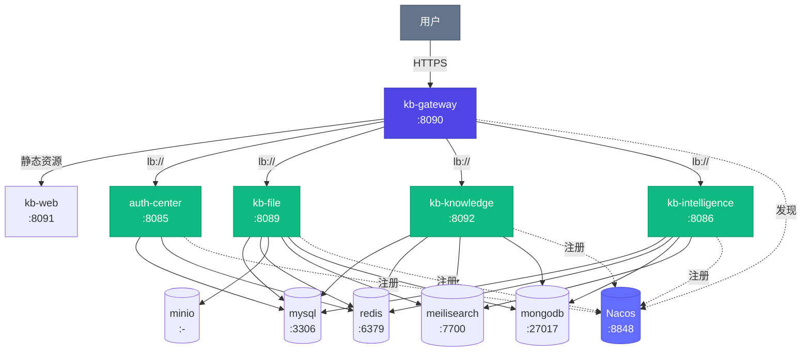

# mykng 模块契约文档

> 本文件由 `mykng/gen-registry.py` 从 `mykng/module-registry.yml` 自动生成，**请勿手工编辑**。
> 源文件 sha256：`cd69518a8e9c6116…`（与 `module-manifest.json` 的 `sourceSha256` 一致）
> 规模：6 个模块 / 5 项基础设施 / 24 个插件

> 修改方式：改 `module-registry.yml` → 跑 `python3 mykng/gen-registry.py` → 提交。
> 只改前者不跑生成器，CI 的 `ModuleManifestConsistencyTest` 会失败。

---

## 1. 模块总览

| 模块 | 类型 | Nacos 注册 | 容器端口 | 宿主端口 | 数据库 | 描述 |
|------|------|:---:|:---:|:---:|------|------|
| `kb-gateway` | service | ✅ | 8080 | 8090 | `—` | API 网关：路由转发、JWT 鉴权、限流 |
| `auth-center` | external | ✅ | 8085 | 8085 | `kb_auth` | 统一认证中心（SSO/OIDC）：登录、JWT 签发、用户管理、API Token、操作日志 |
| `kb-file` | service | ✅ | 8089 | 8089 | `kb_file` | 文件管理：上传、下载、分片、解析、回收站 |
| `kb-knowledge` | service | ✅ | 8092 | 8092 | `kb_knowledge` | 知识管理：文档、文件夹、分享、标签、搜索、版本 |
| `kb-intelligence` | service | ✅ | 8086 | 8086 | `kb_intelligence` | 知识引擎：导入、解析、实体抽取、LLM 集成 |
| `kb-web` | frontend | ➖ | 80 | 8091 | `—` | Vue3 前端 |

**网关健康探针期望集**（`nacos-registered: true`，共 5 个）：`auth-center`、`kb-file`、`kb-gateway`、`kb-intelligence`、`kb-knowledge`

> 网关 `GET ${KB_CONTEXT}/api/system/modules` 会拿这个期望集与 Nacos 实际注册做比对，
> 按四态返回：`OK`（期望有+实例有）/ `DOWN`（期望有+曾有实例+现为 0）/
> `MISSING`（期望有+从未注册，疑似改名漂移）/ `UNEXPECTED`（注册了但不在期望集，野模块）。

## 2. 网关路由

| 路径 | 目标模块 |
|------|----------|
| `/kb/api/auth/**` | `auth-center` |
| `/kb/api/user/**` | `auth-center` |
| `/kb/api/token/**` | `auth-center` |
| `/kb/api/log/**` | `auth-center` |
| `/kb/api/file/**` | `kb-file` |
| `/kb/api/bucket/**` | `kb-file` |
| `/kb/api/doc/**` | `kb-knowledge` |
| `/kb/api/folder/**` | `kb-knowledge` |
| `/kb/api/web/**` | `kb-knowledge` |
| `/kb/api/search/**` | `kb-knowledge` |
| `/kb/api/share/**` | `kb-knowledge` |
| `/kb/api/tag/**` | `kb-knowledge` |
| `/kb/api/space/**` | `kb-knowledge` |
| `/kb/api/trash/**` | `kb-knowledge` |
| `/kb/api/version/**` | `kb-knowledge` |
| `/kb/api/intelligence/**` | `kb-intelligence` |

## 3. 模块依赖

| 模块 | 依赖服务 | 依赖基础设施 |
|------|----------|--------------|
| `kb-gateway` | — | — |
| `auth-center` | — | `mysql`、`redis` |
| `kb-file` | `auth-center` | `mysql`、`redis`、`minio`、`meilisearch`、`mongodb` |
| `kb-knowledge` | `auth-center`、`kb-file` | `mysql`、`redis`、`meilisearch`、`mongodb` |
| `kb-intelligence` | — | `mysql`、`redis`、`mongodb`、`meilisearch` |
| `kb-web` | `kb-gateway` | — |

## 4. 基础设施

| 名称 | 镜像 | 端口 | Profile | 内存上限 | 描述 |
|------|------|------|---------|----------|------|
| `mysql` | `mysql:8.0` | 3306 | core | 512m | MySQL 数据库 |
| `redis` | `redis:7-alpine` | 6379 | core | 256m | Redis 缓存 + 事件流（Streams） |
| `minio` | `minio/minio:latest` | - | storage | 512m | MinIO 对象存储 |
| `meilisearch` | `getmeili/meilisearch:v1.12` | 7700 | search | 256m | MeiliSearch 全文搜索引擎 |
| `mongodb` | `mongo:7.0` | 27017 | storage | 512m | MongoDB 文档存储 |

## 5. 插件清单

共 24 个。`enabled-by-default` 决定 `plugins: all` 是否启用。

| 插件 ID | 名称 | 优先级 | 所属模块 | 默认启用 | 可卸载 |
|---------|------|:---:|----------|:---:|:---:|
| `plugin-rbac` | RBAC 权限插件 | P0 | `auth-center` | ✅ | ❌ |
| `plugin-user-mgmt` | 用户管理插件 | P0 | `auth-center` | ✅ | ❌ |
| `plugin-security` | 安全加固插件 | P0 | `kb-gateway` | ✅ | ❌ |
| `plugin-chunk-upload` | 文件分片上传插件 | P0 | `kb-file` | ✅ | ✅ |
| `plugin-doc-lifecycle` | 文档状态机插件 | P1 | `kb-knowledge` | ➖ | ✅ |
| `plugin-comment-notify` | 评论与通知插件 | P1 | `kb-knowledge` | ➖ | ✅ |
| `plugin-collab-edit` | 协作编辑插件 | P1 | `kb-knowledge` | ➖ | ✅ |
| `plugin-knowledge-graph` | 知识图谱可视化插件 | P1 | `kb-knowledge` | ➖ | ✅ |
| `plugin-database-table` | 多维表格插件 | P2 | `kb-knowledge` | ➖ | ✅ |
| `plugin-block-editor` | 块级编辑插件 | P2 | `kb-knowledge` | ➖ | ✅ |
| `plugin-llm-qa` | LLM 智能问答插件 | P2 | `kb-intelligence` | ➖ | ✅ |
| `plugin-auto-summary` | 自动摘要插件 | P2 | `kb-knowledge` | ➖ | ✅ |
| `plugin-smart-tag` | 智能标签推荐插件 | P2 | `kb-knowledge` | ➖ | ✅ |
| `plugin-self-maintain` | 自维护知识库插件 | P2 | `kb-knowledge` | ➖ | ✅ |
| `plugin-verification` | 知识验证周期插件 | P2 | `kb-knowledge` | ➖ | ✅ |
| `plugin-sso` | SSO/LDAP 集成插件 | P2 | `auth-center` | ➖ | ✅ |
| `plugin-notify-channels` | 第三方通知插件 | P2 | `kb-knowledge` | ➖ | ✅ |
| `plugin-webhook` | Webhook 插件 | P2 | `kb-knowledge` | ➖ | ✅ |
| `plugin-helpcenter` | 对外发布/帮助中心插件 | P2 | `kb-knowledge` | ➖ | ✅ |
| `plugin-ocr` | OCR 文字识别插件 | P2 | `kb-file` | ➖ | ✅ |
| `plugin-mobile-app` | 移动端 App 插件 | P3 | `kb-web` | ➖ | ✅ |
| `plugin-dark-mode` | 暗黑模式插件 | P2 | `kb-web` | ✅ | ✅ |
| `plugin-i18n` | i18n 国际化插件 | P3 | `kb-web` | ➖ | ✅ |
| `plugin-a11y` | 无障碍插件 | P3 | `kb-web` | ✅ | ✅ |

## 6. Profile 预设

### dev-minimal

- 描述：仅核心模块（认证 + 网关），内存占用 < 2GB
- 模块：`kb-gateway`、`auth-center`
- 基础设施：`mysql`、`redis`
- 插件：`plugin-rbac`、`plugin-user-mgmt`、`plugin-security`

### dev-core

- 描述：核心三服务，内存占用 < 4GB
- 模块：`kb-gateway`、`auth-center`、`kb-file`、`kb-knowledge`
- 基础设施：`mysql`、`redis`、`minio`、`meilisearch`、`mongodb`
- 插件：`plugin-rbac`、`plugin-user-mgmt`、`plugin-security`、`plugin-chunk-upload`、`plugin-doc-lifecycle`、`plugin-knowledge-graph`、`plugin-dark-mode`

### dev-full

- 描述：全量模块，内存占用 < 6GB
- 模块：`kb-gateway`、`auth-center`、`kb-file`、`kb-knowledge`、`kb-intelligence`、`kb-web`
- 基础设施：`mysql`、`redis`、`minio`、`meilisearch`、`mongodb`
- 插件：all（所有 enabled-by-default=true）

### test

- 描述：测试环境全量启动
- 模块：`kb-gateway`、`auth-center`、`kb-file`、`kb-knowledge`、`kb-intelligence`、`kb-web`
- 基础设施：`mysql`、`redis`、`minio`、`meilisearch`、`mongodb`
- 插件：all（所有 enabled-by-default=true）

### prod

- 描述：生产环境全量启动 + AI 能力
- 模块：`kb-gateway`、`auth-center`、`kb-file`、`kb-knowledge`、`kb-intelligence`、`kb-web`
- 基础设施：`mysql`、`redis`、`minio`、`meilisearch`、`mongodb`
- 插件：all（所有 enabled-by-default=true）

## 7. 架构图

---

*由 `mykng/gen-registry.py` 自动生成，请勿手工编辑。*
