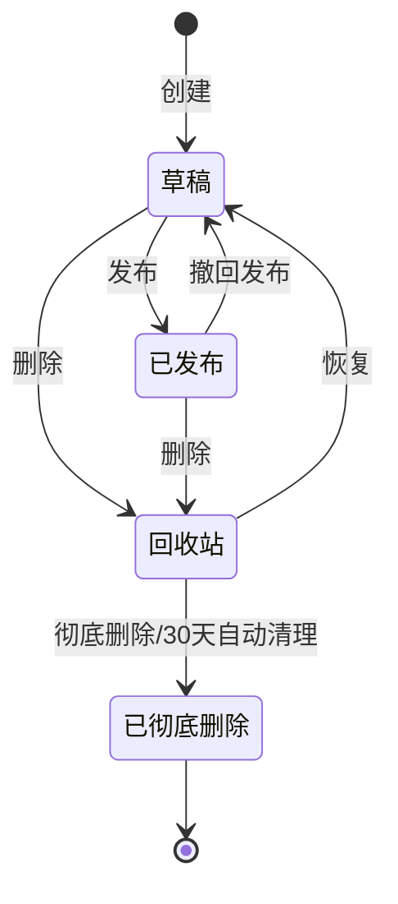
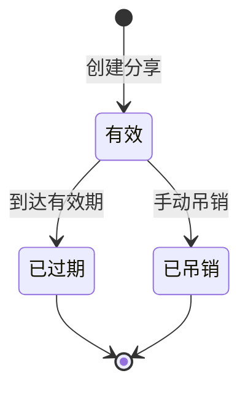
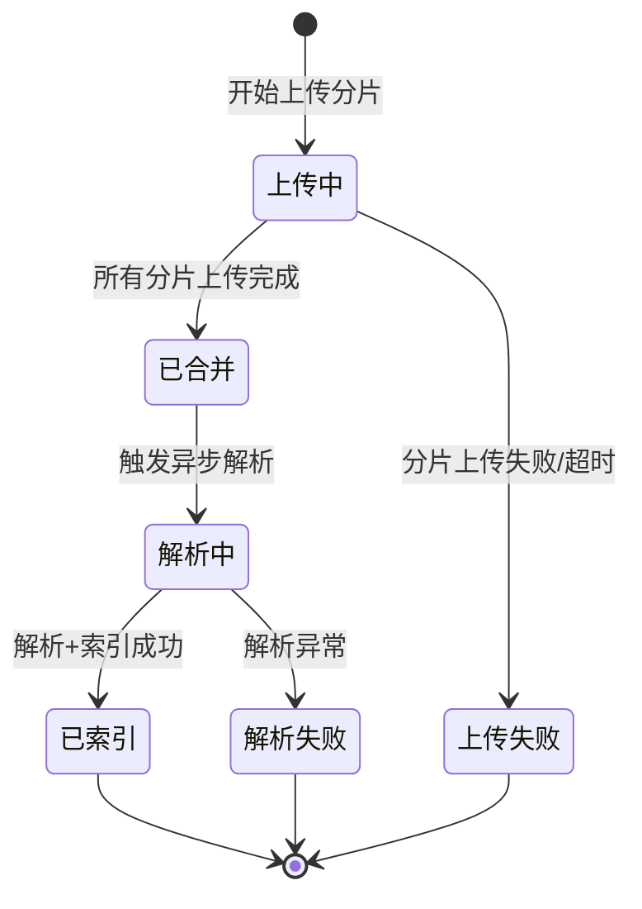
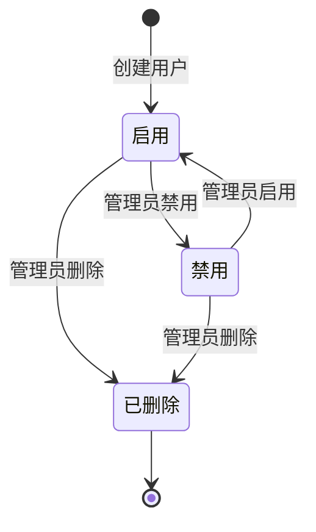

# MyKNG 知识库平台 — 产品需求文档（PRD）

| 属性 | 值 |
|------|-----|
| 版本 | v2.0 |
| 创建日期 | 2026-06-28 |
| 更新日期 | 2026-07-02 |
| 适用版本 | mykng v7.1（微服务架构 + 笔记功能增强） |
| 来源 | 从 `私有化全端个人知识库_v7.md` + `接口规范清单_v1.md` + `笔记功能优化_需求与设计_20260702.md` 提炼 |
| SOP 合规 | 满足《软件工程开发流程规范_SOP_V2.1》阶段0要求 |

> 本文档为产品需求总纲，定义功能清单、验收标准、业务状态机、上下文路径、模块划分与测试数据设计。详细架构见 [私有化全端个人知识库_v7.md](私有化全端个人知识库_v7.md)，详细 API 见 [接口规范清单_v1.md](接口规范清单_v1.md)，笔记功能增强详见 [笔记功能优化_需求与设计_20260702.md](笔记功能优化_需求与设计_20260702.md)。

---

## 1. 产品定位

**MyKNG** 是一套私有化部署的全端个人知识库平台，支持：
- 文档/笔记/网页收藏的统一管理（资源树 + 标签 + 全文搜索）
- 多格式笔记（Markdown / 富文本 HTML），支持文档大纲、双向链接、版本对比
- 文件上传与解析（MinIO + MeiliSearch 索引），文本类文件支持在线编辑
- 知识导入与双维度渲染（Markdown 解析 + 实体抽取）
- 运维看板（主机/服务/端口/凭据/依赖/矛盾检测）
- 多端访问（Web PC / H5），通过统一网关 + JWT 鉴权

---

## 2. 功能清单（Must have / Should have）

### 2.1 Must have（必须完成）

| 编号 | 功能点 | 模块 | 验收标准（Given-When-Then） |
|------|--------|------|----------------------------|
| M01 | 用户登录/登出 | kb-auth | Given 用户已注册且未登录，When 输入正确账号密码，Then 返回 accessToken（15分钟）+ refreshToken（7天），密码不明文返回 |
| M02 | Token 刷新 | kb-auth | Given accessToken 已过期且 refreshToken 有效，When 调用刷新接口，Then 返回新的 accessToken 和 refreshToken，旧 refreshToken 失效（一次性） |
| M03 | 用户管理 | kb-auth | Given 管理员已登录，When 创建/禁用/删除用户，Then 用户表对应记录变更，敏感字段（密码）脱敏返回 |
| M04 | API Token 管理 | kb-auth | Given 用户已登录，When 创建 API Token，Then Token 加密存储，可用于脚本调用，支持吊销 |
| M05 | 文件分片上传 | kb-file | Given 用户已登录，When 上传文件（分片），Then 所有分片合并成功，生成唯一 fileId，写入 kb_file 表，触发异步解析 |
| M06 | 文件解析与索引 | kb-file | Given 文件已上传，When 解析任务执行，Then 文本内容写入 MongoDB，MeiliSearch 索引建立成功 |
| M07 | 桶管理 | kb-file | Given 管理员已登录，When 创建/删除 MinIO 桶，Then 桶状态同步到 bucket 表，删除时校验非空 |
| M08 | 文档 CRUD | kb-knowledge | Given 用户已登录，When 创建/读取/更新/删除文档，Then doc 表变更，MongoDB 内容同步，MeiliSearch 索引更新 |
| M09 | 文件夹管理 | kb-knowledge | Given 用户已登录，When 创建/移动/删除文件夹，Then folder 表变更，子文档/子文件夹级联移动，删除走回收站 |
| M10 | 空间管理 | kb-knowledge | Given 用户已登录，When 创建/切换空间，Then space 表变更，空间隔离数据 |
| M11 | 标签管理 | kb-knowledge | Given 用户已登录，When 创建标签并绑定到资源，Then tag + resource_tag 表变更，支持按标签检索 |
| M12 | 全文搜索 | kb-knowledge | Given 用户已登录，When 输入关键词搜索，Then 返回 MeiliSearch 匹配结果（高亮、分页、按空间过滤） |
| M12-1 | 知识引擎文档搜索 | kb-intelligence | Given 管理员已登录，When 在知识引擎模块搜索文档，Then 返回匹配的导入文档列表（按类型/标签筛选，基于标题/摘要/标签/路径的 MySQL 全文检索） |
| M13 | 分享链接 | kb-knowledge | Given 用户已登录，When 创建分享链接（可选密码/有效期），Then 生成 share 记录，访问者通过链接+密码访问 |
| M14 | 回收站 | kb-knowledge | Given 用户已登录，When 删除文档/文件夹，Then 进入回收站，支持恢复/彻底删除，30天后自动清理 |
| M15 | 版本管理 | kb-knowledge | Given 用户已登录，When 更新文档内容，Then 自动生成版本记录，支持回滚到历史版本 |
| M15-1 | 版本对比（diff） | kb-knowledge | Given 文档有多个历史版本，When 用户选择两个版本进行对比，Then 展示行级 diff（新增/删除/修改高亮） |
| M16 | 网页收藏 | kb-knowledge | Given 用户已登录，When 提交网页 URL，Then 抓取网页内容存入 MongoDB，建立索引 |
| M17 | 多格式笔记 | kb-knowledge | Given 用户已登录，When 新建文档，Then 可选择 Markdown 或 富文本(HTML) 格式，对应编辑器分别渲染 |
| M18 | 文档大纲（TOC） | kb-knowledge | Given 文档有 H1~H6 标题，When 打开文档编辑页，Then 右侧显示文档大纲，点击可跳转到对应标题位置 |
| M19 | 双向链接 | kb-knowledge | Given 文档 A 中使用 [[docId|标题]] 语法引用文档 B，When 查看文档 A，Then 链接可点击跳转；查看文档 B，Then 反向链接面板显示所有引用它的文档 |
| M20 | 文本文件在线编辑 | kb-file | Given 上传的是文本类文件（txt/md/json/csv/xml/html/log 等），When 点击"编辑"，Then 可在线编辑并保存，更新 MinIO + MongoDB + MeiliSearch 索引 |
| M21 | 资源树展示 | kb-knowledge | Given 进入知识空间，When 切换树视图，Then 左侧展示包含文件夹/文档/文件/网页的完整资源树，支持展开收起和点击跳转 |
| M22 | 文档模板 | kb-knowledge | Given 用户新建文档，When 选择模板，Then 自动填入模板内容（空白文档/会议纪要/技术方案/学习笔记/个人日记/项目周报） |
| M23 | 文档导出 | kb-knowledge | Given 用户已登录，When 点击导出，Then 可将文档导出为 Markdown 或 HTML 格式并下载 |
| M24 | 搜索建议 | kb-knowledge | Given 用户在搜索框输入关键词，When 输入停止 300ms，Then 下拉显示匹配的文档标题建议，点击可直接搜索 |
| M25 | 快捷新建入口 | kb-web | Given 用户在任意页面，When 点击 header 右侧"新建"按钮，Then 下拉菜单可快速选择新建文档/上传文件/收藏网页 |
| M26 | 全局搜索框 | kb-web | Given 用户在任意页面，When 在 header 中间搜索框输入关键词，Then 支持搜索建议，回车跳转到搜索结果页 |
| M27 | 运维看板 | kb-ops | Given 管理员已登录，When 查看看板，Then 返回主机数/服务数/端口数/凭据数/矛盾数等汇总指标 |
| M28 | 主机/服务/端口/凭据/依赖/域名管理 | kb-ops | Given 管理员已登录，When CRUD 运维资源，Then 对应表变更，支持导入导出 |
| M29 | 矛盾检测 | kb-ops | Given 管理员已登录，When 触发矛盾检测，Then 检测端口冲突/凭据重复/依赖循环，输出矛盾清单 |
| M30 | 知识导入 | kb-intelligence | Given 管理员已登录，When 指定目录路径导入，Then 扫描 Markdown 文件，解析实体（主机/端口/凭据/命令/时间线），写入知识库 |
| M31 | 知识引擎→运维中心同步 | kb-ops | Given 管理员已登录且 kb-intelligence 有数据，When 点击「从知识引擎同步」，Then 自动将主机/服务/端口/凭据/域名/依赖 6 类实体按唯一键增量同步到运维中心，密码自动加密，返回新增/更新/跳过/失败统计 |
| M32 | 知识引擎前端模块 | kb-web | Given 管理员已登录，When 进入「知识引擎」侧边栏，Then 可查看文档库（导入的文档列表+详情）、实体总览（主机/服务/端口/凭据/域名/命令/时间线 7 类实体的只读列表）、命令库（按分类/主机筛选，点击复制）、时间线（运维事件时间轴），所有数据只读，来源于 kb-intelligence |
| M33 | 同步增强 | kb-ops | Given 管理员在运维看板点击「从知识引擎同步」，When 弹出同步预览框，Then 展示即将新增/更新/跳过的数量和示例数据，确认后执行同步，同步完成后记录同步历史（时间/操作人/同步数量/耗时），可在同步历史中查看过往记录 |

### 2.2 Should have（应该完成）

| 编号 | 功能点 | 模块 | 验收标准 |
|------|--------|------|---------|
| S01 | 操作日志 | kb-ops | 关键操作（登录/CRUD/导入）记录到 operation_log，含 traceId，支持按时间/用户/操作类型查询 |
| S02 | 部署记录 | kb-ops | 记录每次部署的服务/版本/环境/结果，支持回溯 |
| S03 | 运维知识库 | kb-ops | 运维文档 CRUD + 全文搜索 |
| S04 | 数据导入 | kb-ops | 支持 JSON/CSV 批量导入主机/服务/凭据 |
| S05 | 仪表盘图表 | kb-ops | 按域名/环境分组的可视化图表（前端实现） |

### 2.3 Nice to have（后续迭代）

- LLM 智能问答（kb-intelligence）
- 多用户协作编辑
- 移动端原生 App
- 知识图谱可视化

---

## 3. 业务状态机

### 3.0 搜索功能体系（两套独立搜索）

MyKNG 知识库包含两套独立的搜索体系，服务于不同场景和用户群体：

#### 3.0.1 用户侧全文搜索（M12）

| 属性 | 说明 |
|------|------|
| 模块 | kb-knowledge + kb-file |
| 搜索引擎 | MeiliSearch（v1.x） |
| 索引数量 | 3 个（kb_docs / kb_webpages / kb_files） |
| 搜索范围 | 笔记标题+正文、网页标题+正文、文件名+解析内容 |
| 前端入口 | `/search` 页面（左侧菜单「知识库 → 全文搜索」） |
| 核心接口 | `GET /search`（全文搜索）、`GET /search/suggest`（搜索建议） |
| 筛选维度 | 资源类型（全部/文件/笔记/网页）、标签、文件夹 |
| 结果特性 | 关键词高亮、分页（默认 20 条/页）、按相关性排序 |
| 降级策略 | MeiliSearch 不可用时自动回退到 MySQL LIKE 查询（doc + web，file 暂不支持降级） |
| 索引同步 | 资源 CRUD 时异步写入 MeiliSearch 索引，启动时自动初始化索引配置 |
| 安全策略 | 按 userId 过滤，用户只能搜索到自己的资源 |

**索引字段设计**：
- `kb_docs`: id, docId, userId, folderId, title, content, starred, createdAt, updatedAt
- `kb_webpages`: id, webId, userId, folderId, url, title, content, starred, createdAt
- `kb_files`: id, fileId, userId, name, type, content, starred, createdAt

**已知限制**（v1.0）：
- 搜索建议接口（`/search/suggest`）为空实现，暂返回空列表
- 文件类型降级搜索（MySQL fallback）未实现
- 搜索结果标题和高亮使用 `v-html` 渲染，存在 XSS 风险（详见功能健全性审查 P0-4）

#### 3.0.2 知识引擎文档搜索（M12-1）

| 属性 | 说明 |
|------|------|
| 模块 | kb-intelligence |
| 搜索引擎 | MySQL LIKE 查询（无 MeiliSearch、无向量检索） |
| 搜索范围 | 导入的运维文档：标题、摘要、标签、文件路径 |
| 前端入口 | 知识引擎模块各页面的列表筛选（`/intel/docs` 等） |
| 核心接口 | `POST /intelligence/machine/search` |
| 筛选维度 | 文档类型（TABLE/PLAN/TIMELINE/GRAPH/RULE/GENERAL）、标签 |
| 结果特性 | 分页、按更新时间倒序 |
| 索引同步 | 文档导入时直接写入 MySQL kn_doc 表，无需额外索引 |
| 权限 | 仅管理员可访问知识引擎模块 |

**与用户侧搜索的区别**：
- 用户侧搜索面向普通用户的个人知识库（文件/笔记/网页），基于 MeiliSearch 全文检索
- 知识引擎搜索面向管理员的运维文档库（导入的 Markdown），基于结构化元数据筛选
- 两套搜索数据物理隔离（不同数据库、不同索引）

### 3.1 文档生命周期状态机



**状态迁移路径覆盖矩阵**（测试用例对应）：

| 起始状态 | 事件 | 目标状态 | 测试用例 ID |
|---------|------|---------|------------|
| (初始) | 创建文档 | 草稿 | TC_DOC_001 |
| 草稿 | 发布 | 已发布 | TC_DOC_002 |
| 草稿 | 删除 | 回收站 | TC_DOC_003 |
| 已发布 | 撤回发布 | 草稿 | TC_DOC_004 |
| 已发布 | 删除 | 回收站 | TC_DOC_005 |
| 回收站 | 恢复 | 草稿 | TC_DOC_006 |
| 回收站 | 彻底删除 | 已彻底删除 | TC_DOC_007 |
| 回收站 | 30天到期 | 已彻底删除 | TC_DOC_008 |

### 3.2 分享链接状态机



### 3.3 文件上传状态机



### 3.4 用户状态机



---

## 4. 上下文路径配置（设计阶段确定）

> **铁律**：所有应用必须配置上下文路径，禁止使用根路径 `/` 直接部署。

| 配置点 | 配置项 | 值 | 配置文件位置 |
|--------|--------|-----|------------|
| 后端网关 | `kb.gateway.context-path` + 路由谓词 `Path=${KB_CONTEXT:/kb}/api/**` | `/kb` | kb-gateway/application.yml（WebFlux，非 servlet.context-path） |
| 前端 Vite | `base` | `/kb/s/` | kb-web/vite.config.ts |
| Nginx（腾讯云2号） | `location` | `/kb/` | nginx/kb.marschat.online.tencent.conf |
| Nginx（mykng本地） | `location` | `/kb/` + `/kb/api/` + `/kb/s/` | nginx/kb.marschat.online.conf |
| 环境变量 | `KB_CONTEXT` | `/kb` | .env.example（可覆盖） |

**API 路径规范**：`/kb/api/{module}/{operation}`
- 示例：`POST /kb/api/auth/login`、`GET /kb/api/doc/list`
- 网关 StripPrefix=2，剥离 `/kb/api` 后转发到后端服务

---

## 5. 模块划分

### 5.1 后端模块

| 模块 | 端口 | 职责 | 关键 Controller/Service |
|------|------|------|------------------------|
| kb-gateway | 8090 | API 网关、JWT 鉴权、路由转发、限流、链路追踪 | JwtAuthFilter, TraceIdFilter |
| kb-auth | 8081 | 认证授权、用户管理、API Token | AuthController, UserController, ApiTokenController |
| kb-file | 8082 | 文件上传/合并/解析、桶管理 | KbFileController, BucketController |
| kb-knowledge | 8083 | 文档/文件夹/空间/标签/搜索/分享/回收站/版本/网页 | DocController, FolderController, SpaceController, SearchController, ShareController, TrashController, VersionController, WebPageController, TagController |
| kb-ops | 8084 | 运维看板、主机/服务/端口/凭据/依赖/域名/矛盾/操作日志/知识引擎同步 | DashboardController, HostController, SyncFromIntelligenceController 等 |
| kb-intelligence | 8086 | 知识导入、双维度渲染引擎 | KnowledgeImportController, KnowledgeMachineController |
| kb-common | - | 公共组件：统一返回、异常体系、链路追踪、业务断言库 | Result, BusinessException, KbAssertions |

### 5.2 前端模块

详见 `.trae/documents/PRD-mykng-frontend.md`，主要目录：
- `api/` — API 请求封装（按服务分文件）
- `views/` — 页面（auth/file/knowledge/ops/intelligence）
- `components/` — 可复用组件
- `router/` — 路由（含导航守卫）
- `stores/` — Pinia 状态管理
- `utils/` — 工具函数
- `test-utils/` — 测试工具 + 测试数据工厂

---

## 6. 接口设计

详细接口规范见 [api-design.md](api-design.md) 和 [接口规范清单_v1.md](接口规范清单_v1.md)。

**接口总数**：137 个
- kb-auth: 12 个
- kb-file: 13 个
- kb-knowledge: 52 个
- kb-ops: 48 个
- kb-intelligence: 12 个

**统一返回格式**：
```json
{
  "code": 200,
  "message": "success",
  "data": { ... },
  "traceId": "abc123"
}
```

**错误码**：见 [api-design.md](api-design.md) 错误码对照表。

---

## 7. 数据库设计

详细 DDL 见 [database-design.md](database-design.md) 和 `sql/V1__init_schema.sql`。

**核心表**：
- kb_auth: `user`, `refresh_token`, `jwt_blacklist`, `api_token`
- kb_file: `kb_file`, `file_chunk`, `bucket`
- kb_knowledge: `space`, `folder`, `doc`, `version`, `tag`, `resource_tag`, `share`, `share_access_log`, `web_page`
- kb_ops: `kn_host`, `kn_service`, `kn_port`, `kn_credential`, `kn_dependency`, `kn_domain`, `kn_command`, `kn_timeline`, `kn_doc`, `kn_doc_entity_ref`, `deployment_record`, `operation_log`
- kb_intelligence: 复用 kb_ops 表

**数据库变更规范**（SOP V1.1 阶段0要求）：
- 禁止删表/清空数据，所有变更用 `ALTER TABLE`
- 先查后加（`information_schema` 判断列/索引是否存在）
- 必须包含 DDL + 回滚脚本 + 数据迁移校验脚本
- 已有脚本：`sql/V1__init_schema.sql` + `sql/V1__init_schema_rollback.sql` + `sql/V1__init_schema_verify.sql`

---

## 8. 测试数据设计

### 8.1 关键业务场景测试数据

| 场景 | 数据要求 | 来源 |
|------|---------|------|
| 用户登录 | admin/admin123（管理员）、user1/user123（普通用户） | `sql/data/seed_data.sql` |
| 文件上传 | 测试文件 test.txt（1KB）、large.pdf（10MB，分片） | `sql/data/test_data.sql` |
| 文档 CRUD | 默认空间 10 篇文档（含 Markdown/HTML/纯文本） | `sql/data/seed_data.sql` |
| 搜索 | 预置 100 篇含关键词"知识库"的文档 | `sql/data/test_data.sql` |
| 分享 | 公开分享 + 密码保护分享 + 有效期分享各 1 条 | `sql/data/test_data.sql` |
| 运维数据 | 5 主机 + 10 服务 + 20 端口 + 5 凭据 + 3 矛盾 | `sql/data/seed_data.sql` |

### 8.2 边界/异常测试数据

| 类型 | 数据 |
|------|------|
| 空值 | null、空字符串、空白字符 |
| 超长 | 10000 字符标题、100MB 文件名 |
| 特殊字符 | emoji（🎉）、中文标点（、。！）、SQL 注入字符（' OR 1=1 --） |
| 非法格式 | 错误邮箱、错误 URL、非 Base64 内容 |
| 越权 | user1 尝试访问 user2 的私有文档 |

### 8.3 测试数据工厂

按 SOP V1.1 阶段2.5.3 要求，核心业务实体必须有 Test Data Builder：

| Builder | 位置 | 用途 |
|---------|------|------|
| UserBuilder | kb-auth/src/test/java/.../builder/ | 构造用户测试数据 |
| LoginRequestBuilder | kb-auth/src/test/java/.../builder/ | 构造登录请求 |
| KbFileBuilder | kb-file/src/test/java/.../builder/ | 构造文件测试数据 |
| SpaceBuilder | kb-knowledge/src/test/java/.../builder/ | 构造空间 |
| DocBuilder | kb-knowledge/src/test/java/.../builder/ | 构造文档 |
| FolderBuilder | kb-knowledge/src/test/java/.../builder/ | 构造文件夹 |
| ShareBuilder | kb-knowledge/src/test/java/.../builder/ | 构造分享 |
| HostBuilder | kb-ops/src/test/java/.../builder/ | 构造主机 |

---

## 9. 需求变更管控

- 需求变更必须走变更流程，不是"随口说一句就改"
- 变更影响评估：工作量、影响范围、是否影响已完成功能、是否影响数据库、是否影响已写的测试用例
- 变更经产品+技术负责人确认后才实施
- 变更后同步更新所有相关文档（PRD/接口/设计/测试用例/业务状态机）

---

## 10. 验收标准（DoD）

- [ ] 所有 Must have 功能开发完成
- [ ] 6 层自测全部通过（变异测试/编译静态检查/单元测试/集成测试/功能流程/BDD）
- [ ] 业务功能测试专项通过（BDD 场景全绿、状态机路径 100% 覆盖、测试数据工厂就位、业务断言库使用正确）
- [ ] 单元测试覆盖率：核心 Service 行覆盖率 ≥ 85%，异常分支覆盖率 ≥ 80%
- [ ] 接口文档与代码实现一致
- [ ] 部署文档完整，在 STAGING 演练过部署+回滚
- [ ] 数据库脚本（DDL + 回滚 + 校验）齐全并在 SIT 验证过
- [ ] UAT 验收通过（业务方确认）

---

## 变更记录

| 版本 | 日期 | 变更内容 | 变更人 |
|------|------|---------|--------|
| v1.0 | 2026-06-28 | 初始版本，按 SOP V1.1 阶段0要求创建 | AI（Trae） |
| v2.0 | 2026-07-02 | 新增笔记功能增强（M17-M26）：多格式笔记/文档大纲/双向链接/文本文件在线编辑/资源树/文档模板/导出/搜索建议/快捷新建/全局搜索；新增版本对比（M15-1）；运维/知识引擎功能编号后移为 M27-M33 | AI（Trae） |
