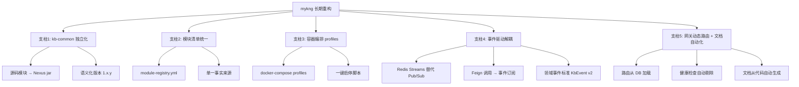

# mykng 知识库系统长期重构方案：事件驱动解耦 + 容器编排 profiles

> 日期：2026-07-03
> 文档类型：长期架构重构方案（6 个月路线图）
> 核心策略：**事件驱动解耦** + **容器编排 profiles（按需启停模块）**
> 上游文档：`架构反思_模块剥离痛点分析_20260703.md`
> 重构目标：让每个模块像"插件一样可插拔"，剥离/插入一个模块在 1 小时内完成

---

## 目录

- [一、背景与重构目标](#一背景与重构目标)
  - [1.1 问题的起源](#11-问题的起源)
  - [1.2 当前架构现状](#12-当前架构现状)
  - [1.3 重构目标与衡量指标](#13-重构目标与衡量指标)
- [二、总体方案设计](#二总体方案设计)
  - [2.1 目标架构总览](#21-目标架构总览)
  - [2.2 五大改造支柱](#22-五大改造支柱)
  - [2.3 设计原则](#23-设计原则)
- [三、事件驱动解耦](#三事件驱动解耦)
  - [3.1 当前 Feign 调用清单](#31-current-feign-inventory)
  - [3.2 消息中间件选型](#32-消息中间件选型)
  - [3.3 领域事件标准（KbEvent v2）](#33-领域事件标准kbevent-v2)
  - [3.4 Feign → 事件 改造清单](#34-feign--事件-改造清单)
  - [3.5 事件溯源与最终一致性](#35-事件溯源与最终一致性)
  - [3.6 事件驱动改造代码示例](#36-事件驱动改造代码示例)
- [四、容器编排 profiles（按需启停模块）](#四容器编排 profiles按需启停模块)
  - [4.1 module-registry.yml 模块清单设计](#41-module-registryyml-模块清单设计)
  - [4.2 docker-compose profiles 机制](#42-docker-compose-profiles-机制)
  - [4.3 三套 profile 配置示例](#43-三套-profile-配置示例)
  - [4.4 一键启停脚本设计](#44-一键启停脚本设计)
- [五、kb-common 独立化](#五kb-common-独立化)
  - [5.1 改造目标与边界](#51-改造目标与边界)
  - [5.2 独立 jar 发布流程](#52-独立-jar-发布流程)
  - [5.3 语义化版本策略](#53-语义化版本策略)
  - [5.4 各服务引用方式](#54-各服务引用方式)
- [六、网关动态路由](#六网关动态路由)
  - [6.1 当前路由痛点](#61-当前路由痛点)
  - [6.2 动态路由方案设计](#62-动态路由方案设计)
  - [6.3 模块上下线自动感知](#63-模块上下线自动感知)
- [七、分阶段实施路线图（6 个月）](#七分阶段实施路线图6-个月)
  - [7.1 路线图总览](#71-路线图总览)
  - [7.2 阶段 1（M1）：kb-common 独立 jar + module-registry.yml](#72-阶段-1m1kb-common-独立-jar--module-registryyml)
  - [7.3 阶段 2（M2-M3）：docker-compose profiles + 一键启停脚本](#73-阶段-2m2-m3docker-compose-profiles--一键启停脚本)
  - [7.4 阶段 3（M4-M5）：事件驱动改造](#74-阶段-3m4-m5事件驱动改造)
  - [7.5 阶段 4（M6）：网关动态路由 + 文档自动化](#75-阶段-4m6网关动态路由--文档自动化)
- [八、风险评估与回滚预案](#八风险评估与回滚预案)
  - [8.1 阶段性风险矩阵](#81-阶段性风险矩阵)
  - [8.2 回滚策略](#82-回滚策略)
  - [8.3 兼容性保证（新旧架构并存期）](#83-兼容性保证新旧架构并存期)
- [九、实施检查清单](#九实施检查清单)
- [十、附录](#十附录)

---

## 一、背景与重构目标

### 1.1 问题的起源

2026 年 6 月底，我们将 `kb-ops` 模块从 mykng 系统剥离为独立项目。预期"删除模块代码"应是一个轻量级操作，但实际工作量统计如下（详见 `架构反思_模块剥离痛点分析_20260703.md`）：

| 工作类别 | 文件数 | 耗时占比 |
|---------|-------|---------|
| 删除模块代码本身 | 82 | **5%** |
| 处理散落的配置、脚本、文档、依赖 | ~140 | **95%** |

**核心结论**：mykng 当前是一个"分布式单体（Distributed Monolith）"——我们承担了微服务的复杂性（网络调用、分布式事务、运维成本），却没有享受微服务的独立性（可插拔、独立部署、松耦合）。

### 1.2 当前架构现状

mykng 当前包含 5 个 Spring Boot 微服务 + 1 个 Vue3 前端：

```
┌─────────────────────────────────────────────────────────────────┐
│                       kb-web (Vue3 前端)                        │
└──────────────────────────────┬──────────────────────────────────┘
                               │ HTTP
┌──────────────────────────────▼──────────────────────────────────┐
│                   kb-gateway (8080/8090)                        │
│            Spring Cloud Gateway + JWT 鉴权                      │
│        路由硬编码在 application.yml × 4 环境                     │
└───┬───────────┬───────────────┬───────────────┬─────────────────┘
    │           │               │               │
    ▼           ▼               ▼               ▼
┌────────┐ ┌────────┐    ┌──────────┐    ┌──────────────┐
│kb-auth │ │kb-file │    │kb-       │    │kb-           │
│ (8081) │ │ (8082) │    │knowledge │    │intelligence  │
│        │ │        │    │ (8083)   │    │ (8086)       │
└───┬────┘ └───┬────┘    └────┬─────┘    └──────┬───────┘
    │          │              │                  │
    │          │  Feign 直连  │                  │
    │          ◄──────────────┤  (AuthClient /   │
    │          │  Feign 直连  │   FileClient)    │
    │          ◄──────────────┤                  │
    │          │              │                  │
    │          │ Redis Pub/Sub (仅 file.* 事件)  │
    │          ──────────────►│                  │
    │          │              │                  │
    ▼          ▼              ▼                  ▼
┌─────────────────────────────────────────────────────────────┐
│  MySQL  │ Redis  │ MinIO │ MeiliSearch │ MongoDB (kb_*库)   │
└─────────────────────────────────────────────────────────────┘

所有服务 ← 编译时依赖 → kb-common (源码模块)
所有服务 ← 父子继承 → kb-parent (1.0.0)
```

**当前 5 大痛点（详见反思文档）**：
1. kb-common 公共库以**源码模块**存在，导致编译时强耦合
2. 配置散落在 **15+ 文件**（application.yml × 4 环境、docker-compose、CI/CD、脚本、SQL）
3. Maven 父子工程强绑定（kb-parent 约束所有子模块）
4. Feign 服务间直接调用，没有走网关，形成网状依赖
5. 文档手动维护，模块变更需同步修改 10+ 文档

### 1.3 重构目标与衡量指标

#### 核心目标

| 目标 | 衡量指标 |
|------|---------|
| **模块可插拔** | 剥离/插入一个模块在 **1 小时内** 完成（当前需 2-3 天） |
| **按需启停** | 开发环境只启 2-3 个核心模块，生产环境全量启动 |
| **事件驱动解耦** | 服务间通过消息总线通信，生产者不感知消费者是否存在 |
| **配置单点管理** | 添加/移除模块从"改 15 个文件"变成"改 1 个 module-registry.yml" |
| **文档自动化** | 模块变更后，相关文档自动同步生成，无需人工维护 |

#### 非目标（明确不做的事）

- ❌ 不引入 Kubernetes（当前团队规模和部署复杂度不需要 K8s）
- ❌ 不引入 Service Mesh（Istio/Linkerd 过重）
- ❌ 不引入 Nacos/Eureka 注册中心（保持轻量，复用现有 Redis）
- ❌ 不切换构建工具（继续使用 Maven，不迁移到 Gradle）
- ❌ 不重写已有业务代码（仅在必要处做接口适配）

---

## 二、总体方案设计

### 2.1 目标架构总览

```
                    ┌─────────────────────────────────────┐
                    │         kb-web (Vue3 前端)          │
                    └────────────────┬────────────────────┘
                                     │ HTTP
                    ┌────────────────▼────────────────────┐
                    │      kb-gateway (动态路由)          │
                    │  路由从 module-registry.yml 加载    │
                    │  支持 DB 热更新 + 健康检查自动剔除  │
                    └──┬───────┬──────────┬──────────┬────┘
                       │       │          │          │
            ┌──────────┘       │          │          └──────────┐
            ▼                  ▼          ▼                     ▼
       ┌────────┐         ┌────────┐  ┌──────────┐       ┌──────────────┐
       │kb-auth │         │kb-file │  │kb-       │       │kb-           │
       │ (8081) │         │ (8082) │  │knowledge │       │intelligence  │
       │        │         │        │  │ (8083)   │       │ (8086)       │
       └───┬────┘         └───┬────┘  └────┬─────┘       └──────┬───────┘
           │                  │            │                     │
           │   事件总线 (Redis Streams)    │                     │
           │                  │ ──发布──► │ ──订阅──►            │
           │                  │ ◄─订阅──  │ ◄─发布──             │
           │                  │            │                     │
           │  ┌───────────────────────────────────────────────┐ │
           │  │  kb-common-x.y.z.jar (独立发布到 Nexus)        │ │
           │  └───────────────────────────────────────────────┘ │
           │                  │            │                     │
           ▼                  ▼            ▼                     ▼
     ┌─────────────────────────────────────────────────────────────┐
     │  MySQL  │ Redis  │ MinIO │ MeiliSearch │ MongoDB (kb_*库)   │
     └─────────────────────────────────────────────────────────────┘

     ┌─────────────────────────────────────────────────────────────┐
     │  module-registry.yml (单一事实来源)                         │
     │  ├── 模块清单（名称/端口/profile/依赖）                      │
     │  ├── CI/CD 从此读取服务列表                                 │
     │  ├── 脚本从此读取启停列表                                   │
     │  ├── 网关从此读取路由                                       │
     │  └── 文档生成器从此读取模块元数据                           │
     └─────────────────────────────────────────────────────────────┘
```

### 2.2 五大改造支柱



### 2.3 设计原则

1. **单一事实来源（Single Source of Truth）**：所有"模块清单"信息只在一个地方维护（`module-registry.yml`），其他所有配置/脚本/文档从该文件派生。
2. **渐进式改造**：每个阶段都可独立交付价值，新旧架构可并存，不要求一次性切换。
3. **向后兼容优先**：任何改造都需保证现有功能不回归，提供回滚路径。
4. **轻量级优先**：在满足需求的前提下，选择运维成本最低的方案（如 Redis Streams 而非 Kafka）。
5. **可观测性内建**：事件流、模块状态、路由变更都需要可观测，便于排查问题。

---

## 三、事件驱动解耦

### 3.1 当前 Feign 调用清单

通过全量扫描 `@FeignClient` 注解，当前 mykng 共有 **2 个 Feign 客户端**，全部位于 `kb-knowledge` 模块：

#### 3.1.1 AuthClient（kb-knowledge → kb-auth）

文件：`kb-knowledge/src/main/java/com/kb/knowledge/feign/AuthClient.java`

| 方法 | 用途 | 调用频率 | 同步/异步 | 改造难度 |
|------|------|---------|----------|---------|
| `getUserById(id)` | 根据用户 ID 获取用户信息（含状态） | 高（每次写操作校验） | 同步 | 中（需保留同步路径） |
| `isUserActive(userId)` | 验证用户状态是否正常（默认放行） | 高 | 同步 | 中 |

**调用语义分析**：这是典型的"读操作 + 强一致性需求"——kb-knowledge 在执行写操作前需确认用户状态。不适合直接改为纯异步事件，需保留同步路径但走网关。

#### 3.1.2 FileClient（kb-knowledge → kb-file）

文件：`kb-knowledge/src/main/java/com/kb/knowledge/feign/FileClient.java`

| 方法 | 用途 | 调用频率 | 改造方向 |
|------|------|---------|---------|
| `getById(id)` | 获取文件元数据 | 高（分享详情等读操作） | **保留同步**（走网关） |
| `getDownloadUrl(id)` | 获取预签名下载链接 | 中 | **保留同步**（走网关） |
| `getContent(id)` | 获取文件解析后文本 | 中 | **保留同步**（走网关） |
| `listTrash(userId)` | 列出回收站文件 | 低 | **保留同步**（走网关） |
| `restore(id)` | 恢复已删除文件 | 低 | **保留同步**（走网关） |
| `permanentDelete(id)` | 永久删除文件 | 低 | **改为事件**（file.permanent_deleted） |
| `emptyTrash(userId)` | 清空回收站 | 低 | **改为事件**（file.trash_emptied） |
| `searchByName(keyword, folderId)` | 按名称搜索文件 | 中 | **保留同步**（走网关） |
| `listAll()` | 列出用户所有文件 | 低（资源树聚合） | **改为事件**（file.index_updated 增量同步） |

#### 3.1.3 已有的事件系统

当前已存在基于 Redis Pub/Sub 的事件系统（`kb-common/event/KbEvent.java` + `kb-file/service/EventPublisher.java` + `kb-knowledge/event/IndexEventListener.java`），但仅支持 3 个事件类型：
- `file.parsed`：文件解析完成
- `file.deleted`：文件删除
- `file.reparse`：文件重新解析

**问题**：
1. 使用 Redis Pub/Sub，**消息无持久化**，消费方离线时丢失事件
2. 无消费者确认机制，无法保证至少一次投递
3. 事件类型硬编码为常量，扩展性差
4. 无事件溯源能力，无法回放历史事件

### 3.2 消息中间件选型

#### 候选方案对比

| 维度 | Redis Streams | RocketMQ | RabbitMQ | Kafka |
|------|--------------|----------|----------|-------|
| **运维复杂度** | ⭐ 极低（复用现有 Redis） | ⭐⭐ 中（独立部署） | ⭐⭐ 中（独立部署） | ⭐⭐⭐ 高（ZK/KRaft） |
| **消息持久化** | ✅ 支持 | ✅ 支持 | ✅ 支持 | ✅ 支持 |
| **消费者组** | ✅ XGROUP | ✅ 支持 | ✅ 支持 | ✅ 支持 |
| **消息回溯** | ✅ XPENDING/XCLAIM | ✅ 支持 | ⚠️ 有限 | ✅ 支持 |
| **Spring 集成** | ✅ 原生 | ✅ starter | ✅ starter | ✅ starter |
| **吞吐量** | 中（万级/秒） | 高（十万级） | 中（万级） | 极高（百万级） |
| **资源占用** | ~0（复用 Redis） | ~1GB | ~512MB | ~2GB |
| **学习成本** | 低 | 中 | 中 | 高 |

#### 决策：选择 Redis Streams

**理由**：
1. mykng 已部署 Redis 7（见 docker-compose.yml），**零额外运维成本**
2. 当前事件量预估 < 1000/秒，Redis Streams 完全满足
3. 支持消费者组（XGROUP）、消息确认（XACK）、死信处理（XPENDING/XCLAIM）
4. Spring Boot 3.2 原生支持 `RedisTemplate.opsForStream()`
5. 与现有 Pub/Sub 系统同源，迁移成本低

**不选 RocketMQ/RabbitMQ 的理由**：当前业务规模不需要独立消息中间件，引入会增加 1GB+ 内存占用和额外运维负担。

**未来扩展路径**：若事件量增长到万级/秒以上，可平滑迁移到 RocketMQ（KbEvent 抽象层屏蔽底层实现）。

### 3.3 领域事件标准（KbEvent v2）

#### 3.3.1 KbEvent v2 基类设计

```java
package com.kb.common.event;

import lombok.Data;
import lombok.NoArgsConstructor;

import java.time.Instant;
import java.util.Map;
import java.util.UUID;

/**
 * 跨服务领域事件基类 v2
 * <p>
 * 通过 Redis Streams 传递，支持持久化、消费者组、消息确认。
 * 所有具体事件继承此类，通过 eventType 区分。
 */
@Data
@NoArgsConstructor
public class KbEvent {

    /** 事件唯一 ID（用于幂等消费） */
    private String eventId;

    /** 事件类型，格式：domain.action，如 file.parsed、user.disabled */
    private String eventType;

    /** 事件版本号，用于兼容性管理（如 "1.0"、"2.0"） */
    private String version;

    /** 关联实体 ID */
    private Long entityId;

    /** 附加数据（业务负载） */
    private Map<String, Object> payload;

    /** 事件发生时间（业务时间，非投递时间） */
    private Instant timestamp;

    /** 事件来源服务名（如 "kb-file"） */
    private String source;

    /** traceId（用于跨服务链路追踪） */
    private String traceId;

    public KbEvent(String eventType, Long entityId, Map<String, Object> payload) {
        this.eventId = UUID.randomUUID().toString();
        this.eventType = eventType;
        this.version = "1.0";
        this.entityId = entityId;
        this.payload = payload;
        this.timestamp = Instant.now();
        this.traceId = MDC.get("traceId"); // 从 MDC 获取当前链路 ID
    }

    // ============ 标准事件类型常量 ============
    // 文件域事件
    public static final String FILE_PARSED = "file.parsed";
    public static final String FILE_DELETED = "file.deleted";
    public static final String FILE_REPARSED = "file.reparsed";
    public static final String FILE_RESTORED = "file.restored";
    public static final String FILE_PERMANENT_DELETED = "file.permanent_deleted";
    public static final String FILE_TRASH_EMPTIED = "file.trash_emptied";

    // 用户域事件
    public static final String USER_DISABLED = "user.disabled";
    public static final String USER_DELETED = "user.deleted";
    public static final String USER_ROLE_CHANGED = "user.role_changed";

    // 知识域事件
    public static final String DOC_CREATED = "doc.created";
    public static final String DOC_UPDATED = "doc.updated";
    public static final String DOC_DELETED = "doc.deleted";
    public static final String DOC_SHARED = "doc.shared";

    // 知识引擎域事件
    public static final String KNOWLEDGE_IMPORTED = "knowledge.imported";
    public static final String KNOWLEDGE_INDEXED = "knowledge.indexed";
}
```

#### 3.3.2 事件分类与通道设计

按领域划分 Stream，避免单一通道过载：

| Stream Key | 生产者 | 消费者 | 事件类型 |
|-----------|--------|--------|---------|
| `kb:stream:file` | kb-file | kb-knowledge | file.parsed / file.deleted / file.restored / file.permanent_deleted |
| `kb:stream:user` | kb-auth | kb-knowledge, kb-file | user.disabled / user.deleted |
| `kb:stream:doc` | kb-knowledge | kb-intelligence | doc.created / doc.updated / doc.deleted |
| `kb:stream:knowledge` | kb-intelligence | kb-knowledge | knowledge.imported / knowledge.indexed |

#### 3.3.3 消费者组设计

每个消费者服务对应一个消费者组（Consumer Group），同一服务的多实例负载均衡：

| 消费者组名 | 所属服务 | 订阅的 Stream |
|-----------|---------|--------------|
| `kb-knowledge-group` | kb-knowledge | kb:stream:file, kb:stream:user, kb:stream:knowledge |
| `kb-file-group` | kb-file | kb:stream:user |
| `kb-intelligence-group` | kb-intelligence | kb:stream:doc |

### 3.4 Feign → 事件 改造清单

#### 改造原则

| 调用语义 | 改造方向 | 示例 |
|---------|---------|------|
| **写操作触发下游状态变更** | ✅ 改为事件 | 文件永久删除 → 通知 kb-knowledge 失效分享 |
| **读操作需强一致性** | ❌ 保留同步（走网关） | 获取文件元数据用于分享详情 |
| **批量数据同步** | ✅ 改为事件（增量） | 文件列表全量同步改为增量事件 |
| **跨服务事务** | ✅ 改为事件 + Saga | 用户禁用 → 级联失效所有会话 |

#### 具体改造清单

| # | 当前调用 | 改造方向 | 新事件类型 | 实施阶段 |
|---|---------|---------|-----------|---------|
| 1 | FileClient.permanentDelete | ✅ 事件 | file.permanent_deleted | M4 |
| 2 | FileClient.emptyTrash | ✅ 事件 | file.trash_emptied | M4 |
| 3 | FileClient.listAll | ✅ 事件（增量同步） | file.index_updated | M5 |
| 4 | kb-auth 用户禁用（当前无通知） | ✅ 新增事件 | user.disabled | M4 |
| 5 | kb-auth 用户删除（当前无通知） | ✅ 新增事件 | user.deleted | M4 |
| 6 | kb-intelligence 知识导入完成 | ✅ 新增事件 | knowledge.imported | M5 |
| 7 | FileClient.getById | ❌ 保留同步 | - | 走网关 |
| 8 | FileClient.getDownloadUrl | ❌ 保留同步 | - | 走网关 |
| 9 | FileClient.getContent | ❌ 保留同步 | - | 走网关 |
| 10 | FileClient.listTrash | ❌ 保留同步 | - | 走网关 |
| 11 | FileClient.restore | ❌ 保留同步 | - | 走网关 |
| 12 | FileClient.searchByName | ❌ 保留同步 | - | 走网关 |
| 13 | AuthClient.getUserById | ❌ 保留同步 | - | 走网关 |
| 14 | AuthClient.isUserActive | ❌ 保留同步 | - | 走网关 |

**统计**：14 个 Feign 方法中，**6 个改为事件**，**8 个保留同步但走网关**。

### 3.5 事件溯源与最终一致性

#### 3.5.1 事件存储模型

所有事件持久化到 Redis Streams（自动保留），并按需归档到 MySQL 事件表（用于长期审计和回放）：

```sql
-- 事件归档表（kb_common 库，所有服务共享读权限）
CREATE TABLE IF NOT EXISTS `kb_event_log` (
  `id` bigint NOT NULL AUTO_INCREMENT COMMENT '自增主键',
  `event_id` varchar(64) NOT NULL COMMENT '事件唯一ID（UUID）',
  `event_type` varchar(64) NOT NULL COMMENT '事件类型（domain.action）',
  `version` varchar(16) NOT NULL DEFAULT '1.0' COMMENT '事件版本',
  `entity_id` bigint DEFAULT NULL COMMENT '关联实体ID',
  `payload` json DEFAULT NULL COMMENT '事件负载（JSON）',
  `source` varchar(32) NOT NULL COMMENT '事件来源服务',
  `trace_id` varchar(64) DEFAULT NULL COMMENT '链路追踪ID',
  `created_at` datetime NOT NULL DEFAULT CURRENT_TIMESTAMP COMMENT '事件发生时间',
  PRIMARY KEY (`id`),
  UNIQUE KEY `uk_event_id` (`event_id`),
  KEY `idx_event_type` (`event_type`),
  KEY `idx_entity_id` (`entity_id`),
  KEY `idx_created_at` (`created_at`)
) ENGINE=InnoDB DEFAULT CHARSET=utf8mb4 COMMENT='领域事件归档日志';
```

#### 3.5.2 最终一致性保证机制

```
┌─────────────┐    1. 发布事件     ┌──────────────┐    2. 持久化     ┌──────────────┐
│  生产者     │ ─────────────────► │ Redis Stream │ ──────────────► │ 归档到 MySQL  │
│ (kb-file)   │                    │ (kb:stream:*)│                 │ (kb_event_log)│
└─────────────┘                    └──────┬───────┘                 └──────────────┘
                                          │
                                          │ 3. 消费者组拉取（XREADGROUP）
                                          ▼
                                   ┌──────────────┐
                                   │   消费者     │
                                   │(kb-knowledge)│
                                   └──────┬───────┘
                                          │
                                          │ 4. 业务处理
                                          ▼
                                   ┌──────────────┐
                                   │ 5. XACK 确认 │
                                   │  （成功后）   │
                                   └──────────────┘
                                          │
                                          │ 处理失败？
                                          ▼
                                   ┌──────────────┐
                                   │ 6. XPENDING  │
                                   │  超时未确认   │
                                   │  → XCLAIM 重投│
                                   │  → 重试 3 次  │
                                   │  → 死信 Stream │
                                   └──────────────┘
```

**关键机制**：
1. **至少一次投递**：消费者必须 XACK 后消息才从 PEL（Pending Entries List）移除
2. **幂等消费**：消费者通过 `eventId` 去重（查询 `kb_event_log` 或本地已处理表）
3. **死信处理**：重试 3 次仍失败的消息转移到 `kb:stream:deadletter`，触发告警
4. **事件回放**：从 `kb_event_log` 按时间范围重放，用于数据修复或新服务初始化

#### 3.5.3 跨服务事务：Saga 模式

对于需要跨服务一致性的场景（如"删除用户 → 级联清理所有关联数据"），采用编排式 Saga：

```
用户删除 Saga：
  1. kb-auth 发布 user.deleted 事件（标记用户为"删除中"）
  2. kb-knowledge 消费 → 清理文档/分享 → 发布 doc.cleanup_completed
  3. kb-file 消费 → 清理文件 → 发布 file.cleanup_completed
  4. kb-auth 收集所有补偿事件 → 标记用户为"已删除"
  5. 任一环节失败 → 发布 user.delete_rollback → 各服务回滚
```

### 3.6 事件驱动改造代码示例

#### 3.6.1 事件发布器（v2，基于 Redis Streams）

```java
package com.kb.common.event.publisher;

import com.kb.common.event.KbEvent;
import lombok.RequiredArgsConstructor;
import lombok.extern.slf4j.Slf4j;
import org.springframework.beans.factory.annotation.Value;
import org.springframework.data.redis.core.RedisTemplate;
import org.springframework.stereotype.Component;

import java.util.HashMap;
import java.util.Map;

/**
 * 跨服务事件发布器 v2（基于 Redis Streams）
 * <p>
 * 替代原 EventPublisher（基于 Redis Pub/Sub）。
 * 支持持久化、消费者组、消息确认。
 */
@Slf4j
@Component
@RequiredArgsConstructor
public class KbEventPublisher {

    private final RedisTemplate<String, Object> redisTemplate;

    @Value("${kb.event.stream-prefix:kb:stream}")
    private String streamPrefix;

    /**
     * 发布事件到指定领域的 Stream
     * @param domain 领域名：file / user / doc / knowledge
     * @param event 事件对象
     */
    public void publish(String domain, KbEvent event) {
        String streamKey = streamPrefix + ":" + domain;
        try {
            Map<String, Object> fields = new HashMap<>();
            fields.put("eventId", event.getEventId());
            fields.put("eventType", event.getEventType());
            fields.put("version", event.getVersion());
            fields.put("entityId", event.getEntityId());
            fields.put("payload", event.getPayload());
            fields.put("source", event.getSource());
            fields.put("traceId", event.getTraceId());
            fields.put("timestamp", event.getTimestamp().toString());

            redisTemplate.opsForStream().add(streamKey, fields);
            log.info("[事件发布] stream={} eventType={} entityId={}",
                    streamKey, event.getEventType(), event.getEntityId());
        } catch (Exception e) {
            log.error("[事件发布失败] stream={} eventType={} entityId={}",
                    streamKey, event.getEventType(), event.getEntityId(), e);
            // 失败重试或写入本地降级表（避免事件丢失）
            throw new RuntimeException("事件发布失败", e);
        }
    }
}
```

#### 3.6.2 事件订阅器（v2，消费者组模式）

```java
package com.kb.common.event.subscriber;

import com.fasterxml.jackson.databind.ObjectMapper;
import com.kb.common.event.KbEvent;
import jakarta.annotation.PostConstruct;
import lombok.RequiredArgsConstructor;
import lombok.extern.slf4j.Slf4j;
import org.springframework.data.redis.connection.stream.*;
import org.springframework.data.redis.core.RedisTemplate;
import org.springframework.data.redis.stream.StreamListener;
import org.springframework.data.redis.stream.StreamMessageListenerContainer;
import org.springframework.data.redis.stream.Subscription;

import java.time.Duration;
import java.util.Map;

/**
 * 事件订阅器示例（kb-knowledge 消费 file 事件）
 */
@Slf4j
@RequiredArgsConstructor
public class FileEventSubscriber implements StreamListener<String, MapRecord<String, String, String>> {

    private final RedisTemplate<String, Object> redisTemplate;
    private final ObjectMapper objectMapper;
    private final String streamKey = "kb:stream:file";
    private final String consumerGroup = "kb-knowledge-group";
    private final String consumerName = "kb-knowledge-1";

    @PostConstruct
    public void init() {
        // 创建消费者组（如果不存在）
        try {
            redisTemplate.opsForStream().createGroup(streamKey, consumerGroup);
        } catch (Exception e) {
            log.info("消费者组已存在: {}", consumerGroup);
        }

        // 启动监听容器
        StreamMessageListenerContainer.StreamMessageListenerContainerOptions<String, MapRecord<String, String, String>> options =
                StreamMessageListenerContainer.StreamMessageListenerContainerOptions.builder()
                        .pollTimeout(Duration.ofSeconds(1))
                        .build();
        // 此处省略容器初始化代码，详见 Spring Data Redis 文档
    }

    @Override
    public void onMessage(MapRecord<String, String, String> message) {
        try {
            Map<String, String> fields = message.getValue();
            KbEvent event = parseEvent(fields);
            log.info("[事件消费] eventType={} eventId={}", event.getEventType(), event.getEventId());

            // 幂等性检查（基于 eventId）
            if (isAlreadyProcessed(event.getEventId())) {
                log.info("[事件已处理，跳过] eventId={}", event.getEventId());
                ack(message);
                return;
            }

            // 路由到具体处理器
            switch (event.getEventType()) {
                case KbEvent.FILE_DELETED -> handleFileDeleted(event);
                case KbEvent.FILE_PERMANENT_DELETED -> handleFilePermanentDeleted(event);
                case KbEvent.FILE_RESTORED -> handleFileRestored(event);
                default -> log.debug("[忽略非相关事件] eventType={}", event.getEventType());
            }

            // 标记已处理 + ACK
            markProcessed(event.getEventId());
            ack(message);
        } catch (Exception e) {
            log.error("[事件消费失败] id={} value={}", message.getId(), message.getValue(), e);
            // 不 ACK，消息留在 PEL 中，等待重试或死信处理
        }
    }

    private void ack(RecordId id) {
        redisTemplate.opsForStream().acknowledge(streamKey, consumerGroup, id);
    }

    // ... 其他辅助方法省略
}
```

#### 3.6.3 改造前后对比：文件永久删除

**改造前（Feign 同步调用）**：

```java
// kb-knowledge 的 ShareService 调用 kb-file 永久删除
public void onFilePermanentDelete(Long fileId) {
    fileClient.permanentDelete(fileId); // 同步调用，可能失败
    shareMapper.invalidateByFileId(fileId);
}
```

**改造后（事件驱动）**：

```java
// kb-file 发布事件（不关心谁消费）
public class KbFileService {
    private final KbEventPublisher eventPublisher;

    public void permanentDelete(Long fileId) {
        // 1. 删除文件（本地事务）
        fileMapper.deleteById(fileId);
        // 2. 发布事件（事务提交后发布，避免幻读）
        KbEvent event = new KbEvent(KbEvent.FILE_PERMANENT_DELETED, fileId,
                Map.of("fileId", fileId));
        event.setSource("kb-file");
        eventPublisher.publish("file", event);
    }
}

// kb-knowledge 订阅事件（异步处理）
public class FileEventSubscriber {
    private void handleFilePermanentDeleted(KbEvent event) {
        Long fileId = event.getEntityId();
        // 失效所有关联分享
        shareMapper.update(null,
                new LambdaUpdateWrapper<Share>()
                        .eq(Share::getResourceId, fileId)
                        .eq(Share::getResourceType, "file")
                        .set(Share::getDeleted, 1));
    }
}
```

**收益**：
- kb-file 不再感知 kb-knowledge 的存在
- kb-knowledge 离线时事件不丢失（持久化在 Stream 中）
- 剥离 kb-knowledge 时无需修改 kb-file 任何代码

---

## 四、容器编排 profiles（按需启停模块）

### 4.1 module-registry.yml 模块清单设计

#### 4.1.1 设计目标

将散落在 15+ 文件中的"模块清单"信息收敛到**单一文件**，作为所有脚本/CI/CD/网关/文档的派生源。

#### 4.1.2 完整文件设计

文件路径：`mykng/module-registry.yml`

```yaml
# ====================================================================
# mykng 模块注册清单（Single Source of Truth）
# ====================================================================
# 所有脚本、CI/CD、网关路由、文档生成器从此文件派生模块信息。
# 添加/移除模块只需修改此文件，无需遍历 15+ 配置文件。
# ====================================================================

# 全局配置
global:
  project-name: mykng
  context-path: ${KB_CONTEXT:/kb}
  java-version: 21
  spring-boot-version: 3.2.5
  network: kb-net

# 基础设施（所有 profile 默认启动）
infrastructure:
  - name: mysql
    image: mysql:8.0
    port: 3306
    profile: core          # core=所有环境必启
    health-check: ["CMD", "mysqladmin", "ping", "-h", "localhost"]
    volumes:
      - kb-mysql-data:/var/lib/mysql
      - ./init-sql:/docker-entrypoint-initdb.d
    mem-limit: 512m

  - name: redis
    image: redis:7-alpine
    port: 6379
    profile: core
    health-check: ["CMD", "redis-cli", "ping"]
    volumes:
      - kb-redis-data:/data
    mem-limit: 256m

  - name: minio
    image: minio/minio:latest
    ports: [9000, 9001]
    profile: storage       # 仅 file/knowledge 模块启动时才需要
    health-check: ["CMD", "curl", "-f", "http://localhost:9000/minio/health/live"]
    volumes:
      - kb-minio-data:/data
    mem-limit: 512m

  - name: meilisearch
    image: getmeili/meilisearch:v1.12
    port: 7700
    profile: search
    health-check: ["CMD", "curl", "-f", "http://localhost:7700/health"]
    volumes:
      - kb-meili-data:/meili_data
    mem-limit: 256m

  - name: mongodb
    image: mongo:7.0
    port: 27017
    profile: storage
    health-check: ["CMD", "mongosh", "--eval", "db.adminCommand('ping')"]
    volumes:
      - kb-mongo-data:/data/db
    mem-limit: 512m

# 微服务模块
modules:
  - name: kb-gateway
    type: service
    profile: core          # core=所有环境必启
    port: 8080             # 容器内端口
    host-port: 8090        # 宿主机映射端口（仅 gateway 映射）
    context: /kb
    health-path: /actuator/health
    depends-on: []         # 网关不依赖业务服务（路由延迟生效）
    infra-depends: []      # 不依赖任何基础设施
    routes:
      - path: /kb/api/auth/**
        target: kb-auth
      - path: /kb/api/user/**
        target: kb-auth
      - path: /kb/api/token/**
        target: kb-auth
      - path: /kb/api/log/**
        target: kb-auth
      - path: /kb/api/file/**
        target: kb-file
      - path: /kb/api/bucket/**
        target: kb-file
      - path: /kb/api/doc/**
        target: kb-knowledge
      - path: /kb/api/folder/**
        target: kb-knowledge
      - path: /kb/api/intelligence/**
        target: kb-intelligence
    description: API 网关：路由转发、JWT 鉴权、限流
    removable: false       # 核心模块，不可剥离

  - name: kb-auth
    type: service
    profile: core
    port: 8081
    host-port: null        # 不映射宿主机端口
    health-path: /actuator/health
    depends-on: []         # 不依赖其他业务服务
    infra-depends: [mysql, redis]
    database: kb_auth
    description: 认证授权：登录、JWT、用户管理、API Token
    removable: false

  - name: kb-file
    type: service
    profile: file
    port: 8082
    host-port: null
    health-path: /actuator/health
    depends-on: [kb-auth]
    infra-depends: [mysql, redis, minio, meilisearch, mongodb]
    database: kb_file
    description: 文件管理：上传、下载、分片、解析、回收站
    removable: true

  - name: kb-knowledge
    type: service
    profile: knowledge
    port: 8083
    host-port: null
    health-path: /actuator/health
    depends-on: [kb-auth, kb-file]
    infra-depends: [mysql, redis, meilisearch, mongodb]
    database: kb_knowledge
    description: 知识管理：文档、文件夹、分享、标签、搜索
    removable: true

  - name: kb-intelligence
    type: service
    profile: intelligence
    port: 8086
    host-port: null
    health-path: /actuator/health
    depends-on: []
    infra-depends: [mysql, redis, mongodb, meilisearch]
    database: kb_intelligence
    description: 知识引擎：导入、解析、实体抽取、LLM 集成
    removable: true

  - name: kb-web
    type: frontend
    profile: web
    port: 80
    host-port: 8088
    health-path: /
    depends-on: [kb-gateway]
    infra-depends: []
    description: Vue3 前端
    removable: false

# Profile 组合（预置的模块组合方案）
profile-presets:
  dev-minimal:            # 开发环境最小集（只做认证相关开发）
    modules: [kb-gateway, kb-auth]
    infra: [mysql, redis]

  dev-core:               # 开发环境核心集（认证 + 文件 + 知识）
    modules: [kb-gateway, kb-auth, kb-file, kb-knowledge]
    infra: [mysql, redis, minio, meilisearch, mongodb]

  dev-full:               # 开发环境全量
    modules: [kb-gateway, kb-auth, kb-file, kb-knowledge, kb-intelligence, kb-web]
    infra: [mysql, redis, minio, meilisearch, mongodb]

  test:                   # 测试环境（全量）
    modules: [kb-gateway, kb-auth, kb-file, kb-knowledge, kb-intelligence, kb-web]
    infra: [mysql, redis, minio, meilisearch, mongodb]

  prod:                   # 生产环境（全量）
    modules: [kb-gateway, kb-auth, kb-file, kb-knowledge, kb-intelligence, kb-web]
    infra: [mysql, redis, minio, meilisearch, mongodb]
```

#### 4.1.3 字段说明

| 字段 | 类型 | 必填 | 说明 |
|------|------|------|------|
| `name` | string | ✅ | 模块名（与目录名一致） |
| `type` | string | ✅ | `service` / `frontend` / `infra` |
| `profile` | string | ✅ | docker-compose profile（`core`/`file`/`knowledge`/...） |
| `port` | int | ✅ | 容器内端口 |
| `host-port` | int/null | ❌ | 宿主机映射端口（null=不映射） |
| `depends-on` | string[] | ✅ | 业务服务依赖（影响启动顺序） |
| `infra-depends` | string[] | ✅ | 基础设施依赖 |
| `routes` | object[] | ❌ | 网关路由配置（仅 gateway 需要） |
| `removable` | bool | ✅ | 是否可剥离（核心模块=false） |
| `database` | string | ❌ | 独立数据库名 |

### 4.2 docker-compose profiles 机制

#### 4.2.1 改造后的 docker-compose.yml（节选）

```yaml
# docker-compose.yml（改造后）
# 所有服务通过 profiles 控制启停
# 启动方式：docker compose --profile dev-core up -d

services:
  # ========== 基础设施 ==========
  mysql:
    image: mysql:8.0
    profiles: ["core", "dev-minimal", "dev-core", "dev-full", "test", "prod"]
    # ... 其余配置同原版

  redis:
    image: redis:7-alpine
    profiles: ["core", "dev-minimal", "dev-core", "dev-full", "test", "prod"]
    # ...

  minio:
    image: minio/minio:latest
    profiles: ["storage", "dev-core", "dev-full", "test", "prod"]  # 不含 dev-minimal
    # ...

  meilisearch:
    image: getmeili/meilisearch:v1.12
    profiles: ["search", "dev-core", "dev-full", "test", "prod"]
    # ...

  mongodb:
    image: mongo:7.0
    profiles: ["storage", "dev-core", "dev-full", "test", "prod"]
    # ...

  # ========== 微服务 ==========
  kb-gateway:
    build:
      context: ./kb-gateway
      dockerfile: Dockerfile
    profiles: ["core", "dev-minimal", "dev-core", "dev-full", "test", "prod"]
    ports:
      - "8090:8080"
    environment:
      - SPRING_PROFILES_ACTIVE=${ENV:-prod}
      - KB_CONTEXT=${KB_CONTEXT:-/kb}
      # 下游服务地址从环境变量注入（动态发现）
      - KB_AUTH_HOST=kb-auth:8081
      - KB_FILE_HOST=kb-file:8082
      - KB_KNOWLEDGE_HOST=kb-knowledge:8083
      - KB_INTELLIGENCE_HOST=kb-intelligence:8086
    healthcheck:
      test: ["CMD", "wget", "--spider", "-q", "http://localhost:8080/actuator/health"]
      interval: 30s
      timeout: 5s
      retries: 3
      start_period: 40s
    networks:
      - kb-net
    mem_limit: 512m

  kb-auth:
    build:
      context: ./kb-auth
      dockerfile: Dockerfile
    profiles: ["core", "dev-minimal", "dev-core", "dev-full", "test", "prod"]
    environment:
      - SPRING_PROFILES_ACTIVE=${ENV:-prod}
      - MYSQL_HOST=mysql
      - REDIS_HOST=redis
      # ...
    depends_on:
      mysql:
        condition: service_healthy
      redis:
        condition: service_healthy
    networks:
      - kb-net
    mem_limit: 512m

  kb-file:
    build:
      context: ./kb-file
      dockerfile: Dockerfile
    profiles: ["file", "dev-core", "dev-full", "test", "prod"]  # 不含 dev-minimal
    environment:
      # ...
    depends_on:
      mysql: { condition: service_healthy }
      redis: { condition: service_healthy }
      minio: { condition: service_healthy }
      meilisearch: { condition: service_healthy }
      mongodb: { condition: service_healthy }
    networks: [kb-net]
    mem_limit: 512m

  kb-knowledge:
    build:
      context: ./kb-knowledge
      dockerfile: Dockerfile
    profiles: ["knowledge", "dev-core", "dev-full", "test", "prod"]
    environment:
      # ...
    depends_on:
      mysql: { condition: service_healthy }
      redis: { condition: service_healthy }
      meilisearch: { condition: service_healthy }
      mongodb: { condition: service_healthy }
      kb-auth: { condition: service_healthy }
      kb-file: { condition: service_healthy }
    networks: [kb-net]
    mem_limit: 512m

  kb-intelligence:
    build:
      context: ./kb-intelligence
      dockerfile: Dockerfile
    profiles: ["intelligence", "dev-full", "test", "prod"]  # 不含 dev-minimal/dev-core
    environment:
      # ...
    depends_on:
      mysql: { condition: service_healthy }
      redis: { condition: service_healthy }
      mongodb: { condition: service_healthy }
      meilisearch: { condition: service_healthy }
    networks: [kb-net]
    mem_limit: 768m

  kb-web:
    build:
      context: ./kb-web
      dockerfile: Dockerfile
    profiles: ["web", "dev-full", "test", "prod"]
    ports:
      - "8088:80"
    depends_on:
      kb-gateway: { condition: service_healthy }
    networks: [kb-net]
```

#### 4.2.2 关键设计点

1. **`profiles` 数组语义**：服务在列出的任一 profile 启动时生效
2. **`core` profile**：基础设施 + gateway + auth，所有环境必启
3. **`dev-minimal`**：只启 mysql + redis + gateway + auth（开发认证模块时）
4. **`dev-core`**：核心三服务（gateway + auth + file + knowledge），不含 intelligence
5. **`dev-full`**：全量（用于集成测试）
6. **依赖隔离**：`depends_on` 只声明，Docker Compose 会自动跳过未启动的依赖（profile 机制保证）

### 4.3 三套 profile 配置示例

#### 4.3.1 开发环境（.env.dev）

```ini
# .env.dev - 开发环境配置
ENV=dev
KB_CONTEXT=/kb

# 数据库
MYSQL_ROOT_PASSWORD=kb123456
REDIS_PASSWORD=

# JWT 密钥（开发环境用简单密钥）
JWT_SECRET=YourSuperSecretKeyForJwtTokenGenerationMustBeAtLeast256BitsLong!!

# 加密密钥
CRYPTO_AES_KEY=YWVzLTI1Ni1nY20ta2V5LTMyLWJ5dGVzISE=

# MinIO
MINIO_ROOT_USER=minioadmin
MINIO_ROOT_PASSWORD=minioadmin

# MeiliSearch
MEILI_MASTER_KEY=kbMeiliKey2026!!Secure

# MongoDB
MONGO_ROOT_USER=kb
MONGO_ROOT_PASSWORD=kb123456

# LLM（开发环境默认关闭）
LLM_ENABLED=false
LLM_ENDPOINT=
LLM_API_KEY=
LLM_MODEL=qwen-turbo

# 知识导入源目录
IMPORT_SOURCE_DIR=./data/import
```

#### 4.3.2 测试环境（.env.test）

```ini
# .env.test - 测试环境配置
ENV=staging
KB_CONTEXT=/kb

# 数据库（测试环境用独立密码）
MYSQL_ROOT_PASSWORD=<从 Vault 注入>
REDIS_PASSWORD=<从 Vault 注入>

# JWT 密钥（测试环境用强密钥）
JWT_SECRET=<从 Vault 注入>

# 其余配置与 dev 类似，但密钥从密钥管理系统注入
```

#### 4.3.3 生产环境（.env.prod）

```ini
# .env.prod - 生产环境配置
ENV=prod
KB_CONTEXT=/kb

# 所有密钥从环境变量注入（不落盘）
MYSQL_ROOT_PASSWORD=${MYSQL_ROOT_PASSWORD}
REDIS_PASSWORD=${REDIS_PASSWORD}
JWT_SECRET=${JWT_SECRET}
CRYPTO_AES_KEY=${CRYPTO_AES_KEY}
MINIO_ROOT_USER=${MINIO_ROOT_USER}
MINIO_ROOT_PASSWORD=${MINIO_ROOT_PASSWORD}
MEILI_MASTER_KEY=${MEILI_MASTER_KEY}
MONGO_ROOT_USER=${MONGO_ROOT_USER}
MONGO_ROOT_PASSWORD=${MONGO_ROOT_PASSWORD}

# LLM（生产环境启用）
LLM_ENABLED=true
LLM_ENDPOINT=${LLM_ENDPOINT}
LLM_API_KEY=${LLM_API_KEY}
LLM_MODEL=qwen-turbo

# 知识导入源目录
IMPORT_SOURCE_DIR=/data/import
```

### 4.4 一键启停脚本设计

#### 4.4.1 设计目标

- 单条命令启停任意模块组合
- 自动从 `module-registry.yml` 读取依赖
- 支持单个模块的启停、重启、查看日志、健康检查

#### 4.4.2 脚本：kb-cli.ps1（PowerShell 版）

```powershell
# kb-cli.ps1 - mykng 模块管理 CLI
# 用法：
#   .\kb-cli.ps1 up dev-core          # 启动 dev-core profile
#   .\kb-cli.ps1 up kb-file           # 启动单个模块
#   .\kb-cli.ps1 down kb-intelligence # 停止单个模块
#   .\kb-cli.ps1 restart kb-auth      # 重启单个模块
#   .\kb-cli.ps1 logs kb-file         # 查看日志
#   .\kb-cli.ps1 health               # 检查所有模块健康状态
#   .\kb-cli.ps1 list                 # 列出所有可用模块和 profile

param(
    [Parameter(Mandatory=$true, Position=0)]
    [ValidateSet("up", "down", "restart", "logs", "health", "list", "build")]
    [string]$Action,

    [Parameter(Mandatory=$false, Position=1)]
    [string]$Target = "",

    [Parameter(Mandatory=$false)]
    [string]$Env = "dev"
)

# 加载环境变量文件
$EnvFile = ".env.$Env"
if (Test-Path $EnvFile) {
    Get-Content $EnvFile | ForEach-Object {
        if ($_ -match "^\s*([^#=\s]+)\s*=\s*(.*)$") {
            Set-Item -Name "ENV:$($Matches[1])" -Value $Matches[2]
        }
    }
}

# 预置 profile 列表（与 module-registry.yml 的 profile-presets 对应）
$ValidProfiles = @("dev-minimal", "dev-core", "dev-full", "test", "prod")
$ValidModules = @("kb-gateway", "kb-auth", "kb-file", "kb-knowledge",
                   "kb-intelligence", "kb-web", "mysql", "redis",
                   "minio", "meilisearch", "mongodb")

switch ($Action) {
    "up" {
        if ($ValidProfiles -contains $Target) {
            Write-Host "[启动] profile=$Target env=$Env" -ForegroundColor Green
            docker compose --profile $Target --env-file $EnvFile up -d
        }
        elseif ($ValidModules -contains $Target) {
            Write-Host "[启动] module=$Target env=$Env" -ForegroundColor Green
            docker compose --env-file $EnvFile up -d $Target
        }
        else {
            Write-Host "无效目标: $Target" -ForegroundColor Red
            Write-Host "可用 profile: $ValidProfiles"
            Write-Host "可用 module: $ValidModules"
            exit 1
        }
    }
    "down" {
        if ($ValidModules -contains $Target) {
            Write-Host "[停止] module=$Target" -ForegroundColor Yellow
            docker compose stop $Target
        } else {
            Write-Host "停止单个模块，必须指定模块名: $ValidModules" -ForegroundColor Red
            exit 1
        }
    }
    "restart" {
        if ($ValidModules -contains $Target) {
            Write-Host "[重启] module=$Target" -ForegroundColor Cyan
            docker compose restart $Target
        }
    }
    "logs" {
        if ($ValidModules -contains $Target) {
            docker compose logs -f $Target
        } else {
            docker compose logs -f
        }
    }
    "health" {
        Write-Host "[健康检查] 检查所有运行中的容器..." -ForegroundColor Cyan
        docker compose ps
        Write-Host "`n[健康端点检查]..."
        $RunningServices = docker compose ps --services --filter "status=running"
        foreach ($svc in $RunningServices) {
            $port = switch ($svc) {
                "kb-gateway" { 8090 }
                "kb-auth" { 8081 }
                "kb-file" { 8082 }
                "kb-knowledge" { 8083 }
                "kb-intelligence" { 8086 }
                default { $null }
            }
            if ($port) {
                try {
                    $response = Invoke-WebRequest -Uri "http://localhost:$port/actuator/health" `
                                                  -UseBasicParsing -TimeoutSec 3
                    Write-Host "  ✅ $svc : $($response.Content)" -ForegroundColor Green
                } catch {
                    Write-Host "  ❌ $svc : 健康检查失败" -ForegroundColor Red
                }
            }
        }
    }
    "list" {
        Write-Host "可用 Profile:" -ForegroundColor Cyan
        $ValidProfiles | ForEach-Object { Write-Host "  - $_" }
        Write-Host "`n可用模块:" -ForegroundColor Cyan
        $ValidModules | ForEach-Object { Write-Host "  - $_" }
    }
    "build" {
        if ($ValidModules -contains $Target) {
            Write-Host "[构建] module=$Target" -ForegroundColor Green
            docker compose build $Target
        } else {
            docker compose build
        }
    }
}
```

#### 4.4.3 典型使用场景

```bash
# 场景 1：开发者只做认证模块开发（最轻量）
.\kb-cli.ps1 up dev-minimal
# 启动：mysql + redis + kb-gateway + kb-auth（4 个容器）

# 场景 2：开发者做文件+知识模块开发（核心功能）
.\kb-cli.ps1 up dev-core
# 启动：mysql + redis + minio + meilisearch + mongodb + gateway + auth + file + knowledge（9 个容器）

# 场景 3：全量集成测试
.\kb-cli.ps1 up dev-full
# 启动所有 11 个容器

# 场景 4：只重启 kb-auth（修改了认证逻辑）
.\kb-cli.ps1 restart kb-auth

# 场景 5：临时停止 kb-intelligence（节省内存）
.\kb-cli.ps1 down kb-intelligence

# 场景 6：查看 kb-file 日志
.\kb-cli.ps1 logs kb-file

# 场景 7：健康检查
.\kb-cli.ps1 health
```

---

## 五、kb-common 独立化

### 5.1 改造目标与边界

#### 5.1.1 现状

kb-common 当前作为 `kb-parent` 的子模块，以**源码模块**形式存在：

```
kb-parent/pom.xml
  ├── <module>../kb-common</module>
  └── dependencyManagement: kb-common 1.0.0

各服务引用方式：
  <dependency>
      <groupId>com.kb</groupId>
      <artifactId>kb-common</artifactId>
      <!-- 不写 version，由 kb-parent 管理 -->
  </dependency>
```

**问题**：任何模块剥离时，必须把 kb-common 的 9 个核心类源码复制过去（如 kb-ops 剥离时已发生）。

#### 5.1.2 改造目标

将 kb-common 从源码模块改造为**独立 jar 制品**，发布到 Nexus 私服，各服务通过版本号引用。

#### 5.1.3 kb-common 包含的内容（盘点）

| 包 | 类 | 职责 |
|----|-----|------|
| `common.result` | Result | 统一响应体 |
| `common.page` | PageResult | 分页结果 |
| `common.exception` | BusinessException / NotFoundException / ConflictException / NoPermissionException / NotLoginException / FileParseException | 业务异常 |
| `common.exception` | GlobalExceptionHandler | 全局异常处理器 |
| `common.assertor` | KbAssertions / AssertResult / AssertException / AssertField | 断言工具 |
| `common.event` | KbEvent | 领域事件基类 |
| `common.trace` | TraceIdInterceptor / FeignTraceIdInterceptor / WebLogAspect / TraceIdAutoConfig | 链路追踪 |

### 5.2 独立 jar 发布流程

#### 5.2.1 kb-common/pom.xml 改造

```xml
<?xml version="1.0" encoding="UTF-8"?>
<project xmlns="http://maven.apache.org/POM/4.0.0">
    <modelVersion>4.0.0</modelVersion>

    <!-- 改造点 1：继承 spring-boot-starter-parent，不再继承 kb-parent -->
    <parent>
        <groupId>org.springframework.boot</groupId>
        <artifactId>spring-boot-starter-parent</artifactId>
        <version>3.2.5</version>
        <relativePath/>
    </parent>

    <groupId>com.kb</groupId>
    <artifactId>kb-common</artifactId>
    <!-- 改造点 2：独立版本号，与 kb-parent 解耦 -->
    <version>1.1.0</version>
    <packaging>jar</packaging>

    <name>kb-common</name>
    <description>mykng 公共库（独立 jar 发布）</description>

    <properties>
        <java.version>21</java.version>
        <hutool.version>5.8.27</hutool.version>
    </properties>

    <!-- 改造点 3：显式声明所有依赖版本（不再依赖 kb-parent 的 dependencyManagement） -->
    <dependencies>
        <dependency>
            <groupId>org.springframework.boot</groupId>
            <artifactId>spring-boot-starter-web</artifactId>
        </dependency>
        <dependency>
            <groupId>org.springframework.cloud</groupId>
            <artifactId>spring-cloud-starter-openfeign</artifactId>
            <version>4.1.3</version>
            <optional>true</optional>  <!-- 可选，仅 FeignTraceIdInterceptor 需要 -->
        </dependency>
        <dependency>
            <groupId>cn.hutool</groupId>
            <artifactId>hutool-all</artifactId>
            <version>${hutool.version}</version>
        </dependency>
        <dependency>
            <groupId>org.projectlombok</groupId>
            <artifactId>lombok</artifactId>
            <optional>true</optional>
        </dependency>
    </dependencies>

    <!-- 改造点 4：配置 Nexus 私服（与 kb-parent 一致） -->
    <distributionManagement>
        <repository>
            <id>nexus-releases</id>
            <url>https://nexus.marschat.online/repository/maven-releases/</url>
        </repository>
        <snapshotRepository>
            <id>nexus-snapshots</id>
            <url>https://nexus.marschat.online/repository/maven-snapshots/</url>
        </snapshotRepository>
    </distributionManagement>

    <build>
        <plugins>
            <!-- 改造点 5：不使用 spring-boot-maven-plugin（普通 jar，非可执行 jar） -->
            <plugin>
                <groupId>org.apache.maven.plugins</groupId>
                <artifactId>maven-compiler-plugin</artifactId>
                <configuration>
                    <source>21</source>
                    <target>21</target>
                </configuration>
            </plugin>
            <!-- 源码包（便于调试） -->
            <plugin>
                <groupId>org.apache.maven.plugins</groupId>
                <artifactId>maven-source-plugin</artifactId>
                <executions>
                    <execution>
                        <id>attach-sources</id>
                        <goals><goal>jar</goal></goals>
                    </execution>
                </executions>
            </plugin>
        </plugins>
    </build>
</project>
```

#### 5.2.2 发布流程

```bash
# 1. 在 kb-common 目录下执行
cd kb-common

# 2. 编译 + 单元测试
mvn clean test

# 3. 发布到 Nexus（release 版本）
mvn clean deploy -DskipTests

# 4. 验证 Nexus 上已有 1.1.0 版本
# 访问 https://nexus.marschat.online/repository/maven-releases/com/kb/kb-common/
```

### 5.3 语义化版本策略

#### 5.3.1 版本号规则

采用 [SemVer](https://semver.org/lang/zh-CN/) 语义化版本：`MAJOR.MINOR.PATCH`

| 版本段 | 何时递增 | 示例 |
|--------|---------|------|
| `MAJOR` | 不兼容的 API 变更 | 删除 Result 类、改变方法签名 |
| `MINOR` | 向后兼容的功能新增 | 新增 KbEvent 字段、新增工具类 |
| `PATCH` | 向后兼容的 Bug 修复 | 修复 GlobalExceptionHandler 空指针 |

#### 5.3.2 当前版本规划

| 版本 | 计划时间 | 变更内容 |
|------|---------|---------|
| 1.0.0 | 已发布（当前） | 源码模块版本 |
| 1.1.0 | M1 阶段 | 首个独立 jar 版本（与 1.0.0 API 兼容） |
| 1.2.0 | M4 阶段 | KbEvent v2（新增 eventId/version/traceId 字段） |
| 1.3.0 | M6 阶段 | 新增事件发布器/订阅器工具类 |

#### 5.3.3 版本兼容性策略

- **MAJOR 升级**：必须提供迁移指南，至少保留一个版本的兼容期
- **MINOR 升级**：各服务可自行决定何时升级（向后兼容）
- **PATCH 升级**：建议各服务及时跟进（Bug 修复）

### 5.4 各服务引用方式

#### 5.4.1 改造前（源码模块依赖）

```xml
<!-- kb-knowledge/pom.xml -->
<parent>
    <groupId>com.kb</groupId>
    <artifactId>kb-parent</artifactId>
    <version>1.0.0</version>
    <relativePath>../kb-parent/pom.xml</relativePath>
</parent>

<dependencies>
    <dependency>
        <groupId>com.kb</groupId>
        <artifactId>kb-common</artifactId>
        <!-- 不写 version，由 kb-parent 管理 -->
    </dependency>
</dependencies>
```

#### 5.4.2 改造后（独立 jar 依赖）

```xml
<!-- kb-knowledge/pom.xml -->
<parent>
    <groupId>com.kb</groupId>
    <artifactId>kb-parent</artifactId>
    <version>1.0.0</version>
    <relativePath>../kb-parent/pom.xml</relativePath>
</parent>

<dependencies>
    <dependency>
        <groupId>com.kb</groupId>
        <artifactId>kb-common</artifactId>
        <version>${kb-common.version}</version>  <!-- 显式指定版本 -->
    </dependency>
</dependencies>
```

#### 5.4.3 kb-parent/pom.xml 的调整

```xml
<!-- kb-parent/pom.xml -->
<properties>
    <!-- 从源码模块版本升级为独立 jar 版本 -->
    <kb-common.version>1.1.0</kb-common.version>
</properties>

<modules>
    <!-- 改造点：移除 kb-common 源码模块 -->
    <!-- <module>../kb-common</module> -->  <!-- 删除此行 -->
    <module>../kb-gateway</module>
    <module>../kb-auth</module>
    <module>../kb-file</module>
    <module>../kb-knowledge</module>
    <module>../kb-intelligence</module>
</modules>

<dependencyManagement>
    <dependencies>
        <!-- 保留版本管理，但 kb-common 不再是源码模块 -->
        <dependency>
            <groupId>com.kb</groupId>
            <artifactId>kb-common</artifactId>
            <version>${kb-common.version}</version>
        </dependency>
    </dependencies>
</dependencyManagement>
```

#### 5.4.4 剥离模块时的简化

改造后，剥离一个模块（如 kb-ops 剥离场景）只需：

```xml
<!-- 剥离后的独立项目 pom.xml -->
<parent>
    <groupId>org.springframework.boot</groupId>
    <artifactId>spring-boot-starter-parent</artifactId>
    <version>3.2.5</version>
</parent>

<dependencies>
    <!-- 直接引用 Nexus 上的 kb-common jar，无需复制源码 -->
    <dependency>
        <groupId>com.kb</groupId>
        <artifactId>kb-common</artifactId>
        <version>1.1.0</version>
    </dependency>
</dependencies>

<!-- 配置 Nexus 私服 -->
<repositories>
    <repository>
        <id>nexus-public</id>
        <url>https://nexus.marschat.online/repository/maven-public/</url>
    </repository>
</repositories>
```

**收益**：剥离模块时**无需复制 9 个类的源码**，直接引用 jar 即可。

---

## 六、网关动态路由

### 6.1 当前路由痛点

当前网关路由硬编码在 `kb-gateway/src/main/resources/application.yml`：

```yaml
spring:
  cloud:
    gateway:
      routes:
        - id: kb-auth
          uri: http://${kb.gateway.services.auth:localhost:8081}
          predicates:
            - Path=${KB_CONTEXT:/kb}/api/auth/**,...
        - id: kb-file
          uri: http://${kb.gateway.services.file:localhost:8082}
          # ...
```

**问题**：
1. 添加/移除模块需修改 **4 个环境的 application.yml**（dev/prod/uat/staging）
2. 路由变更需重启网关
3. 无法感知模块健康状态（下游挂了仍转发）
4. 路由信息散落在配置文件，无法动态管理

### 6.2 动态路由方案设计

#### 6.2.1 方案选型

| 方案 | 优点 | 缺点 | 选择 |
|------|------|------|------|
| **从数据库加载** | 持久化、可审计、支持热更新 | 需建表、需轮询或事件通知 | ✅ 选择 |
| 从 Nacos 加载 | 实时推送 | 引入 Nacos 增加运维成本 | ❌ |
| 从 module-registry.yml 加载 | 单一来源 | 不支持运行时变更 | ❌（仅启动时用） |

**决策**：路由配置存入 MySQL，网关启动时从 `module-registry.yml` 初始化数据库，运行时支持数据库热更新。

#### 6.2.2 路由表设计

```sql
-- 网关路由表（kb_gateway 库）
CREATE TABLE IF NOT EXISTS `gateway_route` (
  `id` varchar(64) NOT NULL COMMENT '路由ID（如 kb-auth）',
  `service_name` varchar(64) NOT NULL COMMENT '目标服务名',
  `uri` varchar(256) NOT NULL COMMENT '目标URI（如 lb://kb-auth 或 http://kb-auth:8081）',
  `predicates` text NOT NULL COMMENT '断言配置（JSON 数组）',
  `filters` text COMMENT '过滤器配置（JSON 数组）',
  `enabled` tinyint NOT NULL DEFAULT 1 COMMENT '是否启用（0=禁用，1=启用）',
  `auto_health_check` tinyint NOT NULL DEFAULT 1 COMMENT '是否自动健康检查',
  `health_path` varchar(128) DEFAULT '/actuator/health' COMMENT '健康检查路径',
  `created_at` datetime NOT NULL DEFAULT CURRENT_TIMESTAMP,
  `updated_at` datetime NOT NULL DEFAULT CURRENT_TIMESTAMP ON UPDATE CURRENT_TIMESTAMP,
  PRIMARY KEY (`id`),
  KEY `idx_enabled` (`enabled`)
) ENGINE=InnoDB DEFAULT CHARSET=utf8mb4 COMMENT='网关动态路由表';

-- 初始数据（从 module-registry.yml 派生）
INSERT INTO `gateway_route` (`id`, `service_name`, `uri`, `predicates`, `filters`, `enabled`) VALUES
('kb-auth', 'kb-auth', 'lb://kb-auth',
 '[{"name":"Path","args":{"_genkey_0":"/kb/api/auth/**","_genkey_1":"/kb/api/user/**","_genkey_2":"/kb/api/token/**","_genkey_3":"/kb/api/log/**"}}]',
 '[{"name":"StripPrefix","args":{"_genkey_0":"2"}}]', 1),
('kb-file', 'kb-file', 'lb://kb-file',
 '[{"name":"Path","args":{"_genkey_0":"/kb/api/file/**","_genkey_1":"/kb/api/bucket/**"}}]',
 '[{"name":"StripPrefix","args":{"_genkey_0":"2"}}]', 1),
('kb-knowledge', 'kb-knowledge', 'lb://kb-knowledge',
 '[{"name":"Path","args":{"_genkey_0":"/kb/api/doc/**","_genkey_1":"/kb/api/folder/**","_genkey_2":"/kb/api/web/**","_genkey_3":"/kb/api/search/**","_genkey_4":"/kb/api/share/**","_genkey_5":"/kb/api/tag/**","_genkey_6":"/kb/api/space/**","_genkey_7":"/kb/api/trash/**","_genkey_8":"/kb/api/version/**"}}]',
 '[{"name":"StripPrefix","args":{"_genkey_0":"2"}}]', 1),
('kb-intelligence', 'kb-intelligence', 'lb://kb-intelligence',
 '[{"name":"Path","args":{"_genkey_0":"/kb/api/intelligence/**"}}]',
 '[{"name":"StripPrefix","args":{"_genkey_0":"2"}}]', 1);
```

#### 6.2.3 动态路由加载器

```java
package com.kb.gateway.config;

import com.fasterxml.jackson.core.type.TypeReference;
import com.fasterxml.jackson.databind.ObjectMapper;
import jakarta.annotation.PostConstruct;
import lombok.RequiredArgsConstructor;
import lombok.extern.slf4j.Slf4j;
import org.springframework.cloud.gateway.event.RefreshRoutesEvent;
import org.springframework.cloud.gateway.route.RouteDefinition;
import org.springframework.cloud.gateway.route.RouteDefinitionLocator;
import org.springframework.context.ApplicationEventPublisher;
import org.springframework.jdbc.core.JdbcTemplate;
import org.springframework.scheduling.annotation.Scheduled;
import org.springframework.stereotype.Component;
import reactor.core.publisher.Flux;

import java.util.ArrayList;
import java.util.List;
import java.util.Map;
import java.util.concurrent.ConcurrentHashMap;

/**
 * 动态路由加载器
 * <p>
 * 从数据库加载路由定义，支持：
 * 1. 启动时全量加载
 * 2. 定时轮询变更（每 30 秒）
 * 3. 健康检查自动剔除故障服务
 */
@Slf4j
@Component
@RequiredArgsConstructor
public class DynamicRouteLoader implements RouteDefinitionLocator {

    private final JdbcTemplate jdbcTemplate;
    private final ApplicationEventPublisher publisher;
    private final ObjectMapper objectMapper = new ObjectMapper();

    // 路由缓存（key=routeId）
    private final Map<String, RouteDefinition> routeCache = new ConcurrentHashMap<>();
    // 上次加载时间（用于增量检测）
    private long lastLoadTimestamp = 0;

    @PostConstruct
    public void init() {
        loadRoutesFromDb();
    }

    /**
     * 定时刷新路由（每 30 秒）
     */
    @Scheduled(fixedDelay = 30000)
    public void refreshRoutes() {
        Long maxUpdated = jdbcTemplate.queryForObject(
                "SELECT MAX(UNIX_TIMESTAMP(updated_at)) FROM gateway_route WHERE enabled = 1",
                Long.class);
        if (maxUpdated != null && maxUpdated > lastLoadTimestamp) {
            log.info("[路由刷新] 检测到路由变更，重新加载...");
            loadRoutesFromDb();
            publisher.publishEvent(new RefreshRoutesEvent(this));
        }
    }

    private void loadRoutesFromDb() {
        List<RouteDefinition> routes = jdbcTemplate.query(
                "SELECT id, uri, predicates, filters FROM gateway_route WHERE enabled = 1",
                (rs, rowNum) -> {
                    RouteDefinition route = new RouteDefinition();
                    route.setId(rs.getString("id"));
                    route.setUri(java.net.URI.create(rs.getString("uri")));
                    // 解析 predicates JSON
                    List<Map<String, Object>> predicates = objectMapper.readValue(
                            rs.getString("predicates"), new TypeReference<>() {});
                    // 转换为 GatewayPredicateDefinition（此处简化）
                    // ...
                    return route;
                });

        routeCache.clear();
        routes.forEach(r -> routeCache.put(r.getId(), r));
        lastLoadTimestamp = System.currentTimeMillis() / 1000;
        log.info("[路由加载] 共加载 {} 条路由", routeCache.size());
    }

    @Override
    public Flux<RouteDefinition> getRouteDefinitions() {
        return Flux.fromIterable(routeCache.values());
    }
}
```

### 6.3 模块上下线自动感知

#### 6.3.1 健康检查机制

```java
package com.kb.gateway.health;

import lombok.RequiredArgsConstructor;
import lombok.extern.slf4j.Slf4j;
import org.springframework.cloud.gateway.event.RefreshRoutesEvent;
import org.springframework.context.ApplicationEventPublisher;
import org.springframework.scheduling.annotation.Scheduled;
import org.springframework.stereotype.Component;
import org.springframework.web.client.RestTemplate;

import java.util.Map;
import java.util.concurrent.ConcurrentHashMap;

/**
 * 下游服务健康检查器
 * <p>
 * 每 10 秒检查所有路由对应的下游服务健康状态。
 * 连续 3 次失败 → 自动禁用路由（从路由表移除）
 * 恢复正常 → 自动重新启用路由
 */
@Slf4j
@Component
@RequiredArgsConstructor
public class DownstreamHealthChecker {

    private final RestTemplate restTemplate = new RestTemplate();
    private final ApplicationEventPublisher publisher;
    private final DynamicRouteLoader routeLoader;

    // 服务失败计数（key=serviceName, value=连续失败次数）
    private final Map<String, Integer> failureCount = new ConcurrentHashMap<>();

    @Scheduled(fixedDelay = 10000)
    public void checkHealth() {
        routeLoader.getRouteDefinitions().toIterable().forEach(route -> {
            String serviceName = route.getId();
            String healthUrl = route.getUri() + "/actuator/health";
            try {
                restTemplate.getForObject(healthUrl, String.class);
                failureCount.remove(serviceName);
                log.debug("[健康检查] {} 正常", serviceName);
            } catch (Exception e) {
                int count = failureCount.merge(serviceName, 1, Integer::sum);
                log.warn("[健康检查] {} 失败（连续 {} 次）: {}",
                        serviceName, count, e.getMessage());
                if (count >= 3) {
                    log.error("[健康检查] {} 连续 3 次失败，自动禁用路由", serviceName);
                    disableRoute(serviceName);
                }
            }
        });
    }

    private void disableRoute(String serviceName) {
        // 更新数据库 enabled=0，触发路由刷新
        // publisher.publishEvent(new RefreshRoutesEvent(this));
    }
}
```

#### 6.3.2 模块上下线流程

```
模块上线（如新增 kb-note 模块）：
  1. 在 module-registry.yml 添加模块定义
  2. 执行初始化脚本：将路由写入 gateway_route 表
  3. 网关定时刷新（30 秒内）自动加载新路由
  4. 健康检查通过 → 路由生效
  5. 无需重启网关

模块下线（如移除 kb-intelligence）：
  1. 在 gateway_route 表将 enabled=0
  2. 网关定时刷新自动移除路由
  3. 停止对应容器
  4. 无需重启网关
  5. 后续可清理 module-registry.yml 和数据库记录
```

---

## 七、分阶段实施路线图（6 个月）

### 7.1 路线图总览

```
2026-07 ─── 2026-08 ─── 2026-09 ─── 2026-10 ─── 2026-11 ─── 2026-12 ─── 2027-01
   │            │            │            │            │            │            │
   ▼            ▼            ▼            ▼            ▼            ▼            ▼
┌──────────────────────────────────────────────────────────────────────────────┐
│ 阶段 1 (M1)         │ 阶段 2 (M2-M3)      │ 阶段 3 (M4-M5)     │ 阶段 4 (M6) │
│ kb-common 独立 jar  │ docker profiles    │ 事件驱动改造       │ 动态路由    │
│ + module-registry   │ + 一键启停脚本      │ Feign → 事件       │ + 文档自动化│
└──────────────────────────────────────────────────────────────────────────────┘
   │                    │                    │                    │
   ▼                    ▼                    ▼                    ▼
风险：低                风险：低              风险：中              风险：中
回滚：保留源码模块      回滚：恢复原 compose  回滚：恢复 Feign      回滚：恢复静态路由
```

### 7.2 阶段 1（M1）：kb-common 独立 jar + module-registry.yml

#### 7.2.1 目标
- kb-common 发布为独立 jar 到 Nexus
- 创建 `module-registry.yml` 作为单一事实来源
- 各服务引用 kb-common jar 版本

#### 7.2.2 工作分解

| 任务 | 工作量 | 优先级 | 依赖 |
|------|--------|--------|------|
| kb-common/pom.xml 改造（独立 parent） | 1 天 | P0 | - |
| kb-common 发布到 Nexus（1.1.0） | 0.5 天 | P0 | 上一个 |
| kb-parent/pom.xml 移除 kb-common 模块 | 0.5 天 | P0 | 上一个 |
| 各服务 pom.xml 引用 jar 版本 | 1 天 | P0 | 上一个 |
| 创建 module-registry.yml | 1 天 | P0 | - |
| 编写 module-registry.yml 解析脚本 | 1 天 | P1 | 上一个 |
| 全量回归测试 | 1 天 | P0 | 全部 |

#### 7.2.3 验收标准
- [ ] `mvn clean install` 在所有服务通过
- [ ] Nexus 上可看到 `com.kb:kb-common:1.1.0`
- [ ] 各服务能正确引用 kb-common jar（无源码依赖）
- [ ] module-registry.yml 包含所有 5 个微服务 + 5 个基础设施的完整定义
- [ ] 模拟剥离一个模块：只需改 module-registry.yml，无需改 15 个文件

### 7.3 阶段 2（M2-M3）：docker-compose profiles + 一键启停脚本

#### 7.3.1 目标
- docker-compose.yml 支持 profiles 机制
- 实现 `kb-cli.ps1` 一键启停脚本
- 开发环境支持 dev-minimal / dev-core / dev-full 三种组合

#### 7.3.2 工作分解

| 任务 | 工作量 | 优先级 |
|------|--------|--------|
| docker-compose.yml 添加 profiles 字段 | 2 天 | P0 |
| 创建 .env.dev / .env.test / .env.prod | 1 天 | P0 |
| 编写 kb-cli.ps1（PowerShell 版） | 3 天 | P0 |
| 编写 kb-cli.sh（Bash 版，供 Linux 部署用） | 2 天 | P1 |
| 从 module-registry.yml 生成 docker-compose.yml 片段（脚本） | 2 天 | P1 |
| 验证三种 profile 组合启动正确 | 2 天 | P0 |
| 文档：更新运维手册 | 1 天 | P1 |

#### 7.3.3 验收标准
- [ ] `.\kb-cli.ps1 up dev-minimal` 只启动 4 个容器（mysql + redis + gateway + auth）
- [ ] `.\kb-cli.ps1 up dev-core` 启动 9 个容器（含 file + knowledge）
- [ ] `.\kb-cli.ps1 up dev-full` 启动 11 个容器（全量）
- [ ] `.\kb-cli.ps1 down kb-intelligence` 能单独停止一个模块
- [ ] `.\kb-cli.ps1 health` 能正确报告所有运行中模块的健康状态
- [ ] 开发者本地内存占用：dev-minimal < 2GB，dev-core < 4GB

### 7.4 阶段 3（M4-M5）：事件驱动改造

#### 7.4.1 目标
- 升级 KbEvent 到 v2（基于 Redis Streams）
- 将 6 个 Feign 调用改为事件订阅
- 8 个 Feign 调用改为走网关
- 建立事件归档和死信处理机制

#### 7.4.2 工作分解（M4）

| 任务 | 工作量 | 优先级 |
|------|--------|--------|
| KbEvent v2 设计与实现 | 2 天 | P0 |
| kb-common 1.2.0 发布（含 KbEvent v2） | 1 天 | P0 |
| KbEventPublisher v2（Redis Streams） | 2 天 | P0 |
| KbEventSubscriber v2（消费者组） | 3 天 | P0 |
| 改造 FileClient.permanentDelete → file.permanent_deleted 事件 | 1 天 | P0 |
| 改造 FileClient.emptyTrash → file.trash_emptied 事件 | 1 天 | P0 |
| 新增 user.disabled / user.deleted 事件（kb-auth 发布） | 2 天 | P0 |
| kb_event_log 表创建 + 归档逻辑 | 2 天 | P1 |
| 死信处理（重试 3 次后转 deadletter） | 2 天 | P1 |

#### 7.4.3 工作分解（M5）

| 任务 | 工作量 | 优先级 |
|------|--------|--------|
| 改造 FileClient.listAll → 增量事件同步 | 3 天 | P0 |
| 新增 knowledge.imported / knowledge.indexed 事件 | 2 天 | P0 |
| 8 个保留的 Feign 调用改为走网关 | 2 天 | P0 |
| 事件回放工具（从 kb_event_log 重放） | 2 天 | P1 |
| Saga 模式实现（用户删除级联） | 3 天 | P2 |
| 事件流监控 dashboard | 2 天 | P2 |

#### 7.4.4 验收标准
- [ ] kb-file 永久删除文件时，kb-knowledge 自动失效关联分享（无需 Feign 调用）
- [ ] kb-knowledge 离线时，kb-file 的事件不丢失（持久化在 Stream 中）
- [ ] kb-knowledge 重新上线后，能消费离线期间积压的事件
- [ ] 事件消费失败 3 次后自动进入死信队列，并触发告警
- [ ] 8 个保留的 Feign 调用全部通过 kb-gateway 转发（不再直连服务）
- [ ] 剥离 kb-knowledge 时，kb-file 无需任何代码修改

### 7.5 阶段 4（M6）：网关动态路由 + 文档自动化

#### 7.5.1 目标
- 网关路由从数据库动态加载，支持热更新
- 健康检查自动剔除故障服务
- 文档从 module-registry.yml 自动生成

#### 7.5.2 工作分解

| 任务 | 工作量 | 优先级 |
|------|--------|--------|
| gateway_route 表创建 + 初始数据 | 1 天 | P0 |
| DynamicRouteLoader 实现 | 3 天 | P0 |
| DownstreamHealthChecker 实现 | 2 天 | P0 |
| 路由管理 REST API（增删改查） | 2 天 | P1 |
| 从 module-registry.yml 生成文档脚本 | 2 天 | P1 |
| 从代码注解生成 OpenAPI 文档 | 3 天 | P1 |
| 从 module-registry.yml 生成架构图（Mermaid） | 2 天 | P2 |
| 全量回归测试 + 性能测试 | 2 天 | P0 |

#### 7.5.3 验收标准
- [ ] 在数据库新增一条路由记录，30 秒内网关自动生效（无需重启）
- [ ] 某个下游服务挂掉，10 秒内连续 3 次健康检查失败后路由自动剔除
- [ ] 下游服务恢复后，路由自动重新启用
- [ ] 执行 `.\kb-cli.ps1 up kb-note`（假设新增模块）后，网关自动感知新路由
- [ ] 运行文档生成脚本，自动产出：模块清单、API 列表、架构图、部署说明

---

## 八、风险评估与回滚预案

### 8.1 阶段性风险矩阵

#### 8.1.1 阶段 1 风险（kb-common 独立化）

| 风险点 | 影响 | 概率 | 严重度 | 缓解措施 |
|--------|------|------|--------|---------|
| Nexus 私服不可用 | 各服务无法拉取 kb-common jar | 低 | 高 | 配置 Nexus 备份；本地仓库缓存 |
| kb-common 版本冲突 | 多服务引用不同版本导致行为不一致 | 中 | 中 | kb-parent 统一管理版本号 |
| GlobalExceptionHandler 自动配置失效 | 异常处理回归 | 中 | 高 | 保留 `AutoConfiguration.imports`；回归测试覆盖 |
| 自动配置类丢失 | TraceIdAutoConfig 不生效 | 中 | 高 | 验证 `@AutoConfiguration` 注解；单元测试 |

#### 8.1.2 阶段 2 风险（docker-compose profiles）

| 风险点 | 影响 | 概率 | 严重度 | 缓解措施 |
|--------|------|------|--------|---------|
| profile 组合遗漏依赖 | 服务启动失败 | 中 | 中 | depends_on + health check 保证启动顺序 |
| 脚本兼容性问题（PowerShell 版本） | 脚本无法执行 | 低 | 低 | 支持 PowerShell 5.1+ 和 7+ |
| 开发者不熟悉新命令 | 开发效率短期下降 | 高 | 低 | 编写快速上手文档；保留旧命令兼容期 |

#### 8.1.3 阶段 3 风险（事件驱动改造）

| 风险点 | 影响 | 概率 | 严重度 | 缓解措施 |
|--------|------|------|--------|---------|
| 事件丢失 | 数据不一致 | 中 | 高 | Redis Streams 持久化 + 事件归档表 |
| 事件重复消费 | 数据脏写 | 中 | 中 | 基于 eventId 幂等去重 |
| 消费者积压 | 业务延迟 | 中 | 中 | 监控 PEL 长度；告警阈值 |
| 最终一致性延迟 | 用户感知数据"不同步" | 高 | 中 | 关键场景保留同步路径（走网关） |
| Redis 内存增长 | Redis OOM | 低 | 高 | 配置 Stream MAXLEN 限制；定期清理 |

#### 8.1.4 阶段 4 风险（动态路由 + 文档自动化）

| 风险点 | 影响 | 概率 | 严重度 | 缓解措施 |
|--------|------|------|--------|---------|
| 数据库路由表被误改 | 网关路由异常 | 中 | 高 | 路由变更需审批；保留路由历史版本 |
| 健康检查误判 | 正常服务被剔除 | 中 | 中 | 连续 3 次失败才剔除；恢复后自动启用 |
| 文档生成脚本错误 | 文档与代码不同步 | 中 | 低 | CI 流水线校验文档与代码一致性 |

### 8.2 回滚策略

#### 8.2.1 阶段 1 回滚

```
触发条件：kb-common jar 引用后出现编译错误或运行时异常
回滚步骤：
  1. 各服务 pom.xml 恢复 kb-common 源码模块依赖
  2. kb-parent/pom.xml 恢复 <module>../kb-common</module>
  3. 不删除 Nexus 上的 1.1.0 jar（保留供下次尝试）
回滚耗时：< 1 小时
```

#### 8.2.2 阶段 2 回滚

```
触发条件：docker-compose profiles 导致服务无法启动
回滚步骤：
  1. 恢复原 docker-compose.yml（git revert）
  2. 保留 module-registry.yml 和 kb-cli.ps1（不影响运行）
回滚耗时：< 30 分钟
```

#### 8.2.3 阶段 3 回滚

```
触发条件：事件驱动改造导致数据不一致或业务异常
回滚步骤：
  1. 各服务恢复 Feign 直接调用（git revert 业务代码）
  2. 保留 KbEvent v2 类（不影响运行，未使用即可）
  3. 清空 Redis Streams（XTRIM kb:stream:* MAXLEN 0）
  4. 禁用事件监听器（注释 @Component）
回滚耗时：< 2 小时
```

#### 8.2.4 阶段 4 回滚

```
触发条件：动态路由导致请求转发异常
回滚步骤：
  1. kb-gateway 恢复 application.yml 静态路由配置
  2. 禁用 DynamicRouteLoader（@ConditionalOnProperty 控制开关）
  3. 网关重启
回滚耗时：< 30 分钟
```

### 8.3 兼容性保证（新旧架构并存期）

#### 8.3.1 阶段 3 过渡期策略

事件驱动改造期间，**Feign 调用与事件订阅并存**：

```java
// 过渡期：同时保留 Feign 调用和事件订阅
@Service
public class ShareService {

    private final FileClient fileClient;          // 旧：Feign 调用
    private final FileEventSubscriber subscriber; // 新：事件订阅

    @Value("${kb.event.enabled:false}")
    private boolean eventEnabled;

    public void onFilePermanentDelete(Long fileId) {
        if (eventEnabled) {
            // 新路径：什么都不做，事件订阅器会处理
            log.info("[事件模式] 等待事件异步处理 fileId={}", fileId);
        } else {
            // 旧路径：Feign 同步调用
            fileClient.permanentDelete(fileId);
            invalidateShares(fileId);
        }
    }
}
```

**切换流程**：
1. M4 初期：`kb.event.enabled=false`，所有服务走 Feign（与现状一致）
2. M4 中期：灰度开启 `kb.event.enabled=true`（单个服务试点）
3. M4 后期：全量开启事件模式，观察 1 周
4. M5：移除 Feign 调用代码

#### 8.3.2 阶段 4 过渡期策略

网关动态路由与静态路由并存：

```yaml
# application.yml（过渡期）
kb:
  gateway:
    dynamic-route:
      enabled: false  # 默认关闭，灰度开启

spring:
  cloud:
    gateway:
      # 静态路由作为兜底（动态路由未命中时使用）
      routes:
        - id: kb-auth
          uri: lb://kb-auth
          # ...
```

```java
// 动态路由加载器通过开关控制
@Component
@ConditionalOnProperty(name = "kb.gateway.dynamic-route.enabled", havingValue = "true")
public class DynamicRouteLoader implements RouteDefinitionLocator {
    // ...
}
```

---

## 九、实施检查清单

### 9.1 阶段 1 检查清单（M1）

- [ ] **kb-common 改造**
  - [ ] kb-common/pom.xml 改为继承 spring-boot-starter-parent
  - [ ] kb-common/pom.xml 显式声明所有依赖版本
  - [ ] kb-common/pom.xml 配置 Nexus distributionManagement
  - [ ] `META-INF/spring/org.springframework.boot.autoconfigure.AutoConfiguration.imports` 保留
  - [ ] mvn clean deploy 成功发布 1.1.0 到 Nexus
- [ ] **kb-parent 改造**
  - [ ] kb-parent/pom.xml 移除 `<module>../kb-common</module>`
  - [ ] kb-parent/pom.xml 的 dependencyManagement 保留 kb-common 版本管理
  - [ ] kb-common.version 属性更新为 1.1.0
- [ ] **各服务改造**
  - [ ] kb-gateway/pom.xml 引用 kb-common 1.1.0
  - [ ] kb-auth/pom.xml 引用 kb-common 1.1.0
  - [ ] kb-file/pom.xml 引用 kb-common 1.1.0
  - [ ] kb-knowledge/pom.xml 引用 kb-common 1.1.0
  - [ ] kb-intelligence/pom.xml 引用 kb-common 1.1.0
  - [ ] 所有服务 mvn clean install 通过
- [ ] **module-registry.yml**
  - [ ] 创建 mykng/module-registry.yml
  - [ ] 包含 5 个微服务完整定义
  - [ ] 包含 5 个基础设施完整定义
  - [ ] 包含 profile-presets 定义
  - [ ] 编写 YAML 校验脚本
- [ ] **回归测试**
  - [ ] 全量单元测试通过
  - [ ] 全量集成测试通过
  - [ ] 模拟剥离一个模块：只需改 module-registry.yml

### 9.2 阶段 2 检查清单（M2-M3）

- [ ] **docker-compose 改造**
  - [ ] 所有服务添加 profiles 字段
  - [ ] 基础设施按需 profile 分组（core/storage/search）
  - [ ] 验证 dev-minimal / dev-core / dev-full 三种组合
- [ ] **环境配置文件**
  - [ ] .env.dev 创建
  - [ ] .env.test 创建
  - [ ] .env.prod 创建
- [ ] **CLI 脚本**
  - [ ] kb-cli.ps1 实现 up/down/restart/logs/health/list/build 命令
  - [ ] kb-cli.sh 实现（Linux 版）
  - [ ] 脚本能从 module-registry.yml 读取模块列表
- [ ] **验证**
  - [ ] dev-minimal 启动 4 容器，内存 < 2GB
  - [ ] dev-core 启动 9 容器，内存 < 4GB
  - [ ] dev-full 启动 11 容器，全量功能正常
  - [ ] 单模块启停正常（down/restart）

### 9.3 阶段 3 检查清单（M4-M5）

- [ ] **KbEvent v2**
  - [ ] KbEvent 新增 eventId / version / traceId 字段
  - [ ] kb-common 1.2.0 发布
- [ ] **事件总线**
  - [ ] KbEventPublisher v2 实现（Redis Streams）
  - [ ] KbEventSubscriber v2 实现（消费者组）
  - [ ] 创建 4 个 Stream（file/user/doc/knowledge）
  - [ ] 创建消费者组
- [ ] **Feign 改造**
  - [ ] FileClient.permanentDelete → 事件
  - [ ] FileClient.emptyTrash → 事件
  - [ ] FileClient.listAll → 增量事件
  - [ ] 新增 user.disabled / user.deleted 事件
  - [ ] 新增 knowledge.imported / knowledge.indexed 事件
  - [ ] 8 个保留 Feign 调用改为走网关
- [ ] **可靠性保证**
  - [ ] kb_event_log 表创建
  - [ ] 事件归档逻辑实现
  - [ ] 死信队列实现
  - [ ] 幂等消费实现（基于 eventId）
- [ ] **验证**
  - [ ] kb-knowledge 离线时事件不丢失
  - [ ] 事件消费失败 3 次后进死信
  - [ ] 剥离 kb-knowledge 时 kb-file 无需改动

### 9.4 阶段 4 检查清单（M6）

- [ ] **动态路由**
  - [ ] gateway_route 表创建
  - [ ] DynamicRouteLoader 实现
  - [ ] DownstreamHealthChecker 实现
  - [ ] 路由管理 REST API
  - [ ] 30 秒内路由变更自动生效
  - [ ] 故障服务 30 秒内自动剔除
- [ ] **文档自动化**
  - [ ] 从 module-registry.yml 生成模块清单文档
  - [ ] 从代码注解生成 OpenAPI 文档
  - [ ] 从 module-registry.yml 生成 Mermaid 架构图
  - [ ] CI 流水线校验文档与代码一致性
- [ ] **全量验证**
  - [ ] 新增模块无需修改网关配置
  - [ ] 移除模块无需修改网关配置
  - [ ] 性能测试：动态路由 vs 静态路由延迟对比

---

## 十、附录

### 10.1 术语表

| 术语 | 含义 |
|------|------|
| 分布式单体（Distributed Monolith） | 部署上是微服务，但开发/部署/版本高度耦合的系统 |
| 事件驱动架构（EDA） | 服务间通过异步事件通信，而非同步调用 |
| 事件溯源（Event Sourcing） | 通过回放历史事件重建系统状态 |
| Saga 模式 | 跨服务事务的编排模式，通过补偿事件实现最终一致性 |
| 消费者组（Consumer Group） | 同一组的消费者负载均衡消费同一 Stream |
| PEL（Pending Entries List） | 已投递但未确认的消息列表 |
| 死信队列（Dead Letter Queue） | 重试多次仍失败的消息转入的队列 |
| Single Source of Truth | 单一事实来源，所有派生数据从一处维护 |
| SemVer | 语义化版本（MAJOR.MINOR.PATCH） |
| docker-compose profiles | Docker Compose 的服务分组启停机制 |

### 10.2 参考资料

- [Redis Streams 官方文档](https://redis.io/docs/data-types/streams/)
- [Spring Cloud Gateway Dynamic Routing](https://docs.spring.io/spring-cloud-gateway/docs/current/reference/html/)
- [Docker Compose Profiles](https://docs.docker.com/compose/profiles/)
- [SemVer 语义化版本规范](https://semver.org/lang/zh-CN/)
- [Event Sourcing Pattern](https://martinfowler.com/eaaDev/EventSourcing.html)
- [Saga Pattern](https://microservices.io/patterns/data/saga.html)
- mykng 内部文档：`架构反思_模块剥离痛点分析_20260703.md`
- mykng 内部文档：`运维手册_v1.md`
- mykng 内部文档：`知识库部署方案_20260628.md`

### 10.3 关键文件索引

| 文件 | 用途 | 改造阶段 |
|------|------|---------|
| `mykng/kb-parent/pom.xml` | 父 POM，管理所有子模块和版本 | M1 |
| `mykng/kb-common/pom.xml` | 公共库 POM | M1 |
| `mykng/kb-common/src/main/java/com/kb/common/event/KbEvent.java` | 事件基类 | M4 |
| `mykng/kb-file/src/main/java/com/kb/file/service/EventPublisher.java` | 事件发布器（v1） | M4 |
| `mykng/kb-knowledge/src/main/java/com/kb/knowledge/event/IndexEventListener.java` | 事件监听器（v1） | M4 |
| `mykng/kb-knowledge/src/main/java/com/kb/knowledge/feign/AuthClient.java` | Feign 客户端（→ kb-auth） | M4-M5 |
| `mykng/kb-knowledge/src/main/java/com/kb/knowledge/feign/FileClient.java` | Feign 客户端（→ kb-file） | M4-M5 |
| `mykng/kb-gateway/src/main/resources/application.yml` | 网关静态路由配置 | M6 |
| `mykng/docker-compose.yml` | 容器编排文件 | M2-M3 |
| `mykng/module-registry.yml`（新增） | 模块清单单一来源 | M1 |

### 10.4 改造前后对比总结

| 维度 | 改造前 | 改造后 | 改造阶段 |
|------|--------|--------|---------|
| 公共库依赖 | 源码模块（编译时耦合） | 独立 jar（运行时依赖） | M1 |
| 模块清单 | 散落 15+ 文件 | module-registry.yml 单一来源 | M1 |
| 模块启停 | 修改 docker-compose.yml | profile 切换 + CLI 命令 | M2-M3 |
| 服务间通信 | Feign 直连（网状依赖） | 事件驱动 + 网关转发 | M4-M5 |
| 网关路由 | 4 个环境配置文件硬编码 | 数据库动态加载 + 热更新 | M6 |
| 文档维护 | 手动维护 10+ 文档 | 从代码自动生成 | M6 |
| 剥离模块耗时 | 2-3 天（改 140+ 项） | 1 小时（改 1 个文件） | 全阶段 |
| 开发环境资源 | 全量启动 11 容器 | dev-minimal 4 容器 | M2-M3 |

---

## 文档信息

- **文档版本**：v1.0
- **创建日期**：2026-07-03
- **文档作者**：mykng 架构组
- **审核状态**：待审核
- **下次评审**：2026-08-03（阶段 1 完成后）
- **关联文档**：
  - `架构反思_模块剥离痛点分析_20260703.md`（痛点分析）
  - `运维手册_v1.md`（运维操作）
  - `知识库部署方案_20260628.md`（部署方案）

---

**本方案核心信念**：模块像插件一样可插拔，不是一句口号，而是需要从**公共库独立化 + 模块清单统一 + 容器编排 profiles + 事件驱动解耦 + 网关动态路由 + 文档自动化**六个维度系统性改进。每个维度独立交付价值，渐进式改造，最终实现"剥离/插入一个模块在 1 小时内完成"的目标。
