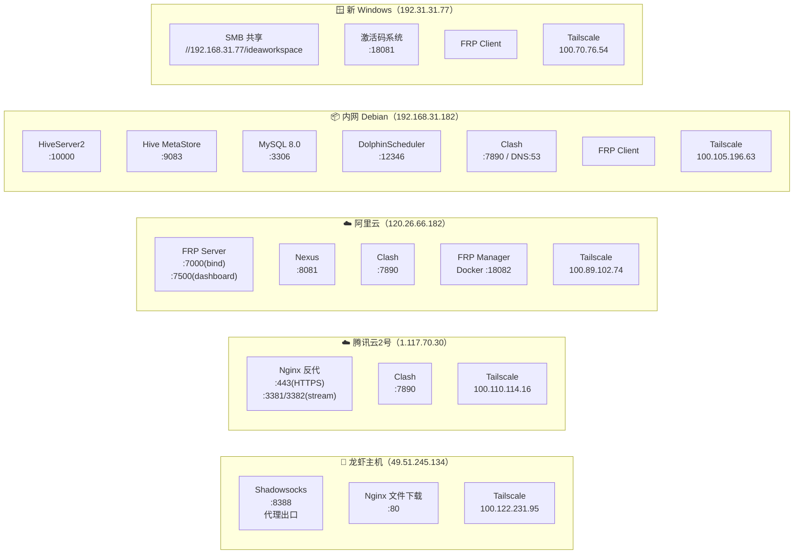
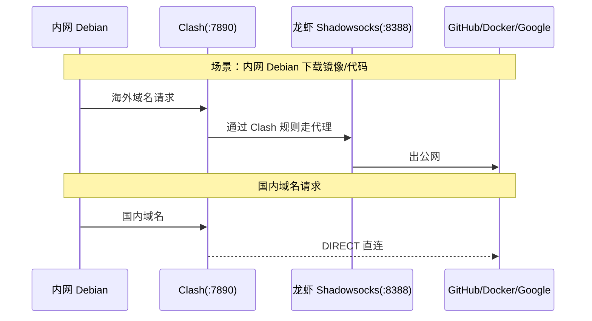
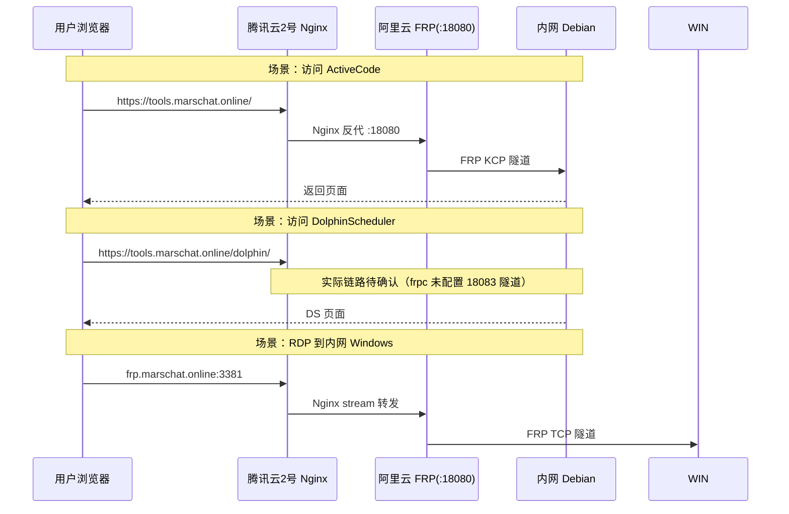
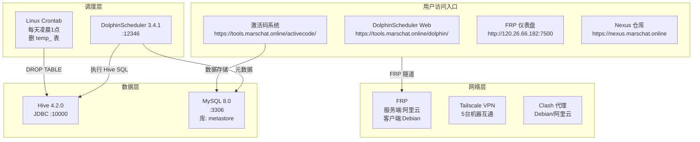

# 🌐 整体架构总览

> 生成时间：2026-06-03
> 用途：全网架构多维总览（拓扑 / 服务 / 代理 / 应用 / 运维）
> 格式说明：架构图使用 Mermaid 语法，支持在支持 Mermaid 的编辑器中渲染

---

## 一、物理拓扑（谁在哪）

```mermaid
graph TB
    subgraph 腾讯云["☁️ 腾讯云"]
        LB["🦐 龙虾主机<br/>49.51.245.134<br/>Tailscale: 100.122.231.95"]
        TX2["☁️ 腾讯云2号<br/>1.117.70.30<br/>Tailscale: 100.110.114.16"]
    end

    subgraph 阿里云["☁️ 阿里云<br/>120.26.66.182<br/>Tailscale: 100.89.102.74"]
        FRPS["FRP 服务端"]
        NEXUS["Nexus 仓库"]
    end

    subgraph 家庭["🏠 家庭宽带"]
        DEB["📦 内网 Debian<br/>192.168.31.182<br/>Tailscale: 100.105.196.63"]
        WIN_NEW["🪟 新 Windows<br/>192.168.31.77<br/>Tailscale: 100.70.76.54"]
        WIN_OLD["🪟 旧 Windows<br/>192.168.31.243"]
    end

    ~~subgraph 火山["🌋 火山云<br/>115.190.161.88"]~~
    ~~    DEVP["PyPI devpi 私服"]~~
    ~~end~~
    ~~PyPI 已下线，统一到 Nexus~~
```

## 二、服务拓扑（每台机器上有什么）



## 三、网络流量（数据怎么走）

### 3.1 出网方向（内网 → 外网）



### 3.2 入网方向（外网 → 内网服务）



### 3.3 FRP 隧道总表

```mermaid
graph LR
    subgraph 外["外网端口"]
        P3383["3383"]
        P3384["3384"]
        P18080["18080"]
        P18081["18081"]
        # P18083["18083"]  # DS 链路待确认
    end

    subgraph 内["内网服务"]
        S_SSH["SSH (Debian :22)"]
        S_RDP["RDP (旧Win :3389)"]
        S_ACT["ActiveCode (Debian :8080)"]
        S_ACT_WIN["激活码 (新Win :18081)"]
        S_DS["DS (Debian :12346)"]
    end

    P3383 --> S_SSH
    P3384 --> S_RDP
    P18080 -->|KCP| S_ACT
    P18081 --> S_ACT_WIN
    # P18083 --> S_DS   # DS 链路待确认
```

## 四、应用依赖关系



## 五、服务端口速查

| 机器 | 服务 | 端口 | 协议 | 对外 | 备注 |
|------|------|------|------|------|------|
| **龙虾主机** | Shadowsocks | 8388 | TCP | ❌ | 代理出口 |

| | Nginx 文件下载 | 80 | HTTP | ❌ | |
| **腾讯云2号** | Nginx HTTPS | 443 | HTTPS | ✅ | Let's Encrypt |
| | Nginx Stream | 3381 | TCP | ✅ | RDP 转发 |
| | Nginx Stream | 3382 | TCP | ✅ | SSH 转发 |
| | Clash | 7890 | HTTP | ❌ | |
| **阿里云** | FRP Server | 7000 | TCP | ❌ | 隧道绑定 |
| | FRP 仪表盘 | 7500 | HTTP | ❌ | admin/MySecurePassword@2025 |
| | Nexus | 8081 | HTTP | ❌ | 反代到腾讯云2号 |
| | Clash | 7890 | HTTP | ❌ | |
| | FRP Manager 后端 | 18082 | HTTP | ❌ | Docker :18082 |
| | FRP Manager 前端 | 18084 | HTTP | ❌ | Nginx :80 → :18084 |
| **内网 Debian** | HiveServer2 | 10000 | JDBC | ❌ | Thrift |
| | Hive MetaStore | 9083 | TCP | ❌ | |
| | MySQL | 3306 | TCP | ❌ | root/Hwx@1120930 |
| | DolphinScheduler | 12346 | HTTP | ❌ | admin/dolphinscheduler123 |
| | ActiveCode | 18080 | HTTP | ❌ | |
| | Clash | 7890 | HTTP | ❌ | DNS:53 |
| **新 Windows** | SMB 共享 | 445 | SMB | ❌ | share/share123 |
| | 激活码系统 | 18081 | HTTP | ❌ | |
| ~~火山云~~ | ~~PyPI devpi（已下线）~~ | ~~80~~ | ~~HTTP~~ | ❌ | PyPI 已统一到 Nexus |

## 六、关键运维命令

### 6.1 SSH 入口

```bash
# 内网 Debian（通过 FRP 隧道）
sshpass -p 'root01' ssh -p 3383 root01@120.26.66.182

# 腾讯云2号（直接）
sshpass -p 'Hwx@1120930' ssh root@1.117.70.30

# 阿里云（直接）
sshpass -p 'Hwx@1120930' ssh root@120.26.66.182
```

### 6.2 服务管理

```bash
# FRP 服务端（阿里云）
systemctl restart frps

# FRP 客户端（内网 Debian）
echo 'root01' | sudo -S systemctl restart frpc

# DolphinScheduler（内网 Debian）
cd ~/dolphinscheduler && docker compose up -d
docker logs ds-standalone --tail 50

# Clash 重启
systemctl restart clash-meta

# Nginx（腾讯云2号）
nginx -t && systemctl reload nginx
```

### 6.3 快速验证

```bash
# 代理是否正常
curl -x http://127.0.0.1:7890 https://www.google.com -o /dev/null -w '%{http_code}'

# Hive 是否正常
docker exec hive-server2 /opt/hive/bin/beeline -u jdbc:hive2://localhost:10000 \
  -e 'SHOW DATABASES'

# DS 是否正常
curl -X POST https://tools.marschat.online/dolphin/login \
  -d 'userName=admin&userPassword=dolphinscheduler123'
```

## 七、常用账密汇总

| 系统 | 账密 |
|------|------|
| DS | admin / dolphinscheduler123 |
| FRP 仪表盘 | admin / MySecurePassword@2025 |
| FRP Manager | admin / admin123 |
| MySQL root | root / Hwx@1120930 |
| MySQL hive | hive / Hwx@1120930 |
| 内网 Debian SSH | root01 / root01 |
| 腾讯云2号 SSH | root / Hwx@1120930 |
| 阿里云 SSH | root / Hwx@1120930 |
| SMB 共享 | share / share123 |
| 激活码系统 | admin / admin123 |

> ⚠️ 完整账密请参考 `/home/liangzi/document/备忘录/连接信息.md`

---

*本文档自动生成，如有更新请同步修改各分类文档。*
